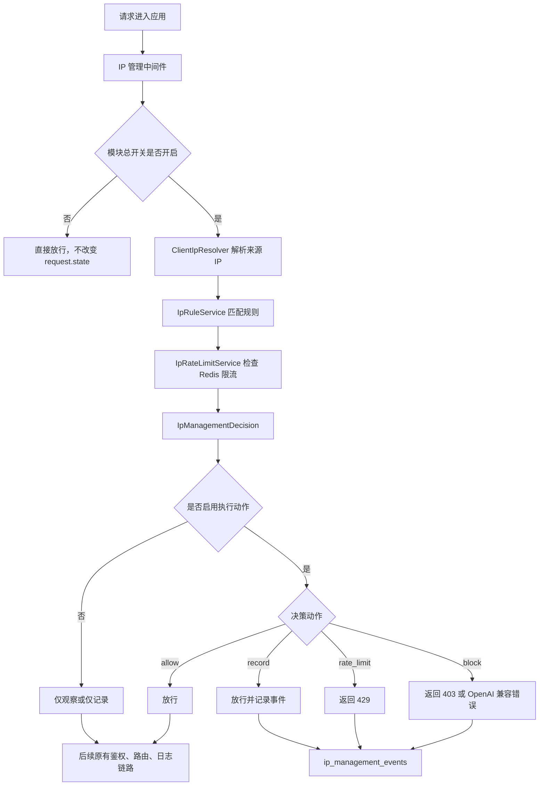

# IP 管理模块完整开发方案

生成日期：2026-06-08

## 1. 目标与边界

### 1.1 本方案目标

本方案用于在当前项目中新增一个相对独立的 IP 管理模块，覆盖请求来源 IP 的可信解析、规则匹配、限流、观察记录、阻断处置、前端配置与审计回溯。

模块必须满足：

- 所有功能默认关闭。
- 默认状态下不改变现有 `/v1/*`、`/api/*`、用户端、后台端、API Key 鉴权、请求日志和路由转发行为。
- 所有功能都必须可在前端管理页面中配置、启停和验证。
- IP 检测与处置必须独立封装，禁止散落在 API Key、代理路由、日志、前端页面中重复实现。
- API Key 现有来源 IP 白名单继续存在，不因新增模块被删除或改变默认语义。
- 若管理员显式启用新模块的可信代理解析或规则处置，必须能清晰看到解析来源、匹配规则、处置动作和事件日志。

### 1.2 非目标

本方案不要求立即替换现有 `ApiKeyService.extract_source_ip()` 和 `ProxySafeHelpers.extract_source_ip()` 的默认行为。

本方案不把 IP 地理位置、商业威胁情报、ASN、代理识别作为首期强依赖。若后续接入第三方情报源，必须作为独立可选开关实现。

本方案不新增第二套对外请求日志主表。对外请求主日志仍以 `request_logs` 为准；IP 管理事件可有独立事件表，用于记录模块决策与规则命中，不承担模型调用主日志职责。

## 2. 资料查阅结论

### 2.1 官方与权威资料

1. MDN：`X-Forwarded-For`
   - 地址：https://developer.mozilla.org/en-US/docs/Web/HTTP/Reference/Headers/X-Forwarded-For
   - 结论：`X-Forwarded-For` 用于记录经过代理链的客户端 IP，但该头可由客户端伪造；只有在可信代理边界明确时才能用于安全判断。

2. NGINX `ngx_http_realip_module`
   - 地址：http://nginx.org/en/docs/http/ngx_http_realip_module.html
   - 结论：NGINX 通过 `set_real_ip_from` 声明可信代理，通过 `real_ip_header` 指定头字段，通过 `real_ip_recursive` 控制递归解析代理链。核心思想是只信任来自可信代理的转发头。

3. Cloudflare 恢复真实访客 IP
   - 地址：https://developers.cloudflare.com/support/troubleshooting/restoring-visitor-ips/restoring-original-visitor-ips/
   - 结论：Cloudflare 会通过 `CF-Connecting-IP` 等头传递原始访客 IP，但源站仍必须只在流量确实来自 Cloudflare 可信边界时使用这些头。

4. RFC 7239：Forwarded HTTP Extension
   - 地址：https://www.rfc-editor.org/rfc/rfc7239
   - 结论：`Forwarded` 是标准化转发头，包含 `for`、`by`、`proto`、`host` 等参数。解析时要处理 IPv6、引号、端口、匿名值和多段代理链。

5. Uvicorn 代理头设置
   - 地址：https://www.uvicorn.org/settings/
   - 结论：Uvicorn 提供 `--proxy-headers` 和 `--forwarded-allow-ips`，其设计同样强调只有允许列表中的代理 IP 才能驱动客户端地址和协议修正。

6. FastAPI 代理部署说明
   - 地址：https://fastapi.tiangolo.com/advanced/behind-a-proxy/
   - 结论：在反向代理之后运行应用时，应用层必须显式理解代理头，且可信代理列表是判断转发头是否可信的前提。

7. Python `ipaddress`
   - 地址：https://docs.python.org/3/library/ipaddress.html
   - 结论：`ipaddress.ip_address()`、`ip_network()`、`ip_interface()` 能可靠解析 IPv4、IPv6、CIDR，并提供私有地址、保留地址、回环地址等属性，适合本项目做 IP 规范化和规则匹配。

### 2.2 可落地原则

根据以上资料，项目新增 IP 管理模块必须遵守以下原则：

- 禁止直接信任客户端传入的 `X-Forwarded-For`、`Forwarded`、`CF-Connecting-IP` 等头。
- 只有当直连来源 `request.client.host` 命中可信代理 CIDR 时，才允许使用代理转发头解析真实客户端 IP。
- 代理链解析必须保留原始链路和解析原因，便于排查“为什么选中这个 IP”。
- 解析失败必须可降级，默认使用直连来源 IP，并标记 `resolution_status=direct` 或 `invalid_header_ignored`。
- 安全处置必须可灰度，默认不开启，不影响已有链路。

## 3. 当前项目现状审查

### 3.1 现有来源 IP 提取

当前项目已有多处来源 IP 读取：

- `app/services/api_key_service.py`
  - `ApiKeyService.extract_source_ip(request)` 优先读取 `x-forwarded-for` 最左侧 IP，否则回退 `request.client.host`。
  - `ApiKeyService.is_source_ip_allowed(api_client_key, source_ip)` 使用 `ipaddress` 支持 API Key 级来源 IP 白名单，支持 CIDR 与精确 IP。

- `app/main.py`
  - `ProxySafeHelpers.extract_source_ip(request)` 同样优先读取 `x-forwarded-for` 最左侧 IP，否则回退 `request.client.host`。
  - 异常日志、对外请求拒绝日志和 API Key 鉴权失败日志会使用该来源 IP。

- `app/routers/proxy.py`
  - 多个 `/v1/*` 路径中使用 `ApiKeyService.extract_source_ip(request)` 写入日志、鉴权上下文和错误链路。

- `app/models/request_log.py`
  - `request_logs.source_ip` 已存在，是正式请求日志的来源 IP 字段。

### 3.2 当前风险

现有 `extract_source_ip()` 直接采用 `X-Forwarded-For` 第一段，存在以下风险：

- 如果应用被直接访问，调用方可以伪造 `X-Forwarded-For`，导致日志和 API Key 来源 IP 白名单判断失真。
- 如果前面存在多层代理，但未配置可信代理边界，应用无法区分真实客户端、可信代理和伪造头。
- 后台、用户端、对外代理多处读取 IP，口径不统一，后续如果逐点修补容易产生分裂。

### 3.3 当前可复用能力

项目已有以下能力可复用：

- SQLAlchemy 模型与 `migrations/` SQL 迁移脚本。
- `SettingService` 运行时配置缓存与失效机制。
- `AdminAuditService` 管理员操作审计。
- `RateLimitService` 现有 Redis 限流计数模式。
- `request_logs` 作为对外请求主日志。
- 内容防护模块的工程形态：
  - `app/routers/content_guard.py`
  - `app/services/content_guard_module_service.py`
  - `app/services/content_guard_rule_service.py`
  - `app/templates/content_guard.html`

IP 管理模块可以参考内容防护模块的“独立路由、独立服务、统一序列化、前端标签页、审计记录”结构，但不能复用内容防护的业务概念。

## 4. 模块总设计

### 4.1 模块命名

建议统一命名为“IP 管理”。

代码命名建议：

- 模型前缀：`IpManagement`
- 服务前缀：`IpManagement`
- API 前缀：`/api/ip-management`
- 页面路径：`/ip-management`
- 模板：`app/templates/ip_management.html`
- 静态 JS 分区：`app/static/js/app.js` 中新增 `ipManagement` 相关初始化或拆分为独立静态文件后同步版本参数。

### 4.2 总体架构



### 4.3 独立性要求

模块禁用时：

- 不解析代理头。
- 不写 IP 管理事件。
- 不执行 IP 规则。
- 不执行 IP 限流。
- 不修改 `request.state.source_ip`。
- 不修改 API Key 鉴权上下文。
- 不修改 `request_logs.source_ip` 的既有来源。
- 不影响任何 `/v1/*` 与 `/api/*` 响应。

模块启用时：

- 仅在配置命中的路径范围内工作。
- 初期建议默认“观察模式”，即解析并记录事件，不阻断。
- 管理员显式开启“执行阻断”或“执行限流”后，才允许对请求返回 403/429。

## 5. 数据模型设计

### 5.1 新增表：`ip_management_settings`

用途：保存 IP 管理模块的单例配置，不挤入 `app_settings` 的大型全局配置表，便于保持独立模块边界。

建议字段：

| 字段 | 类型 | 默认值 | 说明 |
| --- | --- | --- | --- |
| `id` | Integer PK | `1` | 单例配置 |
| `enabled` | Boolean | `false` | 模块总开关 |
| `observe_only_enabled` | Boolean | `false` | 仅观察，不处置 |
| `trusted_proxy_resolution_enabled` | Boolean | `false` | 是否启用可信代理解析 |
| `trusted_proxy_cidrs_json` | Text | `[]` | 可信代理 CIDR 列表 |
| `trusted_header_order_json` | Text | `[]` | 可信头优先级，默认空 |
| `apply_external_v1_enabled` | Boolean | `false` | 是否作用于 `/v1/*` |
| `apply_internal_api_enabled` | Boolean | `false` | 是否作用于 `/api/*` |
| `apply_user_pages_enabled` | Boolean | `false` | 是否作用于用户端页面 |
| `rule_engine_enabled` | Boolean | `false` | 是否启用规则匹配 |
| `block_action_enabled` | Boolean | `false` | 是否允许阻断动作生效 |
| `rate_limit_enabled` | Boolean | `false` | 是否启用 IP 维度限流 |
| `event_logging_enabled` | Boolean | `false` | 是否记录 IP 管理事件 |
| `event_sample_rate` | Integer | `100` | 事件采样比例，0 到 100 |
| `event_retention_days` | Integer | `30` | IP 管理事件保留天数 |
| `store_raw_headers_enabled` | Boolean | `false` | 是否记录原始转发头摘要 |
| `ip_masking_enabled` | Boolean | `false` | 是否对展示 IP 做掩码 |
| `fail_open_enabled` | Boolean | `true` | 模块异常时是否放行 |
| `created_at` | DateTime | 当前时间 | 创建时间 |
| `updated_at` | DateTime | 当前时间 | 更新时间 |

默认全部防护能力关闭，`fail_open_enabled=true` 用于保证模块异常不拖垮主链路。

### 5.2 新增表：`ip_access_rules`

用途：维护允许、观察、限流、阻断等 IP 规则。

建议字段：

| 字段 | 类型 | 默认值 | 说明 |
| --- | --- | --- | --- |
| `id` | Integer PK | 自动 | 规则 ID |
| `name` | Text | 必填 | 中文规则名 |
| `enabled` | Boolean | `false` | 规则开关，默认关闭 |
| `priority` | Integer | `100` | 优先级，越小越先匹配 |
| `scope` | Text | `external_v1` | `external_v1`、`internal_api`、`user_pages`、`all` |
| `match_type` | Text | `cidr` | `exact_ip`、`cidr`、`range` |
| `match_value` | Text | 必填 | IP、CIDR 或范围 |
| `normalized_value` | Text | 计算 | 规范化后的规则值 |
| `action` | Text | `record` | `allow`、`record`、`rate_limit`、`block` |
| `rate_qps_limit` | Integer | `0` | 单规则 QPS，0 表示不限制 |
| `rate_rpm_limit` | Integer | `0` | 单规则 RPM，0 表示不限制 |
| `expires_at` | DateTime | 空 | 临时规则过期时间 |
| `reason` | Text | 空 | 规则原因 |
| `created_by_user_id` | Integer | 空 | 创建管理员 |
| `created_by_username` | Text | 空 | 创建管理员名 |
| `created_at` | DateTime | 当前时间 | 创建时间 |
| `updated_at` | DateTime | 当前时间 | 更新时间 |

索引建议：

- `(enabled, scope, priority, id)`
- `(action, enabled)`
- `(expires_at)`

### 5.3 新增表：`ip_management_events`

用途：记录 IP 模块决策事件，不替代 `request_logs`。

建议字段：

| 字段 | 类型 | 默认值 | 说明 |
| --- | --- | --- | --- |
| `id` | Integer PK | 自动 | 事件 ID |
| `trace_id` | Text | 空 | 请求 trace |
| `request_log_id` | Integer | 空 | 可选关联 `request_logs.id` |
| `request_path` | Text | 空 | 请求路径 |
| `http_method` | Text | 空 | 请求方法 |
| `scope` | Text | 空 | 命中的作用域 |
| `direct_client_ip` | Text | 空 | `request.client.host` |
| `resolved_client_ip` | Text | 空 | 模块解析出的客户端 IP |
| `display_client_ip` | Text | 空 | 掩码后的展示 IP |
| `resolution_source` | Text | 空 | `direct`、`x_forwarded_for`、`forwarded`、`cf_connecting_ip` 等 |
| `resolution_status` | Text | 空 | `disabled`、`direct`、`trusted_proxy`、`untrusted_header_ignored`、`invalid_header_ignored` |
| `trusted_proxy_matched` | Boolean | `false` | 直连来源是否命中可信代理 |
| `forwarded_chain_json` | Text | 空 | 代理链摘要 |
| `matched_rule_id` | Integer | 空 | 命中规则 |
| `matched_rule_name` | Text | 空 | 命中规则名 |
| `decision` | Text | `allow` | `allow`、`record`、`rate_limit`、`block` |
| `decision_reason` | Text | 空 | 决策原因 |
| `enforced` | Boolean | `false` | 是否实际处置 |
| `status_code` | Integer | 空 | 返回状态码 |
| `api_client_key_id` | Integer | 空 | 可选 API Key 维度 |
| `api_client_key_prefix` | Text | 空 | 可选 API Key 前缀 |
| `user_account_id` | Integer | 空 | 可选账户维度 |
| `created_at` | DateTime | 当前时间 | 创建时间 |

索引建议：

- `(created_at, id)`
- `(resolved_client_ip, created_at)`
- `(decision, created_at)`
- `(matched_rule_id, created_at)`
- `(trace_id)`
- `(api_client_key_id, created_at)`

### 5.4 Redis Key 设计

IP 限流不建议用数据库计数，必须使用 Redis 等共享状态。

建议 Key：

- `ipmgmt:rate:qps:{scope}:{ip_hash}:{second}`
- `ipmgmt:rate:rpm:{scope}:{ip_hash}:{minute}`
- `ipmgmt:event:dedupe:{trace_id}:{decision}`
- `ipmgmt:settings:cache`

说明：

- `ip_hash` 使用规范化 IP 的 SHA256 短哈希，避免 Redis Key 直接暴露完整 IP。
- QPS TTL 建议 3 秒。
- RPM TTL 建议 120 秒。
- 事件去重 TTL 可设为 10 到 60 分钟，避免中间件和后续日志回填重复创建同一决策事件。

## 6. 核心服务设计

### 6.1 `ClientIpResolver`

建议文件：`app/services/ip_management_resolver_service.py`

职责：

- 接收 `Request`、模块配置、可信代理列表。
- 解析直连来源 IP。
- 判断直连来源是否命中可信代理 CIDR。
- 在可信代理命中时解析 `Forwarded`、`X-Forwarded-For`、`CF-Connecting-IP` 等头。
- 输出结构化解析结果，不直接做规则判断。

输出对象建议：

```python
@dataclass(frozen=True)
class ClientIpResolution:
    direct_client_ip: str | None
    resolved_client_ip: str | None
    resolution_source: str
    resolution_status: str
    trusted_proxy_matched: bool
    forwarded_chain: list[str]
    ignored_headers: list[str]
    warnings: list[str]
```

解析顺序建议：

1. 若模块或可信代理解析关闭，返回 `direct_client_ip=request.client.host`，状态为 `disabled`。
2. 解析 `request.client.host`，若不是合法 IP，返回状态 `invalid_direct_client`。
3. 若直连 IP 不在 `trusted_proxy_cidrs_json` 中，忽略所有转发头，返回直连 IP，状态 `untrusted_header_ignored`。
4. 若直连 IP 命中可信代理，则按管理员配置的 `trusted_header_order_json` 解析头。
5. 解析候选头时，必须验证每个候选是否为合法 IP。
6. 对 `X-Forwarded-For` 链路按从右到左策略处理：从最靠近应用的代理开始跳过可信代理，选择第一个非可信代理 IP 作为客户端 IP。
7. 对 `Forwarded` 解析 `for=` 参数，支持引号、IPv6 方括号、端口剥离、多个代理段。
8. 对 `CF-Connecting-IP` 仅在直连 IP 命中 Cloudflare 可信网段或管理员配置的可信代理时使用。
9. 解析失败时回退直连 IP，不抛出影响主链路的异常。

### 6.2 `IpRuleService`

建议文件：`app/services/ip_management_rule_service.py`

职责：

- 校验规则输入。
- 规范化 IP、CIDR、IP 范围。
- 维护规则匹配算法。
- 返回匹配结果和决策建议。

规则匹配顺序：

1. 过滤禁用规则。
2. 过滤已过期规则。
3. 过滤 scope 不匹配规则。
4. 按 `priority ASC, id ASC` 排序。
5. 同优先级下使用更具体的匹配优先：
   - `exact_ip`
   - CIDR 前缀更长者
   - `range`
6. 第一条命中规则决定动作。

动作语义：

- `allow`：明确放行，可用于覆盖低优先级阻断规则。
- `record`：放行并记录事件。
- `rate_limit`：触发 IP 限流逻辑，超过限制才返回 429。
- `block`：在 `block_action_enabled=true` 时返回 403，否则只记录观察事件。

### 6.3 `IpManagementService`

建议文件：`app/services/ip_management_service.py`

职责：

- 读取并缓存模块配置。
- 调用 `ClientIpResolver`。
- 调用 `IpRuleService`。
- 调用 `IpRateLimitService`。
- 生成 `IpManagementDecision`。
- 写入事件。
- 给中间件返回“放行或拒绝”的最终结果。

输出对象建议：

```python
@dataclass(frozen=True)
class IpManagementDecision:
    resolved_client_ip: str | None
    scope: str
    decision: str
    status_code: int | None
    error_code: str | None
    message: str | None
    matched_rule_id: int | None
    enforced: bool
    reason: str
```

### 6.4 `IpRateLimitService`

建议文件：`app/services/ip_management_rate_limit_service.py`

职责：

- 使用 Redis 维护 IP 维度短窗口限流。
- 支持全局 IP QPS/RPM 和规则级 QPS/RPM。
- 与现有 `RateLimitService` 保持相似错误语义，但不混用 API Key Key 空间。
- Redis 不可用时遵循 `fail_open_enabled`。

首期算法建议：

- QPS 使用固定秒窗口计数，TTL 3 秒。
- RPM 使用自然分钟窗口计数，TTL 120 秒。
- 后续若需要更平滑的限流，可升级为 Redis Sorted Set 滑动窗口。

### 6.5 `IpManagementEventService`

建议文件：`app/services/ip_management_event_service.py`

职责：

- 根据配置决定是否记录事件。
- 对同一 `trace_id` 和同一决策做幂等去重。
- 支持按 IP、动作、路径、API Key、时间分页查询。
- 支持事件清理和留存策略。
- 支持 IP 掩码展示。

## 7. 中间件接入方案

### 7.1 中间件位置

建议新增：`app/middleware/ip_management_middleware.py`

接入位置建议：

- 放在 trace id 初始化之后，保证事件能记录 `trace_id`。
- 放在业务路由处理之前，保证可拦截 `/v1/*` 和 `/api/*`。
- 不替代现有 API Key 鉴权依赖。

注意：FastAPI/Starlette 中间件执行顺序与添加顺序相关，实施时必须通过测试确认 `trace_id` 已可读取。

### 7.2 作用域识别

建议函数：

```python
def resolve_ip_management_scope(path: str) -> str | None:
    if path.startswith("/v1/"):
        return "external_v1"
    if path.startswith("/api/"):
        return "internal_api"
    if path.startswith("/user"):
        return "user_pages"
    return None
```

配置作用域：

- `apply_external_v1_enabled=false`
- `apply_internal_api_enabled=false`
- `apply_user_pages_enabled=false`

默认全部关闭。

### 7.3 对 `/v1/*` 的错误响应

若启用阻断或限流并作用于 `/v1/*`：

- 403 使用统一错误目录新增错误码，例如 `source_ip_blocked`。
- 429 使用统一错误目录新增错误码，例如 `source_ip_rate_limited`。
- 响应必须保持 OpenAI 兼容 `error` 对象，并包含 `trace_id`、`retryable`、`recoverable`、`category`。
- 限流错误 `retryable=true`，阻断错误 `retryable=false`。

若作用于 `/api/*`：

- 返回内部管理 API 预期的 JSON 错误，不包装成 OpenAI 外部错误。
- 必须避免污染 `api_client_auth` 类型外部鉴权日志。

### 7.4 与现有 API Key 来源 IP 白名单的关系

首期不改变现有 API Key 白名单逻辑。

建议分阶段处理：

1. 第一阶段：IP 管理模块只观察和独立记录，不参与 API Key 白名单判断。
2. 第二阶段：新增开关 `use_resolved_ip_for_api_key_allowlist=false`，默认关闭。
3. 第三阶段：管理员显式开启后，API Key 白名单使用 `request.state.ip_management.resolved_client_ip`。
4. 开启前必须在前端提示：该操作会改变 API Key 白名单判断口径。

这样可以避免新增模块上线后立刻改变现有用户的访问结果。

## 8. API 设计

新增路由文件：`app/routers/ip_management.py`

统一前缀：`/api/ip-management`

### 8.1 设置接口

- `GET /api/ip-management/overview`
  - 返回设置、规则摘要、最近事件、指标。

- `GET /api/ip-management/settings`
  - 返回模块设置。

- `PUT /api/ip-management/settings`
  - 更新设置。
  - 必须写入管理员审计日志。
  - 更新后必须失效配置缓存。

### 8.2 规则接口

- `GET /api/ip-management/rules`
  - 支持分页、关键词、动作、作用域、启用状态筛选。

- `POST /api/ip-management/rules`
  - 新增规则。
  - 默认 `enabled=false`。

- `PUT /api/ip-management/rules/{rule_id}`
  - 更新规则。

- `DELETE /api/ip-management/rules/{rule_id}`
  - 删除规则或软删除。

- `POST /api/ip-management/rules/{rule_id}/enable`
  - 启用规则。

- `POST /api/ip-management/rules/{rule_id}/disable`
  - 停用规则。

### 8.3 事件接口

- `GET /api/ip-management/events`
  - 支持服务端分页。
  - 筛选项：IP、动作、路径、状态码、API Key、用户、时间范围。

- `GET /api/ip-management/events/{event_id}`
  - 查看事件详情。

- `POST /api/ip-management/events/cleanup`
  - 按保留策略清理旧事件。

### 8.4 测试接口

- `POST /api/ip-management/test-resolution`
  - 输入直连 IP、请求头、可信代理列表。
  - 返回解析结果。
  - 不写事件，不影响真实请求。

- `POST /api/ip-management/test-rule`
  - 输入 IP、路径、方法、规则集。
  - 返回规则匹配结果。
  - 用于前端“测试规则”按钮。

## 9. 前端页面设计

新增页面：`/ip-management`

新增模板：`app/templates/ip_management.html`

新增导航：

- 位置：后台左侧侧边栏配置类分组。
- 文案：`IP 管理`
- 图标：可使用 Bootstrap Icons 的 `bi-shield-lock` 或 `bi-diagram-3`。

### 9.1 页面结构

页面必须遵守现行前端规范：

- 中文界面文案。
- 数据密集页面尽量铺满主内容区。
- 启停项使用滑块式开关，不裸露默认勾选框。
- 方框、表单、表格、弹窗等保持直角。
- 不放置脱离实际数据或操作入口的纯说明卡片。
- 表格服务端分页，不一次性拉取全量事件。

建议标签页：

1. `总览`
2. `设置`
3. `规则`
4. `事件`
5. `测试`

### 9.2 总览页

展示实时指标：

- 模块状态。
- 解析次数。
- 已记录事件数。
- 近 1 小时阻断数。
- 近 1 小时限流数。
- 可信代理命中数。
- 无效头忽略数。

数据来自 `GET /api/ip-management/overview`。

### 9.3 设置页

配置项：

- 模块总开关。
- 可信代理解析开关。
- `/v1/*` 作用域开关。
- `/api/*` 作用域开关。
- 用户端作用域开关。
- 规则引擎开关。
- 阻断动作开关。
- IP 限流开关。
- 事件记录开关。
- 失败放行开关。
- 可信代理 CIDR 列表。
- 可信头优先级。
- 事件保留天数。
- 原始头摘要记录开关。
- IP 掩码展示开关。

默认值：

- 所有检测、规则、阻断、限流、事件记录开关均为关闭。
- `fail_open_enabled` 为开启。

### 9.4 规则页

表格列建议：

- 规则名。
- 状态。
- 作用域。
- 匹配类型。
- 匹配值。
- 动作。
- 限流值。
- 优先级。
- 过期时间。
- 操作。

操作：

- 新建。
- 编辑。
- 启用。
- 停用。
- 删除。
- 测试。

规则编辑使用弹窗或抽屉，避免超长页面。

### 9.5 事件页

筛选区：

- 关键词。
- IP。
- 动作。
- 作用域。
- 状态码。
- 时间范围。
- API Key。

表格列建议：

- 时间。
- 解析 IP。
- 直连 IP。
- 路径。
- 动作。
- 是否执行。
- 命中规则。
- 状态码。
- Trace ID。

详情弹层展示：

- 代理链摘要。
- 解析来源。
- 忽略头原因。
- 规则匹配过程。
- 决策原因。

### 9.6 测试页

提供两组测试工具：

- IP 解析测试：
  - 输入直连 IP。
  - 输入 `Forwarded`、`X-Forwarded-For`、`CF-Connecting-IP`。
  - 输入可信代理 CIDR。
  - 返回解析结果。

- 规则匹配测试：
  - 输入 IP。
  - 输入路径。
  - 选择作用域。
  - 返回命中规则和最终动作。

测试接口不写真实事件，不影响真实请求。

## 10. 文件级实施步骤

### 第 1 步：新增模型

目标：

- 建立 IP 管理独立数据结构。

修改：

- 新增 `app/models/ip_management.py`
- 更新 `app/models/__init__.py`，确保模型被导入。

效果：

- 项目具备 `ip_management_settings`、`ip_access_rules`、`ip_management_events` 三张表的 ORM 定义。

### 第 2 步：新增迁移脚本

目标：

- 支持生产环境独立执行数据库结构变更。

修改：

- 新增 `migrations/2026-06-08_add_ip_management_module.sql`

效果：

- 禁止依赖生产 Web worker 启动阶段自动 DDL。

### 第 3 步：新增 Schema

目标：

- 为管理接口提供稳定输入输出模型。

修改：

- 新增 `app/schemas/ip_management.py`

内容：

- `IpManagementSettingsUpdate`
- `IpAccessRuleCreate`
- `IpAccessRuleUpdate`
- `IpAccessRuleQuery`
- `IpManagementEventQuery`
- `IpResolutionTestRequest`
- `IpRuleTestRequest`

效果：

- 所有前端输入都在接口层被校验。
- IP、CIDR、范围、动作、作用域枚举都有明确约束。

### 第 4 步：新增解析服务

目标：

- 统一可信代理与转发头解析。

修改：

- 新增 `app/services/ip_management_resolver_service.py`

效果：

- 所有 IP 管理逻辑只从该服务拿解析结果。
- 不再在中间件、API、前端测试接口中重复解析头。

### 第 5 步：新增规则服务

目标：

- 统一规则校验、排序、匹配和动作决策。

修改：

- 新增 `app/services/ip_management_rule_service.py`

效果：

- 规则匹配行为可测试、可追踪、可解释。

### 第 6 步：新增 Redis 限流服务

目标：

- 支持 IP 维度 QPS/RPM。

修改：

- 新增 `app/services/ip_management_rate_limit_service.py`

效果：

- 多 worker 下使用共享 Redis 计数。
- 与 API Key 限流互不污染。

### 第 7 步：新增模块总服务

目标：

- 对外提供设置、概览、事件、测试、决策入口。

修改：

- 新增 `app/services/ip_management_service.py`
- 新增 `app/services/ip_management_event_service.py`

效果：

- 中间件和接口只调用模块服务，不了解底层表结构和 Redis Key。

### 第 8 步：新增中间件

目标：

- 将 IP 管理接入请求生命周期。

修改：

- 新增 `app/middleware/ip_management_middleware.py`
- 在 `app/main.py` 注册中间件。

效果：

- 模块默认关闭时无行为变化。
- 模块启用后可按作用域观察、记录、限流或阻断。

### 第 9 步：新增管理 API

目标：

- 为前端页面提供配置、规则、事件和测试能力。

修改：

- 新增 `app/routers/ip_management.py`
- 在 `app/main.py` include router，并要求管理员 Session/API 权限。

效果：

- 后台管理员可配置模块。
- 所有修改写入 `AdminAuditService`。

### 第 10 步：新增页面路由和模板

目标：

- 提供完整可操作的 IP 管理页面。

修改：

- `app/routers/pages.py` 新增 `/ip-management` 页面。
- `app/templates/ip_management.html` 新增页面模板。
- `app/templates/base.html` 新增左侧导航。

效果：

- 管理员可在后台进入 IP 管理页面。

### 第 11 步：新增前端交互

目标：

- 支持设置保存、规则 CRUD、事件查询、解析测试、规则测试。

修改：

- 若继续使用现有单体静态脚本：修改 `app/static/js/app.js`。
- 若拆分独立脚本：新增 `app/static/js/ip_management.js`，并在模板中引入。
- 若修改 `app/static/` 下影响浏览器执行结果的资源，必须同步更新 `app/templates/base.html` 资源版本参数。

效果：

- 页面不依赖刷新即可完成管理操作。
- 按钮有加载态和结果反馈。
- 表格使用服务端分页。

### 第 12 步：接入错误目录

目标：

- 对 `/v1/*` 阻断和限流返回统一错误结构。

修改：

- `app/services/error_catalog_service.py`
- `app/services/openai_error_service.py` 如有必要同步映射。

新增错误建议：

- `source_ip_blocked`
- `source_ip_rate_limited`
- `source_ip_resolution_failed`

效果：

- 外部调用方收到 OpenAI 兼容错误。
- 内部 `/api/*` 不被错误包装污染。

### 第 13 步：请求日志关联

目标：

- 保留主日志口径，同时让 IP 管理事件可追踪。

修改：

- 首期不新增 `request_logs` 字段。
- 若需要关联，事件表记录 `trace_id`，后续后台任务可按 `trace_id` 回填 `request_log_id`。

效果：

- 不改变现有日志主表写入路径。
- IP 管理事件可通过 Trace ID 追溯到请求日志。

### 第 14 步：后台清理任务

目标：

- 按配置清理旧 IP 管理事件。

修改：

- 新增任务函数，可接入现有调度器。
- 任务执行前获取 Redis 分布式锁，符合多 worker 规范。

效果：

- 防止事件表无限膨胀。

## 11. 算法细节

### 11.1 IP 规范化

使用 Python `ipaddress`：

- `ipaddress.ip_address(value)` 校验单个 IP。
- `ipaddress.ip_network(value, strict=False)` 校验 CIDR。
- IPv4 映射 IPv6 可规范化为可比较对象。
- 对非法 IP 返回明确校验错误。

### 11.2 `X-Forwarded-For` 链解析

示例：

```text
client, proxy1, proxy2
```

当 `request.client.host=proxy2` 且 `proxy2` 是可信代理：

1. 从右到左读取链路。
2. 跳过可信代理 IP。
3. 选择第一个非可信代理 IP 作为客户端 IP。
4. 若全部都是可信代理，则选择最左侧 IP，并标记 `all_forwarded_entries_trusted`。

### 11.3 `Forwarded` 解析

示例：

```text
Forwarded: for="203.0.113.9";proto=https;host=example.com
```

处理要求：

- 支持多个 `Forwarded` 段。
- 提取每段 `for`。
- 去除引号。
- IPv6 方括号内地址要正确保留。
- 端口要剥离。
- `unknown`、空值、非 IP 字面量要忽略。

### 11.4 Cloudflare 头解析

`CF-Connecting-IP` 仅在满足以下条件时使用：

- 管理员在可信头优先级中启用该头。
- 直连 IP 命中可信代理 CIDR。
- 或管理员导入 Cloudflare 官方 IP 网段并命中。

否则只能记录为“未信任头被忽略”。

### 11.5 规则匹配

匹配输入：

- `resolved_client_ip`
- `scope`
- `request_path`
- `http_method`

匹配输出：

- 命中规则。
- 动作。
- 决策原因。

若没有命中规则：

- 决策为 `allow`。
- 若事件记录开启，可按采样记录 `no_rule_matched`。

### 11.6 限流算法

首期固定窗口：

- QPS：按 Unix 秒计数。
- RPM：按北京时间自然分钟计数。

后续升级：

- 使用 Redis Sorted Set 滑动窗口。
- 支持突发容量与令牌桶。

默认行为：

- `rate_limit_enabled=false` 时不计数。
- Redis 不可用且 `fail_open_enabled=true` 时放行并记录模块异常。
- Redis 不可用且 `fail_open_enabled=false` 时返回 503，但该模式默认不启用。

## 12. 配置默认值

所有防护类功能默认关闭：

```json
{
  "enabled": false,
  "observe_only_enabled": false,
  "trusted_proxy_resolution_enabled": false,
  "trusted_proxy_cidrs_json": "[]",
  "trusted_header_order_json": "[]",
  "apply_external_v1_enabled": false,
  "apply_internal_api_enabled": false,
  "apply_user_pages_enabled": false,
  "rule_engine_enabled": false,
  "block_action_enabled": false,
  "rate_limit_enabled": false,
  "event_logging_enabled": false,
  "store_raw_headers_enabled": false,
  "ip_masking_enabled": false,
  "fail_open_enabled": true
}
```

这样可以确保新增模块上线后不影响现有功能。

## 13. 与现有功能的兼容策略

### 13.1 API Key 来源 IP 白名单

保持现状：

- API Key 白名单仍使用现有字段 `allowed_source_ips_json`。
- 默认仍走 `ApiKeyService.extract_source_ip()`。

后续可选增强：

- 通过独立开关切换到 IP 管理模块解析结果。
- 切换前必须在前端显示影响说明，并要求管理员确认。

### 13.2 请求日志

保持现状：

- `request_logs.source_ip` 默认不变。

可选增强：

- 模块启用后，IP 管理事件记录 `trace_id`。
- 后续可在日志详情中按 `trace_id` 展示 IP 管理事件。
- 不新增第二套请求日志主表。

### 13.3 内部管理 API

内部 `/api/*` 默认不启用 IP 管理。

若管理员开启：

- 返回内部 JSON 错误。
- 不写外部 `api_client_auth` 日志。
- 不包装成 OpenAI 错误。

### 13.4 反向代理部署

部署建议：

- NGINX 层继续配置真实 IP 传递。
- 应用层只信任管理员配置的代理 CIDR。
- 不建议默认信任所有私有网段，除非部署拓扑明确确认。

## 14. 测试计划

### 14.1 单元测试

新增测试文件建议：

- `tests/test_ip_management_resolver_service.py`
- `tests/test_ip_management_rule_service.py`
- `tests/test_ip_management_rate_limit_service.py`
- `tests/test_ip_management_service.py`

覆盖用例：

- 模块关闭时返回 no-op。
- 未配置可信代理时忽略 `X-Forwarded-For`。
- 可信代理命中时正确解析 XFF 链。
- 多层可信代理右到左解析。
- 伪造 XFF 不影响安全决策。
- `Forwarded` 支持 IPv6、引号、端口。
- `CF-Connecting-IP` 只有可信代理命中时生效。
- 非法 IP、非法 CIDR、非法 range 被拒绝。
- exact IP、CIDR、range 匹配。
- priority 和更具体匹配排序稳定。
- allow 规则能覆盖低优先级 block。
- rate_limit 超限返回 429。
- Redis 不可用时按 `fail_open_enabled` 行为处理。

### 14.2 集成测试

覆盖路径：

- `/v1/chat/completions`
- `/v1/responses`
- `/v1/embeddings`
- `/v1/files`
- `/v1/images/generations`
- `/api/ip-management/*`

关键断言：

- 默认关闭时，响应与日志行为不变。
- 开启观察模式时，请求放行并记录事件。
- 开启阻断并命中 block 规则时，`/v1/*` 返回 OpenAI 兼容错误。
- 开启阻断并命中 block 规则时，`/api/*` 返回内部 JSON 错误。
- 启用限流并超过阈值时返回 429。

### 14.3 前端测试

覆盖：

- 页面可访问。
- 设置保存后刷新仍保持。
- 所有开关默认关闭。
- 规则新增、编辑、启用、停用、删除。
- 事件分页和筛选。
- 解析测试结果正确展示。
- 规则测试结果正确展示。
- 按钮执行中不跳动，执行后有反馈。
- 移动端不横向溢出。

### 14.4 回归测试

重点回归：

- API Key 鉴权。
- API Key 来源 IP 白名单。
- 请求日志 `source_ip`。
- `/api/*` 管理接口错误响应。
- `/v1/*` OpenAI 兼容错误响应。
- Redis 限流原有 API Key QPS/RPM。
- 内容防护模块。

## 15. 分阶段开发计划

### 阶段 1：基础结构

目标：

- 新增模型、迁移、Schema、服务骨架。

效果：

- 不接入真实请求。
- 可运行单元测试验证解析和规则。

### 阶段 2：解析与规则测试接口

目标：

- 上线 `/api/ip-management/test-resolution` 和 `/test-rule`。

效果：

- 管理员可以在不影响真实请求的情况下验证配置。

### 阶段 3：管理页面

目标：

- 上线 `/ip-management` 页面。

效果：

- 管理员可配置开关、可信代理、规则和测试工具。
- 所有功能仍默认关闭。

### 阶段 4：观察模式中间件

目标：

- 接入中间件，但默认关闭。
- 开启后仅观察和记录事件。

效果：

- 能在真实流量中验证 IP 解析准确性，不阻断请求。

### 阶段 5：阻断与限流

目标：

- 管理员显式开启后允许执行 `block` 和 `rate_limit`。

效果：

- `/v1/*`、`/api/*` 按作用域配置生效。
- 错误响应符合各自协议。

### 阶段 6：日志联动与运维

目标：

- 在请求日志详情中展示关联 IP 管理事件。
- 增加事件清理任务。

效果：

- 形成完整可观测闭环。

### 阶段 7：可选增强

目标：

- 可选接入 API Key 白名单可信解析结果。
- 可选接入 Cloudflare 网段自动同步。
- 可选接入商业 IP 情报。

效果：

- 在用户明确确认后逐步增强安全能力。

## 16. 风险与控制

### 16.1 误封风险

控制：

- 所有处置默认关闭。
- 初期采用观察模式。
- 阻断必须由 `block_action_enabled=true` 和规则命中同时满足。
- 规则支持过期时间。
- 支持 allow 规则覆盖。

### 16.2 代理头伪造风险

控制：

- 默认不信任转发头。
- 只有直连来源命中可信代理 CIDR 才解析头。
- 记录被忽略的转发头原因。

### 16.3 性能风险

控制：

- 模块关闭时不做额外工作。
- 设置使用缓存。
- 规则列表可缓存，写操作主动失效。
- IP 匹配规则数量设置上限，例如 5000。
- 事件写入可采样，可异步化。

### 16.4 日志膨胀风险

控制：

- 事件记录默认关闭。
- 支持采样比例。
- 支持事件保留天数。
- 热点 IP 事件可做去重或聚合。

### 16.5 隐私风险

控制：

- 支持 IP 掩码展示。
- Redis Key 使用 IP 哈希。
- 原始转发头摘要默认不记录。
- 事件详情避免保存完整敏感头。

## 17. 验收标准

必须满足：

- 新增模块默认关闭，关闭时现有功能无行为变化。
- 后台有独立 `IP 管理` 页面。
- 所有开关可配置并持久化。
- 可信代理解析可通过测试接口验证。
- 规则匹配可通过测试接口验证。
- `/v1/*`、`/api/*`、用户端作用域可独立启停。
- 观察、阻断、限流、事件记录都可独立启停。
- `/v1/*` 阻断和限流错误符合 OpenAI 兼容错误结构。
- `/api/*` 错误不包装成 OpenAI 错误。
- API Key 现有来源 IP 白名单默认不受影响。
- 请求日志主表不被重复替代。
- Redis 限流在多 worker 下有效。
- 单元测试和集成测试覆盖核心解析、规则、限流和默认 no-op。

## 18. 后续开发建议

建议下一步先实施阶段 1 到阶段 3，即模型、服务、测试接口和前端页面。等管理员能在页面中验证真实代理链解析结果后，再接入观察模式中间件。这样可以避免在代理拓扑尚未确认时直接影响正式请求。

