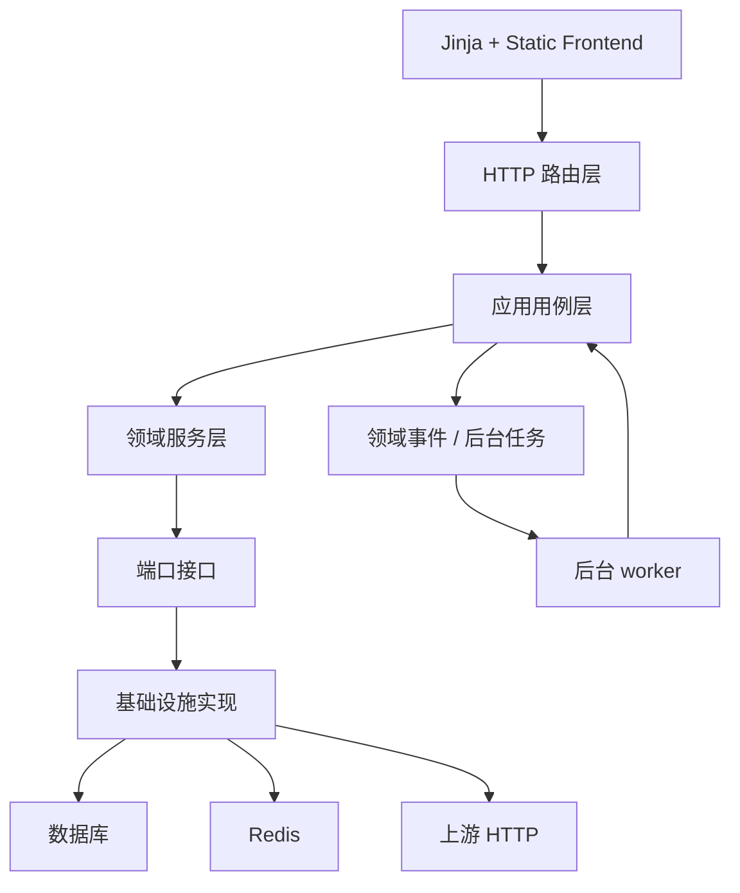

# aotu-gpt 完整改进方案

## 1. 改进目标

本方案目标是在不改变现有前端界面和现有功能的前提下，把项目逐步改造成更清晰的分层分模块架构，使不同层和不同模块之间相对独立，减少循环依赖，降低耦合，提高扩展性与可测试性。

目标状态：

- 路由层只处理 HTTP、Session、鉴权依赖、请求响应转换。
- 应用服务层负责编排用例。
- 领域服务层负责纯业务决策。
- 基础设施层负责数据库、Redis、HTTP 上游、队列、文件存储。
- 日志、计费、健康、内容防护、路由、provider、模型、API Key 各有清晰边界。
- 核心服务依赖方向单向。
- 新功能通过新增小模块或策略类接入，而不是继续扩大超大文件。
- 现有回归脚本继续通过，并逐步迁移到标准测试体系。

## 2. 改造原则

1. 禁止一次性推倒重写。
2. 每一阶段都必须保持现有接口、页面和功能可用。
3. 优先拆依赖和提取纯函数，再移动代码。
4. 每拆一个模块，都要补最小验证。
5. 对外 `/v1/*` 协议兼容性优先级最高。
6. 数据库结构改造必须独立迁移，不在 Web worker 启动时隐式 DDL。
7. 前端界面不做视觉重设计，只做文件组织和可维护性重构。

### 2026-06-08 同步原则

当前工作区已经对模型映射、路由候选和日志计费口径做了局部修正，后续改造必须沿用以下最新边界：

1. 模型映射阶段只选择目标模型，不做提供商级协议、能力、容量、熔断、内容完整性和可信策略筛选。
2. 提供商候选选择阶段统一判断端点协议、流式、视觉、工具调用、图片生成、容量、熔断、内容完整性、可信策略、健康、负载和路由得分。
3. 提供商和提供商模型挂载配置禁止继续维护或对外暴露权重字段；后续路由排序不再设计权重主策略。
4. `/v1/models` 和 `/v1/models/{model_id}` 必须作为同一官方接口族处理，鉴权、计费、Token 补算、用量统计和监控积压复用同一判断函数或等价共享契约。
5. 旧代码若仍读取 `weight`，只能经过 `priority` 兼容别名过渡；目标架构禁止重新引入真实 `weight` 数据库列、Schema 字段或用户可见表单项。
6. 模型目录、模型选项和 provider 运行时缓存必须在写操作、启动同步、迁移回填后主动失效；缓存 key 版本变更要写入对应模块说明，避免前端下拉和引用页面读到旧结构。
7. usage 明细字段必须以 `request_logs` 为事实来源，Token 补全、计费、导出、指标和用户门户展示使用同一提取规则，`stage35_logging_usage_accuracy_regression_check.py` 的场景必须纳入后续标准测试。
8. Chat Completions / Responses 端点协议支持只能来自 provider_model 挂载级协议配置；健康检查、端点测试、内容探针和能力探针只能记录观测结果，禁止自动改写或收紧协议支持。
9. 内容防护可信检测必须以固定答案、外链广告识别、流式污染检测三类必需探针为基线；人工标记可信时也必须留下可追溯的探针确认明细，但后续领域模型应明确区分人工确认和真实探针。
10. 日志中心类型化日志的筛选、时间线和导出需要拆成查询/导出用例；管理端和用户端可复用时间线构建，但用户端必须始终通过拥有者校验后再读取事件明细。
11. Chat/Responses 自动端点互转 fallback 已禁用，目标架构禁止把自动有损互转重新作为默认行为；Responses→Chat 只能作为显式开启的兼容适配插件，并默认使用 database 或其它共享存储保存会话状态。
12. API Key 不能再作为独立余额主体；余额调整和余额扣减必须落到归属用户共享账户，API Key 只保留成本累计、权限策略和所有者引用。
13. cache write token 必须有独立价格、日志字段和账单流水审计字段；缺失价格时的待解决状态不能伪装为 0 费用。
14. 后台任务必须记录锁状态、跳过原因、processed/success/failed 数量；Redis 分布式锁不可用时禁止无锁执行定时任务。
15. `/v1` CORS 预检和不支持端点兜底必须分别归类为 `v1_preflight` 与 `unsupported_endpoint`，禁止继续混入 `api_client_auth` 或真实鉴权失败日志。
16. 图片生成能力必须来自 provider_model 或模型目录的显式 `supports_image_generation=true`，前端和路由都禁止从模型名、视觉能力或工具能力启发式推断。
17. 前端重构必须把日志高级筛选/详情、provider 更多操作菜单、内容可信探针弹窗、内容防护规则筛选分页/危险操作确认、内容防护外部密钥输入控件、IP 管理完整页面控制器、benchmark 模型选择与报告展示拆成独立页面或组件模块；同时把当前 `fetchWithTimeout()`、45 秒请求超时、页面切换 abort、壳层导航 abort 和隐藏页暂停自动轮询抽成共享 `ApiClient` 与 `PageLifecycle`；拆分过程中保持现有界面和操作流程不变。
18. 全局设置中仍存在 `route_mode/default_provider_id/manual_allow_fallback` 历史兼容面；目标架构应通过 `RouteSettingsPolicy` 把它们解释为兼容配置或迁移输入，用户可见路由主策略仍收敛为健康优先。
19. `base.html` 与 `auth_base.html` 静态资源版本参数必须随 `app/static/` 可执行资源变化同步更新；当前管理端 `base.html` 最新版本为 `app.css?v=20260609-05`、`app.js?v=20260609-05`，`auth_base.html` 仍停留在 `app.css?v=20260608-07`、`app.js?v=20260608-36`，后续若登录/注册页依赖同一静态资源变更必须一并同步。
20. `RequestContentGuardEvent` 已经不只存在于 ORM 和请求时间线中，当前已有独立内容防护事件列表、筛选、导出入口和前端 Tab；`/api/content-guard/runtime/events` 也已直接查询 typed event 表并支持分页筛选与 CSV 导出。目标日志体系必须继续把详情、CSV、请求详情摘要、内容防护页面最近事件收敛到同一 projection 和稳定 schema。
21. typed log 导出必须有稳定 schema 和表头版本；当前 `TYPED_LOG_EXPORT_FIELDS` 已在路由层提供固定表头，目标架构必须迁入 `TypedLogCsvSchemaRegistry`，补齐字段说明、schema version、空结果表头和兼容追加规则。`TYPED_LOG_TIME_FILTERS`、`TYPED_LOG_FILTER_ALIASES`、导出 5000 条上限、summary 和 queue status 也要迁入 projection/schema 层，不能继续留在路由控制器里。`asset_events.sha256_hex` 已进入 ORM、迁移、adapter、查询、详情和导出，目标 registry 需要明确完整 SHA256 与前缀字段的用途、脱敏策略和兼容保留期。
22. 后台任务观测必须区分调度任务锁事件和后台队列消费状态。`BackgroundJobEvent` 记录调度运行，队列观测记录 backlog、消费延迟、重试、死信、worker 存活和 stale running；当前 `stale_running` 以 2 小时 running 阈值在查询层标记，目标架构应补心跳和可配置阈值。
23. IP 管理必须作为独立模块继续架构化：默认关闭不改变现有行为，可信代理解析不得直接信任客户端转发头，`request_logs` 仍是对外请求主日志，IP 管理事件只作为独立决策事件存在。
24. IP 管理当前已经有 `/ip-management` 页面模板、管理端导航入口、CSS 和 `app.js` 页面初始化分支，页面控制器已覆盖总览、设置、规则、事件、清理、解析测试和规则测试；架构化时必须把“页面壳、页面控制器、API 契约、浏览器 smoke、前端模块拆分”作为同一闭环验收，禁止只补模板、只补接口或只在巨型 `app.js` 中继续堆功能。
25. 生产资源默认值必须与部署形态联动：`DB_POOL_SIZE=0` 表示按 `WEB_CONCURRENCY × DB_CONNECTIONS_PER_WORKER` 动态计算，`DB_MAX_OVERFLOW=0` 表示按池大小自动补齐；2C2G 默认 Web worker 不超过 2，Web 进程默认不内置后台 worker 时，必须确认独立后台 worker 已启用并消费队列。`GZipMiddleware`、`/static/` 长缓存和 `/uploaded-assets/` 短缓存已经进入入口层，后续静态资源改造必须继续用版本参数保证长期缓存可失效。
26. 日志指标查询需要正式 `MetricQueryCachePolicy`：当前 API Key 指标 summary/timeseries 已有 `CacheService` 5 秒短缓存，改造时必须保留降低重复聚合压力的收益，并把 key 组成、TTL、用户作用域、API Key ID 排序和筛选变更失效纳入可测试策略。
27. 请求日志可靠入队必须在入口队列满载时降级到 Redis 主队列或同步落库；processing 队列恢复必须分批执行，当前 `RequestLogQueueService` 与 `LoggingQueue` 的恢复批大小为 500；上游 HTTP/aiohttp 客户端配置热变更后必须释放旧连接池，禁止长期残留旧连接。
28. 缓存 TTL 的 `0` 值必须保留为“显式禁用缓存”语义；模型列表缓存、provider 运行时缓存和路由候选缓存拆分到独立模块后，仍必须支持正数 TTL 上限、主动失效、前缀分批删除、统计前清理过期项和候选缓存锁表容量上限。
29. 内容防护总开关关闭时，路由候选过滤必须同步跳过内容防护策略过滤；目标 `ContentGuardPolicy` 必须把全局开关、provider 开关、可信状态、blocked 状态、低分硬排除和诊断文案建成同一策略输出，避免页面显示“已关闭”但路由仍按内容策略排除候选。
30. 内容防护 `safe_error` 必须作为独立运行时策略进入目标架构：错误码使用 `content_integrity_safe_error`，typed event 记录命中规则和最终策略；非流式场景保留当前 Chat、Completions、Responses 三种安全兜底响应语义，`finish_reason=content_filter`，成功日志不触发 Token 补全；不能与普通 `content_integrity_violation`、候选切换失败或 provider 健康失败混为同一事件语义。
31. 内容防护 URL 白名单必须保持“显式 JSON 域名数组”契约，目标配置模块需要保留提交前 JSON 校验、URL 到域名规范化、去 `www.`、去重和非法域名拒绝；该规则应从 Schema 下沉到配置策略或应用用例，避免 Schema 长期承担业务策略。
32. 日志脱敏、后台任务摘要和 typed event payload 必须统一使用同一套 `LogSanitizationPolicy`：敏感 key 遮罩、字符串长度、列表条数、总字节数和截断标记都要有统一默认值和可测试边界。
33. 数据保留清理与 IP 管理事件清理必须继续采用分批删除策略，当前批大小为 5000，数据保留每模型/每表单轮最多 100 批；目标 `DataRetentionBatchPolicy` 与 `DataRetentionJobHandler` 应按表或领域拆分清理器，记录每类删除数量、批次数、是否达到上限、耗时和失败原因，禁止恢复为单条大事务删除。
34. 内容防护扫描边界必须显式策略化：当前 `_extract_scan_text()` 已有 `MAX_SCAN_NODES=2000`、`MAX_SCAN_DEPTH=32`，并扫描 Chat 多模态 content、Responses summary/reasoning 和 image_url 对象；目标 `ContentGuardScanPolicy` 必须统一最大字节、节点数、深度、跳过敏感 key 和复杂 JSON 提取规则。
35. 代理安全资源预算必须策略化：上游错误体读取上限当前为 65536 字节；远程图片 URL 自动内联转换当前复用 `AssetService.MAX_IMAGE_BYTES` 和图片 MIME 白名单，并采用流式读取。目标架构需要把上游错误体读取、远程素材抓取、响应体大小、MIME 校验和错误详情截断迁入 `UpstreamResponsePolicy` 或素材抓取端口，避免代理服务继续膨胀。
36. benchmark 压测能力必须有统一 `BenchmarkLimitPolicy` 和 `BenchmarkProfilePolicy`：当前后台接口已把基准并发限制为 1000、探测最大并发 2000、样本请求 10000、每并发请求 20、预热 1000、超时 600 秒，并最多保留 20 个已完成 job 和 80 个报告文件；`scripts/real_concurrency_benchmark.py` 也保留同等生产压测上限，`scripts/benchmark_proxy.py` 则采用单机代理压测画像，请求最多 10000、并发最多 500、预热最多 1000、响应体最多 1 MiB、连接池最多 1000/500。后续重构必须保留这些护栏，把“生产并发压测、代理脚本压测、内容防护开销基准、真实上游功能测试”区分为不同 profile，并把上限、报告清理和专用 API Key 日志/账单清理统一管理。
37. 模型查询和批测护栏必须进入模型模块策略：`GET /api/models` 当前默认分页，非分页兼容路径最多返回 500 条；模型映射列表最多 500 条；批量健康测试最多 50 个模型目录，最大并发仍为 12；模型列表缓存 TTL 为 `0` 时表示禁用，正数最多 300 秒。目标 `ModelCatalogQueryPolicy`、`ModelMappingQueryPolicy`、`ModelHealthBatchPolicy` 必须保留这些边界，并让页面、API、测试脚本读取同一策略说明。
38. API Key 管理查询和统计缓存必须策略化：列表默认/最大 500，导出默认/最大 5000，导出审计 detail 包含 `limit`；summary 当前缓存 key 为 `api-key-admin-summary`，TTL 为 10 秒。目标 `ApiKeyAdminQueryPolicy` 与 `ApiKeyAdminSummaryCachePolicy` 必须定义列表上限、导出上限、审计字段、缓存 key、TTL、写操作主动失效和多 worker 一致性边界。
39. 会话回放必须从日志查询中抽出 `ConversationReplayPolicy`：当前最多读取 200 条请求日志，每个 turn 的请求/响应文本最多 4000 字符，并通过 `truncated` 与 `log_limit` 暴露截断状态。目标实现必须区分“日志条数被截断”和“单条正文被截断”，并让前端提示、导出和回归测试使用同一口径。
40. 内容防护查询能力必须继续应用层化：总览 provider 展示 200、延迟样本 1000、最近事件 100；规则列表支持关键词、分类、启停、分页，`page_size` 最大 50，并返回分类与规则配置错误投影；运行时事件列表 `page_size` 最大 200，导出最多 5000；手动普通探针和可信探针分别写入 `detection_source=manual_probe/manual_trust_probe`。目标 `ContentGuardOverviewQueryPolicy`、`ContentGuardRuleListPolicy`、`ContentGuardRuntimeEventQueryService`、`ContentGuardProbeSourcePolicy` 必须覆盖这些当前边界。
41. Dashboard、Alert 和管理员审计筛选项短缓存必须策略化：工作台 recent/provider/model 状态 10 秒 TTL，usage overview 30 秒 TTL 且 top limit 12；告警看板 payload 15 秒 TTL，异常用户候选最多 500，provider 事件最多 100；管理员审计筛选项默认 200、最大 500、TTL 30 秒。目标 `DashboardQueryCachePolicy`、`AlertDashboardQueryPolicy`、`AdminAuditQueryPolicy` 必须定义 key、TTL、limit、写后失效、多 worker 可接受不一致窗口和前端空状态。
42. provider 批量导入必须从“服务内部直接串联其它模块”升级为导入协调器：当前单次最多 100 个，批内延迟模型目录同步和 API Key 自动授权绑定，结束后统一同步。目标 `ProviderBatchImportPolicy` 与 `ProviderImportCoordinator` 必须保留该性能收益，同时通过领域事件触发 `ModelCatalogChanged`、`ProviderModelsChanged`、`ProviderAuthorizationSyncRequested`，禁止 provider 用例直接 import API Key 管理用例。
43. provider 与 provider_model 熔断状态必须由统一 `CircuitStatePolicy` 管理：`circuit_state`、`circuit_opened_at`、恢复间隔、健康恢复、内容完整性恢复、路由候选重新纳入、缓存失效和诊断文案都要从同一策略输出，避免健康、内容防护、路由和 provider 服务各自写状态。
44. typed logging 队列已经有 dead letter 和 failure count，重构必须把它纳入统一队列观测：`LoggingQueue` 保留 dead letter 最近 1000 个 envelope、failure count、500 恢复批和 1000 消费批上限；`RequestLogQueueService` 保留 500 恢复批、500 消费批和 ingress 队列满降级 Redis 主队列。目标 `QueueFailurePolicy`、`TypedLoggingQueuePolicy`、`QueueObservationProjection` 必须让日志页、监控页和部署验收读取同一组 backlog/processing/dead_letter/failure_count/worker 状态。
45. typed event 注册必须具备契约测试：未注册事件当前会落为 `ExceptionEvent`，`event_name=typed_log_unregistered_event`、`error_code=typed_log_event_unregistered`。目标 `TypedLogRegistryContractTest` 必须证明每类 typed event 都有 adapter、schema registry、详情 projection、CSV 表头和筛选元数据；缺失时不允许静默丢失。
46. 内容防护探针预算和状态迁移必须显式策略化：手动请求 `probe_keys` 最多 5 个，SSE 探针 idle timeout 4 秒、最大持续 12 秒、读取上限 65536 字节，污染探针最多 3 个场景、总超时 24 秒、单场景 8 秒；`content_probe_results_json` 必须保留 `detection_source` 和 `manual_detection`，通过 `ContentProbeStateTransitionPolicy` 区分 manual、automatic、health、trust 来源下的隔离、恢复和熔断清理。
47. 请求日志内容防护摘要字段必须纳入日志分层改造：当前 `request_logs` 已写入 `content_guard_confidence` 与 `content_guard_score_delta`，CSV 导出也包含这两个字段；目标 `RequestLogSummaryPolicy` 只允许保留稳定摘要字段，完整命中规则、片段、缓冲等待、候选切换和 provider 状态变化进入 `ContentGuardEvidenceProjection`。
48. 内容防护扫描与运行时缓冲字节预算必须进入目标策略：当前默认 `content_guard_max_scan_bytes=16384`、`content_guard_stream_buffer_max_bytes=16384`，设置更新最小 1024、最大 262144；`full_buffer` 模式下 stream buffer 不得低于 max scan bytes。目标 `ContentGuardScanPolicy` 或 `ContentGuardRuntimeBufferPolicy` 必须覆盖默认值、硬上限、归一化和回归测试。
49. typed log 元数据必须从路由迁入策略层：当前 `queue_status` 使用 `typed-logging:queue-status` 缓存 2 秒，`retention` 使用 `typed-logging:retention:{log_type}` 缓存 60 秒，并映射到各类日志保留天数字段。目标 `TypedLogRetentionPolicy`、`TypedLogMetadataProjection` 必须定义映射、缓存、设置变更失效和页面展示。
50. 请求日志筛选项必须进入独立查询策略：当前 `/api/logs/filter-options` 与 `/api/user/logs/filter-options` 默认 limit 200、最大 500，`logs:filter-options:*` 缓存 10 秒，key 包含健康检查排除、用户作用域、API Key 作用域和 limit。目标 `RequestLogFilterOptionsPolicy` 必须统一字段集合、权限作用域、TTL、写后收敛窗口和前端空状态。
51. stage 回归迁移不能停留在“大包装”阶段：当前 `tests/test_content_guard_regression.py` 只是导入 `stage33_content_guard_regression_check as stage33` 并执行 `stage33.main()`，它能接入 pytest 运行入口，但失败定位仍会落回一个巨型场景。目标 `StageRegressionPytestBridge` 必须把 stage33 拆成规则服务、运行时动作、路由筛选、typed logging、前端契约等独立 pytest case，同时保留根目录 stage 兼容入口。
52. stage33 当前新增契约必须作为内容防护重构基线：规则服务要覆盖空 URL 白名单严格语义、请求 body 域名不自动放行、规则 JSON 损坏、重复 rule id、非法 enum、非法 regex、ReDoS 复杂度、allow 规则短路和正分规则保留；运行时要覆盖 SSE 非 JSON review/medium 不误 block、模型级 content blocked 硬排除、route score 不混入 trust/content_integrity、标准 provider 启用 runtime guard、`safe_error` 独立错误码、`record_only/review` 不污染 provider/model 状态；日志和前端要覆盖 typed event backfill、`typed_log_type` 导出兼容、日志页标题、分页状态、summary 和 metadata 脱敏。
53. benchmark 脚本必须统一声明 profile：`scripts/benchmark_proxy.py`、`scripts/real_concurrency_benchmark.py`、`scripts/benchmark_content_guard_overhead.py`、`scripts/real_upstream_functional_test.py` 当前各自维护并发、请求数、响应体、连接池、清理批次和扫描字节上限。目标 `BenchmarkProfilePolicy` 必须把这些常量登记成可审计配置，脚本只能选择 profile 并执行规范化，不能继续在每个脚本里暗含一套独立生产边界。
54. API Key 鉴权缓存失效需要独立 `AuthCacheInvalidationPolicy`：当前 `scripts/apply_capacity_defaults.py` 失效 `auth_cache` 时使用 scan limit 10000、delete batch 500，并在达到上限时停止。目标策略必须定义 Redis key 前缀、扫描批次、删除批次、最大扫描数、超限告警和写操作主动失效触发点，避免 API Key、用户账户、授权 provider、模型白名单、余额或额度更新后缓存失效逻辑散落在脚本和服务里。
55. typed logging 迁移需要 `TypedLogMigrationRegistryPolicy`：`2026-06-09_extend_typed_logging_details.sql` 已正式扩展 typed event 表、索引、`content_guard_confidence`、`content_guard_score_delta` 与 `asset_events.sha256_hex`；目标 registry 必须让 ORM、adapter、projection、CSV、backfill、空库迁移验收和前端字段说明同步。
56. 模型目录和模型映射维护需要补充策略：`ModelCatalogOptionPolicy` 保留模型选项 500 上限，`ModelHealthFilterPolicy` 保留健康筛选扫描 1000 上限，`ModelCatalogSummaryCachePolicy` 保留 `model-catalog-summary:v2` 缓存与失效，`ModelMappingMaintenancePolicy` 保留映射规范化 500 批大小。
57. API Key provider 授权维护需要 `ApiKeyProviderBindingBatchPolicy`：当前自动绑定批大小为 200，目标 `ApiKeyAuthorizationMaintenanceService` 负责 provider 导入后自动授权、全量授权和回填，不允许 provider service 直接调用 API Key 管理细节。
58. 用户门户查询需要 `UserPortalQueryCachePolicy` 与 `UserSelfTestModelOptionPolicy`：会话数量缓存 TTL 为 30 秒，自检模型选项最多 500；conversation count 缓存 key 必须使用完整 API Key 集合 digest，不能只依赖 Key 数量和最大 ID。
59. IP 管理查询需要 `IpRuleCachePolicy`、`IpManagementEventWindowPolicy` 和 `IpManagementOverviewProjection`：规则快照 TTL 5 秒，规则写操作主动失效，无筛选事件默认最近 7 天，总览使用条件聚合字段。
60. 内容防护运行时事件需要 `ContentGuardRuntimeEventWindowPolicy` 与 `ContentGuardEventExportProjection`：无筛选默认最近 7 天，导出只选择固定列，页面、日志中心、请求详情和 CSV 使用同一 DTO 与字段顺序。
61. 健康检查扫描预算需要 `HealthScanBudgetPolicy`：自动定时扫描 provider 上限 200，手动流式和非流式全部检查单次也保留 200 上限；后台任务要记录本轮扫描范围、跳过原因、processed/success/failed、是否截断和后续多批执行方式。
62. Responses Chat Adapter 需要 `ResponsesChatAdapterResourcePolicy`：memory session 上限 10000，环境变量上游规格上限 500，数据库清理 5000 条一批且最多 100 批。
63. 数据保留需要 `DataRetentionBatchPolicy`：清理批大小 5000，每模型或每表最大 100 批，任务摘要必须说明是否达到批次上限和是否仍有剩余旧数据。
64. 日志和用户作用域缓存需要 `RequestLogFilterScopeDigestPolicy`：请求日志筛选项已使用 API Key scope SHA256 前 16 位，日志指标、用户门户 conversation count 和其它按 API Key 集合缓存的查询也应复用同一 digest 口径。
65. 路由和代理热路径资源预算必须策略化：`ProxyModelCatalogLimitLockPolicy` 保留模型目录 limit 锁表 2048 上限；`RouteRawCandidatePolicy` 保留原始候选 5000 上限；`RouteCandidateCacheKeyPolicy` 保留策略列表 SHA256 16 位摘要和候选缓存锁表上限；`RouteRetryTracePolicy` 保留路由重试 trace 100 条上限；`RouteCapacitySnapshotPolicy` 保留读取容量前的启用、维护/熔断、授权、端点协议和能力预过滤。
66. 队列恢复和死信采样必须策略化：`QueueRecoveryLimitPolicy` 保留 request log queue 与 typed logging queue 启动恢复最多 100 批；`DeadLetterSamplePolicy` 保留 dead letter 迁移样本 100 条，并要求记录 processing 总数、样本上限和截断标记。
67. 维护任务预算必须统一：`MaintenanceBatchBudgetPolicy` 覆盖 IP 管理事件清理、告警恢复、监控告警恢复、管理员清空日志、模型映射规范化等单轮任务，当前公共边界为最多 100 批；任务摘要必须说明是否达到上限、剩余数据如何继续处理。
68. API Key provider 授权维护必须保留双重边界：单批 200 条、单次最多 10000 批。目标 `ApiKeyAuthorizationMaintenanceService` 必须输出游标、批次数、成功/失败、是否达到最大批次和鉴权缓存失效摘要。
69. Provider 查询必须策略化：`ProviderMetricSamplePolicy` 保留质量日志样本 10000、可用性日志样本 10000、最近内容防护事件 500 和系统监控 provider metric 200；`ProviderListProjectionPolicy` 保留 provider 主列表每个 provider 模型配置最多 500 且输出 `model_config_count/model_configs_truncated`；`ProviderLightListCachePolicy` 保留 `provider-light-lists:*`、TTL 15 秒和 provider runtime cache 失效联动。
70. IP 管理中间件必须保留 fast path：`IpMiddlewareFastPathPolicy` 定义路径作用域不命中或关闭状态缓存新鲜时不创建数据库会话，确保模块默认关闭或局部启用时对主链路接近 no-op。
71. 健康检查和 provider 测试必须保留查询投影：`ProviderHealthQueryProjection` 使用 SQL 条件聚合；`ScheduledProviderLoadPolicy` 在自动 L0 连通性检查中使用 `include_models=False`；`ProviderModelDirectTestPolicy` 按 `(provider_model_id, provider_id)` 直查单模型挂载；`SelectedProviderConnectivityPolicy` 只查询选中 provider ID；`HealthStreamProgressPolicy` 保留 200 条有界进度队列并允许丢弃最旧中间进度。
72. API Key 输入列表边界必须策略化：`ApiKeyListFieldLimitPolicy` 保留 provider/model/source IP 500 项、endpoint/preferred provider/region 100 项；`ApiKeyTemplateListFieldLimitPolicy` 保留模板 provider/model 白名单各 500 项；`AutoProviderBindingValidationPolicy` 要求自动同步全量 provider ID 分支跳过冗余 `_validate_provider_ids()`，显式局部白名单才执行存在性校验。
73. 用户门户查询必须补齐投影和作用域策略：`UserOperationListProjectionPolicy` 不读取 `detail_json`；`UserSelfTestStreamPolicy` 保留 1MB、512 事件、4000 字符输出上限；`UserLogFilterKeyOptionPolicy` 只查 `ApiClientKey.id/name/key_prefix`；`UserMetricScopePolicy` 要求用户指标只按 `user_account_id` 范围过滤；`UserLogApiOptionPolicy` 支持 `include_api_key_options=False`；`UserLogExportScopePolicy` 和 `UserLogFilterScopePolicy` 禁止在已有用户范围时重复构造 API Key ID 大列表。
74. 日志与会话查询必须保留轻量加载策略：`BackgroundJobStatusProjectionPolicy` 只选 `job_name/status/started_at`；`ConversationPreviewProjectionPolicy` 使用 SQL 侧 180 字符预览；`ConversationReplayLoadPolicy` 使用 `load_only()` 并保持 200 条日志上限；`TypedLogFilterValuePolicy` 保留 50 个多值过滤上限；`RequestLogTimelineProjectionPolicy` 与 `RequestLogTimelineLoadPolicy` 要求时间线接口轻量加载和轻量序列化请求日志，不得回退为整行 payload。
75. 压测和真实上游脚本必须纳入工程治理策略：`BenchmarkReportWritePolicy` 保证报告只写一次；`FunctionalTestLogSummaryLoadPolicy` 保证日志摘要字段加载；`FunctionalStreamReadPolicy` 保留真实上游流式 1024 事件/1MB；`BenchmarkBackgroundIdlePolicy` 要求报告前等待请求日志队列和 token finalize 空闲；`BenchmarkAsyncLoopReusePolicy` 保留内容防护开销基准的线程本地 event loop 复用。
77. 鉴权缓存运行时策略必须与维护失效策略分层：`AuthCacheRuntimePolicy` 保留 API Key 鉴权 L1 缓存默认 10000 条、100-100000 钳制、本地过期清理、API Key ID 到 hash 映射清理、用户级失效默认扫描 5000 个 Key；`AuthCacheInvalidationPolicy` 继续覆盖脚本或维护任务的前缀扫描 10000、删除批 500。两者都必须输出超限告警和后续补偿方式。
78. Token finalize 必须独立策略化：`TokenFinalizeQueuePolicy` 定义 worker 数、队列大小、队列满降级 backfill、停止时幂等释放；`TokenFinalizeBatchPolicy` 保留默认批大小 50、最大批大小 500；`TokenFinalizeDelayPolicy` 保留立即补算延迟 0-5000 ms；`TokenUsageBackfillSchedulePolicy` 保留定时 backfill 最小 15 秒周期，并要求部署验收能区分“请求日志已落库”和“Token/计费已最终收敛”。
79. 启动期数据库和重型同步必须策略化：`StartupDatabaseInitPolicy` 要求生产 Web worker 禁止 DDL/create_all；`StartupHeavySyncPolicy` 要求 API Key 自动授权、历史 provider model 同步和模型目录同步默认不在 Web 启动执行，只能由独立初始化或维护命令显式触发；`StartupBillingBackfillPolicy` 保留启动补账批大小默认 5000、最大 50000，并记录处理数量、是否达到上限和剩余数据处理方式。

## 3. 目标架构

建议新增逻辑目录：

- `app/application/`：应用用例编排。
- `app/domain/`：领域对象、策略、纯业务规则。
- `app/infrastructure/`：数据库仓储、Redis、上游 HTTP、队列实现。
- `app/adapters/`：OpenAI 协议适配、provider 协议适配。
- `app/repositories/`：ORM 查询封装，可放在 infrastructure 下。
- `tests/`：标准测试。

此目录不是第一步必须全部新建，可以按模块渐进落地。

## 4. 阶段一：建立架构边界和依赖守卫

### 要改进的地方

当前没有自动化规则阻止 router 直接调用模型、service 互相循环依赖、基础设施反向依赖业务层。

### 如何改进

1. 增加架构依赖检查脚本，例如 `scripts/check_architecture_dependencies.py`。
2. 检查规则先从宽松开始：
   - `app/models` 禁止依赖 `app/services`、`app/routers`。
   - `app/schemas` 禁止依赖 `app/routers`。
   - `app/routers` 允许依赖 `services` 和 `schemas`，但新增代码禁止直接依赖 `models`。
   - `app/services` 暂时允许现有循环，但新增循环要失败。
3. 输出当前循环依赖白名单，把本次发现的 16 模块循环记录为待治理项。
4. 后续每拆掉一个循环，就从白名单移除。

### 改进后的效果

架构不会继续恶化。新增代码必须按目标方向写，避免“边拆边新增耦合”。

### 验收标准

- 执行 `.\.venv\Scripts\python.exe scripts/check_architecture_dependencies.py` 能输出当前依赖图。
- 脚本能识别当前服务层 16 模块循环。
- 新增一个模拟的非法依赖时脚本能失败。
- 不影响任何现有业务接口。

## 5. 阶段二：拆分代理主链路

### 要改进的地方

`app/services/proxy_service.py` 约 9336 行，是最大耦合中心。它同时处理：

- 请求能力识别。
- 模型映射，且只解析源模型到目标模型。
- 路由候选，负责提供商级协议、能力、容量、熔断、信任和内容完整性判断。
- Token 预检。
- legacy images 转换。
- Responses/Chat endpoint fallback。
- 上游请求。
- 流式响应。
- 内容防护。
- 请求日志。
- Token/计费入队。
- provider 状态更新。
- 错误分类和重试。

### 如何改进

第一步不移动大块业务，只抽类型和流程对象：

1. 新增 `app/application/proxy_context.py`
   - `ProxyRequestContext`
   - `ProxyRouteContext`
   - `ProxyAttemptResult`
   - `ProxyResponseContext`

2. 新增 `app/application/proxy_pipeline.py`
   - `prepare_request_context`
   - `resolve_model_mapping`
   - `select_route_candidates`
   - `execute_upstream_attempt`
   - `finalize_proxy_result`

   其中 `resolve_model_mapping` 只允许返回目标模型和映射 trace；`select_route_candidates` 才允许调用提供商挂载、容量租约、健康熔断、内容完整性、可信策略和端点协议判断。

3. 从 `ProxyService._forward_json_request_once` 和 `_forward_stream_request_once` 中提取共同前置逻辑：
   - reasoning 字段规范化。
   - 模型名和 requested_model 解析。
   - 图片、工具、图片生成能力识别。
   - route_context 内容防护策略注入。
   - request_id、conversation_key、session_id 构造。
   - required_capabilities_json 生成。

4. 图片接口单独拆出：
   - `app/adapters/openai/images_adapter.py`
   - 包含 legacy image generation/edit/variation payload 构造和响应合并。

5. 管理类接口单独拆出：
   - `app/adapters/openai/management_adapter.py`
   - 包含 Files、Responses retrieve/cancel/delete、Chat completion management 等请求转发。

### 改进后的效果

- `ProxyService` 从“所有逻辑中心”变为“兼容入口 facade”。
- Chat 和 Responses 的流式/非流式前置流程复用。
- 图片接口、管理接口后续可独立测试。

### 验收标准

- `/v1/chat/completions` 非流式和流式回归通过。
- `/v1/responses` 非流式和流式回归通过。
- `/v1/images/generations`、`edits`、`variations` 回归通过。
- `stage7`、`stage9`、`stage10`、`stage11`、`stage12`、`stage19`、`stage21`、`stage23`、`stage31` 至少通过。
- `proxy_service.py` 行数下降，或新增模块承接明确职责。

## 6. 阶段三：解耦 Responses Chat Adapter

### 要改进的地方

`ResponsesChatAdapterService` 依赖 `ProxyService`，而 `ProxyService` 也调用适配器，形成双向依赖。

### 如何改进

1. 定义端口接口：
   - `UpstreamJsonSender`
   - `UpstreamStreamSender`
   - `ProviderResolver`

2. `ResponsesChatAdapterService` 不再 import `ProxyService`，而是接收 sender 函数或接口实例。

3. 在应用层编排中注入：
   - 原生 Responses 转发 sender。
   - Chat Completions 转发 sender。

4. 将适配器内部状态存储拆成：
   - `AdapterStateMemoryStore`
   - `AdapterStateRedisStore`
   - `AdapterStateDatabaseStore`

5. 正式代理流程禁止默认自动 Chat/Responses 端点互转；应用层只在管理员显式启用 Responses→Chat 兼容适配时调用适配器。

6. 新增 `ResponsesChatAdapterResourcePolicy`：
   - memory store 最多 10000 个 session，达到上限按最近使用或过期策略清理。
   - 环境变量上游规格最多解析 500 条，超出返回配置错误或截断诊断。
   - database 清理按 5000 条一批，单轮最多 100 批，任务摘要记录删除数和是否达到批次上限。

### 改进后的效果

协议适配器成为可替换模块。代理层依赖适配器接口，适配器不反向依赖代理服务；适配器状态、环境变量配置和数据库清理都有可测试资源预算，不会因兼容适配开启而无上限占用内存或数据库事务。

### 验收标准

- import 图中不存在 `responses_chat_adapter_service -> proxy_service`。
- `stage31_responses_chat_adapter_regression_check.py` 通过。
- adapter 的 memory/redis/database 存储单元测试通过。
- 未显式启用 Responses→Chat 适配时，Chat-only 上游收到 `/v1/responses` 请求必须返回端点不支持诊断，而不是自动有损 fallback。
- database 存储为默认配置时，`previous_response_id` 状态能跨 worker 读取，并且过期清理由后台任务记录 processed 数。
- `stage31_responses_chat_adapter_regression_check.py` 必须同时断言运行时默认值和 `Settings` schema 默认值均为 `database`，禁止配置层和运行层默认值漂移。
- memory session 超过 10000、env upstream specs 超过 500、database 清理超过 100 批时均有明确策略行为和测试；清理任务不能一次性删除无限行。

## 7. 阶段四：重构路由决策模块

### 要改进的地方

路由决策分散在 `ProxyService`、`RouterService`、`ModelMappingService`、`ProviderCapacityService`、`ProviderHealthStateService`、`ApiKeyService`。

### 如何改进

1. 新增领域对象：
   - `RouteRequest`
   - `RouteCandidate`
   - `RouteConstraint`
   - `RouteDecision`
   - `RouteRejectReason`

2. 新增 `RoutingEngine`，只负责纯排序和过滤。

3. 输入数据由应用层提前准备：
   - 已授权模型。
   - 已授权 provider。
   - provider 能力快照。
   - provider 容量快照。
   - 健康状态快照。
   - 内容完整性状态快照。

4. `RouterService` 逐步退化为数据加载和调用 `RoutingEngine` 的 facade。

5. 重试策略拆成 `RetryPolicy`：
   - 不可恢复错误直接失败。
   - 可恢复错误按等待窗口重试。
   - 无限重试仅在显式启用时允许。

6. 新增 `RouteSettingsPolicy`：
   - 消化历史全局 `route_mode`、`default_provider_id`、`manual_allow_fallback`。
   - 正式 `/v1/*` 候选选择只暴露健康优先、容量、候选数、重试等待、可信策略等仍有效配置。
   - 若需要保留默认 provider 直连测试，只允许作为内部 playground 或 provider 测试入口，不作为正式路由主策略。

7. 新增路由热路径预算策略：
   - `ProxyModelCatalogLimitLockPolicy`：`ProxyService` 当前模型目录 limit 锁表上限为 2048，超过后清空锁表；目标应把该上限从代理服务迁入共享缓存/锁策略，避免高基数 limit 参数堆积。
   - `RouteRawCandidatePolicy`：`RouterService.RAW_CANDIDATE_LIMIT=5000`，构造原始候选达到上限后停止继续构造并缓存当前候选窗口；目标策略要定义截断诊断和测试夹具。
   - `RouteCandidateCacheKeyPolicy`：`RouterService._cache_list_digest()` 使用 SHA256 16 位摘要表达 allowed/preferred provider id、region tags 等列表；目标所有 route candidate cache key 都必须使用 digest，禁止直接拼接长列表。
   - `RouteRetryTracePolicy`：`ProxyService.ROUTE_RETRY_TRACE_LIMIT=100`，候选耗尽和上游重试 trace 只保留最近 100 条；目标日志和错误详情不得因为长等待无限膨胀。
   - `RouteCapacitySnapshotPolicy`：读取容量快照前先预过滤未启用、维护/熔断、未授权、端点协议或能力不支持的 provider，降低 Redis 与容量计算成本。

### 改进后的效果

- 路由策略可用纯单元测试覆盖。
- 新增策略不需要改代理主链路。
- API Key 权限、容量和健康状态的职责边界更清楚。
- 路由候选构造、缓存 key、重试 trace 和容量读取都有明确预算，极端 provider/model 挂载规模下不会因为架构拆分丢失当前保护。

### 验收标准

- `RoutingEngine` 单元测试覆盖健康优先、会话粘性、容量硬过滤、provider RPM/QPS、内容完整性过滤、候选数上限。
- `RoutingEngine` 单元测试必须覆盖“模型映射已选定目标模型后，提供商候选阶段再判断端点协议、流式、视觉、工具调用、图片生成、容量、熔断、内容完整性和可信策略”。
- 权重字段不得作为候选排序输入；排序输入应收敛为健康、当前负载、路由得分、失败率、成本、会话粘性和硬约束过滤结果。
- 内容完整性、可信等级和内容违规次数不得作为软排序加减分重复参与评分；它们只能通过候选硬过滤、诊断原因、运行时内容防护策略或事件证据表达。
- 路由单元测试必须覆盖端点协议权威来源：Chat 请求只命中挂载级配置支持 `chat_completions` 的 provider_model，Responses 请求只命中挂载级配置支持 `responses` 的 provider_model；健康探针失败不得自动修改协议支持。
- 路由和能力测试必须覆盖图片生成能力只接受显式 `supports_image_generation=true`；未显式开启时，即使模型名包含 image、具备 vision 或 tools，也不得进入图片生成候选。
- 设置页和对外文档不得继续把手动、权重、默认 provider、故障切换当作正式路由主策略；若历史字段仍保留，必须有迁移测试证明正式候选选择不受旧主策略分支影响。
- `stage14`、`stage25`、`stage28`、`stage30`、`stage33` 通过。
- `RouterService` 不再直接依赖 `LogService`，诊断信息作为返回值交给上层写日志。
- 原始候选超过 5000 时能返回结构化截断诊断；策略列表 cache key 使用 SHA256 16 位摘要；重试 trace 超过 100 条时只保留最近窗口；容量快照读取前的预过滤有单元测试覆盖。

## 8. 阶段五：拆分 Provider 与模型目录模块

### 要改进的地方

`ProviderService` 和 `ModelCatalogService` 相互依赖，并且 provider 写操作会同步影响模型目录、API Key 授权、缓存等。

### 如何改进

1. 拆分 `ProviderService`：
   - `ProviderCrudService`
   - `ProviderImportService`
   - `ProviderImportCoordinator`
   - `ProviderCredentialService`
   - `ProviderModelMountService`
   - `ProviderCapabilityService`
   - `ProviderQueryService`
   - `ProviderBatchImportPolicy`：统一单次批量导入最多 100 个、批内延迟模型目录同步、批后统一自动绑定和错误汇总格式。
   - `ProviderCircuitStatePolicy`：统一 provider/provider_model 的 `circuit_state`、`circuit_opened_at`、恢复间隔、恢复条件和缓存失效触发。
   - `ProviderMetricSamplePolicy`：统一质量日志样本 10000、可用性日志样本 10000、最近内容防护事件 500，以及与系统监控 provider metric 200 的关系。
   - `ProviderListProjectionPolicy`：统一 provider 主列表模型配置最多 500 条、`model_config_count`、`model_configs_truncated`、详情/编辑入口完整读取和前端截断提示。
   - `ProviderLightListCachePolicy`：统一 `provider-light-lists:*` 缓存 key、15 秒 TTL、provider runtime cache 失效联动和多 worker 可接受不一致窗口。
   - `ProviderOptionProjectionPolicy`：统一 provider 下拉、筛选器、Playground 选择器只读取 provider 摘要字段和模型名列表，不加载价格、健康、内容防护、容量等完整模型挂载字段。
   - `ProviderSummaryProjectionPolicy`：统一 provider 概览轻量列表字段、模型名集合、状态摘要和截断提示，禁止概览页复用完整详情 DTO。
   - `ProviderPlaygroundProjectionPolicy`：统一 Playground provider 列表字段白名单、Base URL 展示、模型能力字段、权限边界和缓存失效，禁止内部调试页复用完整 provider DTO。
   - `ProviderCapabilityInferencePolicy`：统一模型发现时每个 `model_name` 只推断一次能力，再复用 stream、vision、tools、image generation 等判断结果。
   - `ProviderContentGuardEventProjectionPolicy`：统一 provider 详情和概览中的近期内容防护事件只选择事件摘要字段与 RequestLog 关联摘要字段，禁止加载请求体、响应体、trace 大字段。

2. 拆分 `ModelCatalogService`：
   - `ModelCatalogCrudService`
   - `ModelCatalogQueryService`
   - `ModelPricingSyncService`
   - `ModelHealthAggregationService`
   - `ModelCatalogQueryPolicy`：统一模型列表默认分页、非分页兼容上限 500、详情按模型名精确查询和模型列表缓存 TTL 语义。
   - `ModelCatalogOptionPolicy`：统一模型下拉、自检和授权选择等选项查询最多 500 条、排序、禁用项处理和空状态提示。
   - `ModelHealthFilterPolicy`：统一健康筛选扫描最多 1000 条目录，避免筛选项构造加载全量模型目录。
   - `ModelCatalogSummaryCachePolicy`：统一 `model-catalog-summary:v2` 缓存 key、TTL、写操作和启动同步后的主动失效。
   - `ModelMappingQueryPolicy`：统一模型映射列表上限 500、筛选条件和后续分页 DTO。
   - `ModelMappingMaintenancePolicy`：统一模型映射 normalize/backfill 批大小 500、最大 100 批、幂等处理和任务摘要字段。
   - `ModelHealthBatchPolicy`：统一批量健康测试最多 50 个模型目录、最大并发 12、超时和结果截断提示。
   - `ModelCatalogAuthorizationScopePolicy`：统一用户可用模型范围查询只读取 API Key 必要字段和 provider binding 的 provider id，禁止为展示范围加载完整 API Key、owner 或绑定对象树。
   - `ModelAuthorizationCleanupPolicy`：统一删除或停用模型后的 API Key/策略模板授权清理，必须先用 JSON contains 或等价索引过滤候选，再只加载改写 JSON、缓存失效和审计所需字段。

3. 建立领域事件：
   - `ProviderCreated`
   - `ProviderUpdated`
   - `ProviderDeleted`
   - `ProviderModelsChanged`
   - `ModelCatalogChanged`
   - `ProviderBatchImported`
   - `ProviderCircuitOpened`
   - `ProviderCircuitRecovered`
   - `ProviderAuthorizationSyncRequested`

4. API Key 授权同步、缓存失效、模型价格同步通过事件处理，不由 provider 服务直接调用 API Key 管理服务。
5. 批量导入流程改为 `ProviderImportCoordinator` 编排：先解析和校验最多 100 个 provider，逐条调用 provider CRUD 仓储写入并只记录待同步 provider id；全部写入后统一发布模型目录同步和自动授权绑定事件。若局部失败，返回每条 item 的成功/失败详情，但不能因为单条失败导致已成功 provider 重复同步多次。
6. 熔断状态写入只能通过 `ProviderCircuitStatePolicy` 或健康/内容防护领域事件处理器：健康失败、内容污染、手动恢复、可信探针通过、provider_model 恢复都输出标准状态变更命令，再由 provider 仓储落库。路由服务只读取状态和恢复时间，不直接决定 provider 级状态写入。

### 改进后的效果

- provider 模块不再反向依赖 API Key 管理模块。
- 模型目录和 provider 挂载的同步逻辑可追踪。
- 批量导入、模型发现、价格同步可以独立测试。
- 模型选项、模型健康筛选、模型 summary 和模型映射维护各自有策略边界，不再把所有查询/维护上限塞在 `ModelCatalogService`。
- 批量导入 100 个 provider 时只触发一次模型目录同步和一次自动授权绑定协调，避免过去逐条同步导致的数据库、缓存和 API Key 绑定放大。
- provider 与 provider_model 的熔断开启、恢复、诊断原因和缓存失效有同一套语义，健康检查、内容防护和路由候选不再各自解释 `circuit_opened_at`。
- provider 指标、provider 主列表和轻量 provider 下拉都有统一查询预算和缓存策略，大规模日志或模型挂载不会把管理页拖回全量查询。
- provider 下拉、概览和近期内容防护事件都走独立 projection，新页面可以复用轻量 DTO，不需要理解 `Provider` 与 `ProviderModel` 完整对象图。
- Playground provider 列表与 provider 管理主列表脱钩，内部调试页刷新时只读取调试所需字段，避免把价格、容量、探针和完整健康对象带入高频调试入口。
- 模型发现能力推断从“每个字段重复推断”变成“每个模型一次推断，多字段复用”，模型列表越长收益越明显。
- 模型目录不再为了用户授权范围和授权清理遍历完整 API Key/模板对象，删除模型、用户可用模型查询和鉴权缓存失效边界更可控。

### 验收标准

- import 图中不存在 `provider_service -> api_key_admin_service`。
- import 图中不存在 `provider_service <-> model_catalog_service` 双向依赖。
- provider CRUD、批量导入、模型发现、模型目录页面回归通过。
- `/api/models` 默认分页，非分页兼容查询不会返回超过 500 条；模型详情查询不得为了一个模型加载全量目录。
- 模型映射列表、模型健康全量测试和模型列表缓存关闭语义均由策略对象覆盖单元测试。
- 模型选项查询超过 500 条时按策略截断并返回稳定排序；健康筛选不会扫描超过 1000 条；summary 缓存 key 使用 `model-catalog-summary:v2` 并在模型/provider 写操作后失效；模型映射规范化按 500 批执行。
- provider 质量和可用性指标只读取最近 10000 条样本，内容防护最近事件最多 500，主列表模型配置最多 500 且有截断标记，轻量列表缓存 key 以 `provider-light-lists:` 开头且 TTL 为 15 秒。
- Playground provider query 只读取摘要、Base URL 和模型能力字段，不得 eager load 完整 ProviderModel 配置。
- provider 下拉和 summary query 不得 eager load 完整 provider_models；近期内容防护事件 query 不得加载 RequestLog payload 大字段；模型发现同一 model_name 的能力推断只允许执行一次。
- 模型映射规范化每批 500 条、最多 100 批；达到最大批次时任务摘要必须说明剩余处理方式。
- 用户模型范围查询只读取 Key 摘要和 provider binding id；模型授权清理必须先筛选包含目标模型的 API Key/模板候选，再执行字段级加载和最小 JSON 改写。
- 批量导入超过 100 个 provider 时返回明确错误；导入 100 个以内 provider 时，模型目录同步和自动授权绑定不会按 item 数重复执行。
- provider_model 熔断打开后，恢复间隔内不会进入候选；恢复条件满足后通过同一策略清理 `circuit_opened_at`，并触发 provider runtime 与 route candidate 缓存失效。
- `stage22`、`stage24`、`stage29`、`stage30` 通过。

## 9. 阶段六：重构 API Key 与用户额度模块

### 要改进的地方

API Key 模块同时包含凭据、鉴权、权限、限额、余额、用量回写、管理端批量操作和缓存失效。

### 如何改进

1. 拆分服务：
   - `ApiKeyCredentialService`：生成、hash、加密、轮换、格式校验。
   - `ApiKeyAuthService`：Bearer 解析、鉴权、AuthContext 构造。
   - `ApiKeyPolicyService`：模型/端点/provider/source IP 权限判断。
   - `ApiKeyAdminCommandService`：创建、更新、批量操作。
   - `ApiKeyAdminQueryService`：分页、详情、统计、导出。
   - `ApiKeyAdminQueryPolicy`：统一列表默认/最大 500、导出默认/最大 5000、排序字段、审计 detail 和前端分页提示。
   - `ApiKeyAdminSummaryCachePolicy`：统一 `api-key-admin-summary` 类统计缓存 key、10 秒短 TTL、主动失效触发和多 worker 下可接受的不一致窗口。
   - `ApiKeyProviderBindingBatchPolicy`：统一自动 provider 绑定、全量授权绑定和历史回填的批大小 200、最大 10000 批、游标、失败重试和任务摘要。
   - `ApiKeyExportSerializationPolicy`：统一 API Key 导出字段、是否允许解密明文 Key、`has_stored_raw_key` 语义和审计记录；CSV 不包含 `raw_api_key` 时禁止调用明文解密。
   - `ApiKeyAnalyticsQueryPolicy`：统一 API Key 分析模型分布最多 50、近期错误最多 50、近期错误字段白名单和排序方式。
   - `ApiKeyRecentUsageWindowPolicy`：统一近期用量统计窗口 1-720 小时、默认窗口、内部调用规范化和超限提示。
   - `ApiKeyServiceListLimitPolicy`：统一内部 API Key 列表最大 5000，禁止 `limit=None` 变成无界全量加载。
   - `AuthCacheRuntimePolicy`：统一鉴权 L1 缓存默认 10000 条、100-100000 钳制、按 TTL 淘汰、API Key ID 到 hash 映射清理、用户级失效默认扫描 5000 个 Key 和超限告警。
   - `ApiKeyUsageService`：用量累加与缓存失效。
   - `UserQuotaBatchPolicy`：统一管理端批量额度更新和预览最多 200 个用户，解析表单 ID 时去重、保序、超限报错，服务层使用一次 `IN` 查询加载目标用户。
   - `UserExportProjectionPolicy`：统一用户 CSV 导出默认/最大 5000、排序、字段投影、Key count 查询和管理员审计 detail 中的 limit 记录。
   - `UserBillingExportProjectionPolicy`：统一用户账单导出默认/最大 5000，只按导出记录中出现的 user_id 和 api_client_key_id 查询用户名与 Key 名称，禁止为一次导出预加载全量用户和全量 Key。
   - `UserOptionProjectionPolicy`：统一 `/api/users/options` 默认/最大 500，只返回启用用户，按 ID 倒序，并只输出前端选择器需要的 id/username/display_name/role/enabled 字段。

2. `UserQuotaService` 只处理用户额度策略，不直接调用日志和计费服务取复杂数据；需要的数据由 query service 提供。

3. API Key 与用户账户余额边界：
   - API Key 创建和更新必须显式绑定 `owner_user_id`，未绑定时不得创建可计费正式 Key。
   - API Key 不再支持独立充值或独立余额调整。
   - API Key 查询可以展示共享账户余额快照，但余额来源必须标明为归属用户。
   - 历史 `balance_amount`、`total_recharge_amount`、`token_limit_total`、`request_limit_daily`、`cost_limit_daily` 等字段必须通过迁移删除或在旧库残留检查中标记为不可用；目标数据模型、表单提交和账单命令禁止把 `balance_amount`、`total_recharge_amount` 作为 API Key 自有余额字段读取或写入。查询 DTO 仅可展示归属用户余额快照，并必须在展示文案中明确其共享账户来源。

4. API Key 策略模板边界：
   - 策略模板不再沉淀 API Key 级 `content_guard_required`；内容防护是否运行由全局设置和 provider 内容防护开关决定。
   - `api_client_keys.content_guard_required`、`api_key_policy_templates.content_guard_required` 已从 ORM 模型、启动期兼容 DDL 和治理迁移中移除；若存量库仍有该字段，只能通过后续迁移废弃或删除，不得被 Schema、前端表单、鉴权缓存、路由上下文或模板应用服务重新作为有效策略读取。
   - 正式 migration、启动期兼容 DDL、Schema、序列化、前端 `app.js` 和模板应用服务必须选择同一口径：要么完整迁移删除历史字段，要么仅在兼容层保留但对用户和运行时不可见，禁止出现后端已移除、前端仍提交的漂移。

5. 缓存失效通过事件：
   - `ApiKeyPolicyChanged`
   - `ApiKeyCredentialRotated`
   - `UserQuotaChanged`
   - `BillingFinalized`
   - `ProviderAuthorizationSyncRequested`
   - 运行时用户级失效优先通过用户 Key 集合精确清理；达到扫描上限时必须记录剩余处理提示，并允许维护任务通过 `AuthCacheInvalidationPolicy` 的前缀扫描兜底。

6. Provider 导入、provider 启停或授权模板变更后，由 `ApiKeyAuthorizationMaintenanceService` 消费事件并按 200 条一批同步 provider 绑定，单次最多处理 10000 批；同步过程只读取策略快照和仓储端口，不反向 import provider service。

### 改进后的效果

- 鉴权链路可独立测试。
- 管理端批量操作不污染对外请求链路。
- 用量和余额更新有明确入口。
- API Key 管理模块只处理凭据和策略，不再夹带账本写入或充值逻辑。
- 鉴权缓存运行时和维护脚本失效边界清楚：普通 API Key 或用户变更不需要无界扫描 Redis，容量默认回填等维护任务也不会一次性删除过多 key。
- 自动 provider 授权维护可批处理、可重试、可观测，provider 模块不再负责 API Key 绑定细节。
- 异常规模的自动授权维护不会无限运行，任务摘要能显示是否达到 10000 批保护上限。
- CSV 导出不再为未导出的明文 Key 付出解密成本，也降低导出流程中明文凭据短暂驻留内存的风险。
- API Key 分析和近期用量在路由层与服务层都有一致上限，内部任务或其它服务绕过路由参数时也不会产生无界分组、无界错误列表或超长时间窗口扫描。
- L1 鉴权缓存达到上限时会淘汰旧条目，用户级失效达到扫描上限时不会阻塞正式请求线程，并能在日志或维护任务摘要中看到补偿方案。
- API Key 管理查询可以按场景拆成列表、导出、分析、近期用量四类 query handler，每类都有明确字段白名单和资源预算。
- 用户额度批量更新、用户导出、账单导出和用户选择器都有统一策略，管理端用户规模增长后不会因为一次页面操作全量加载用户、Key 或账单关联对象。

### 验收标准

- `ApiKeyAuthService` 单元测试覆盖有效 Key、禁用、过期、来源 IP、端点、模型、余额不足、限额超限。
- `stage8`、`stage10`、`stage25`、`stage34` 通过。
- import 图中 `api_key_service` 不再依赖 `billing_service` 和 `user_quota_service`，而由应用层组合。
- API Key 独立余额调整入口不可用；用户余额调整、请求扣费和账单导出均以用户账户账本为准。
- `/api/api-keys` 列表查询不会超过策略上限 500，导出不会超过策略上限 5000，导出审计记录包含实际 limit。
- API Key CSV 导出不调用明文解密函数，仍能正确返回 `has_stored_raw_key`、遮罩信息和其它导出列。
- API Key 分析的模型分布和近期错误 limit 超过 50 时会被服务层裁剪；近期错误查询不得加载 RequestLog payload 大字段。
- API Key 近期用量窗口超过 720 小时时会被服务层裁剪；内部列表查询 `limit=None` 或超大 limit 时最多返回 5000 条。
- 新建、更新、禁用、删除、批量操作、owner 变更和计费回写后，API Key summary 缓存按策略失效；不能只依赖 10 秒 TTL 掩盖写后不一致。
- 自动 provider 绑定、全量授权和回填均按 200 条批处理；单批失败会写入任务事件并可重试，不会导致 provider 导入事务回滚或重复全量扫描。
- 自动 provider 授权维护达到 10000 批时必须停止本轮、写入告警或后台任务摘要，并保留下次继续处理的游标或可重跑条件。
- 用户额度批量更新和预览超过 200 人时返回明确错误；导出用户和用户账单超过 5000 时被服务层裁剪或拒绝；账单导出不得查询未出现在导出记录中的用户或 API Key。
- `/api/users/options` 最多返回 500 个启用用户，并且不能通过前端本地过滤全量用户替代服务端 limit。

## 10. 阶段七：统一日志和事件系统

### 要改进的地方

当前存在旧的 `LogService.create_log` 和新的 `app/logging/*` 事件系统并存，且 `request_adapter` 与 `LogService` 互相依赖。

### 如何改进

1. 明确三类日志：
   - 请求摘要：`request_logs`
   - 请求链路事件：`request_*_events`
   - 系统/审计事件：exception、health、billing、background、user operation、asset

2. 新增 `RequestLogWriter`：
   - 只负责写 `request_logs`。
   - 不负责查询、指标、CSV。

3. 新增 `RequestEventWriter`：
   - 通过 `LoggingDispatcher` 写事件表。

4. 拆分 `LogService`：
   - `RequestLogQueryService`
   - `LogMetricService`
   - `MetricQueryCachePolicy`：统一 API Key 指标 summary/timeseries 5 秒短缓存、key 组成、用户作用域、API Key ID 排序和筛选变更失效。
   - `LogMetricGroupPolicy`：统一指标分组查询最多 500 个分组、排序、截断说明和页面展示提示。
   - `RequestLogFilterOptionsPolicy`：统一请求日志筛选项默认 200、最大 500、`logs:filter-options:*` 缓存 key、10 秒 TTL、健康检查排除、用户/API Key 作用域和 distinct 字段集合。
   - `RequestLogFilterScopeDigestPolicy`：统一 API Key scope 列表 SHA256 digest 前 16 位，供筛选项、指标缓存、用户日志和用户门户按 Key 集合缓存的查询复用，避免长 key、缓存碰撞和作用域泄露。
   - `LogExportService`
   - `RequestLogExportPolicy`：统一请求日志 CSV 导出最大 5000、字段白名单、是否允许 payload 字段、审计记录和导出截断提示。
   - `RequestLogHeavyFieldPolicy`：统一 `request_body_json`、`response_body_json`、`response_text`、`api_client_policy_snapshot_json`、`trace_json`、`usage_details_json` 等重字段，列表、时间线、筛选项和指标查询默认不加载。
   - `TokenFinalizePayloadPolicy`：统一 Token/计费补全 job payload 最大 65536 字节，超过上限时只保留摘要、错误码和可重试信息，禁止把超大请求/响应体塞入后台 job。
   - `ConversationReplayService`
   - `ConversationReplayPolicy`：统一会话回放最多 200 条日志、单 turn 内容最多 4000 字符、`truncated/log_limit` 字段和前端提示。
   - `AdminAuditQueryService`
   - `AdminAuditQueryPolicy`：统一管理员审计筛选项默认 200、最大 500、缓存 key `admin-audit:filter-options:limit=<n>`、TTL 30 秒和写操作失效。

5. `request_adapter` 不再调用 `LogService`，只生成事件或调用 writer。

6. 入口日志类型单独建模：
   - `unsupported_endpoint`：外部请求命中了项目不支持的 `/v1/*` 路径。
   - `v1_preflight`：CORS OPTIONS 预检。
   - `api_client_auth`：只表示 API Key 解析、鉴权或授权相关事件。

7. 前端日志详情的原始 JSON 截断上限、计费 token/价格分组和后台任务/素材事件展示必须由 DTO 或展示策略驱动，避免 `app.js` 手写多套字段解释。

8. 在现有内容防护 typed event 入口基础上补齐查询服务、投影和详情：
   - 保留当前 `/api/logging/content-guard-events` 或等价接口作为基线，不再把“新增接口”作为后续架构升级目标。
   - 保留当前 `matched_rule` 查询能力，继续支持时间、trace、request_log_id、guard_stage、guard_result、risk_level、action、provider/model 等筛选。
   - 保留前端日志页已有“内容防护日志”Tab，并把字段解释迁出 `app.js` 的硬编码列配置。
   - 请求日志详情中的内容防护摘要可以展开或关联到对应 typed event 证据。
   - `RequestLogSummaryPolicy` 负责把 `content_guard_confidence`、`content_guard_score_delta`、最终策略、摘要结果写入 `request_logs`；`ContentGuardEvidenceProjection` 负责命中规则、片段、候选切换、缓冲等待、重试 provider 数、provider/model 状态变化等完整证据。

9. 为 typed CSV 导出建立稳定字段契约：
   - 以当前 `TYPED_LOG_EXPORT_FIELDS` 为迁移起点，每类日志定义固定表头和字段顺序。
   - 空结果也输出表头。
   - 字段新增必须通过 schema version 或兼容字段追加方式处理。
   - 计费日志若继续合并 token finalize 与 billing process，必须在导出和前端详情中明确事件族；若无法保持清晰，则拆成两个 Tab。
   - 当前 billing-events 已改为 SQL `union_all` 分页，目标查询用例必须保持数据库层分页能力，禁止退回内存合并后切片。

10. 为 typed log 元数据建立策略层：
   - `TypedLogProjectionService` 统一返回 items、pagination、time_filter、summary、queue_status、retention。
   - `TypedLogRetentionPolicy` 定义 exceptions、health-runs、billing-events、content-guard-events、background-jobs、asset-events 到系统保留天数字段的映射。
   - 保留当前 `typed-logging:queue-status` 2 秒 TTL 和 `typed-logging:retention:{log_type}` 60 秒 TTL，设置保存后主动失效 retention cache。
   - 队列状态应包含 queued、processing、dead_letter、failure_count，若 Redis 不可用必须返回明确降级摘要，而不是让日志页误以为空队列。

11. 为 typed logging 建立队列失败策略：
   - `TypedLoggingQueuePolicy` 保留当前 `MAX_BATCH_SIZE=1000`、`RECOVERY_BATCH_SIZE=500`、`DEAD_LETTER_KEY=logging_events:dead_letter`、`FAILURE_COUNT_KEY=logging_events:failure_count`。
   - `QueueRecoveryLimitPolicy` 保留 `LoggingQueue.RECOVERY_MAX_BATCHES=100` 和 `RequestLogQueueService.RECOVERY_MAX_BATCHES=100`，启动恢复达到上限时必须写入告警摘要，并允许后续重启或人工操作继续处理剩余 processing 项。
   - `DeadLetterSamplePolicy` 保留 `LoggingQueue.DEAD_LETTER_ITEM_LIMIT=100`，死信迁移只采样前 100 条 processing item，同时记录 processing 总数、样本上限和截断标记。
   - worker 失败时 processing 项进入 dead letter envelope，最多保留最近 1000 个，failure count 单调递增。
   - `logging_event_queue_require_local_worker` 只作为本地 worker 强约束开关，生产 Web/worker 分离时必须由部署验收确认独立 worker 存在；若 Web 进程只负责入 Redis 队列，该开关不得误设为要求 Web 本地 worker，否则会把可恢复异步入队变成拒绝入队。

12. 抽出统一 `QueueFailurePolicy` 与 `QueueObservationProjection`：
   - request log queue、typed logging queue、token finalize queue、billing queue 都要暴露 queued、processing、dead_letter、failure_count、oldest_age、consumer heartbeat。
   - `RequestLogQueueService` 保留入口队列满后降级写 Redis 主队列、500 恢复批、500 消费批上限和 100000 ingress 上限。
   - 日志页、监控页、部署脚本读取同一 projection，禁止每个页面各自拼 Redis key。
   - `SchedulerJobConcurrencyPolicy` 统一 APScheduler 定时任务 `max_instances=1`、`coalesce=True`，禁止 provider 健康、模型健康、内容探针、Token backfill、数据保留和事件清理在错过触发后并发补跑。
   - `SchedulerMisfirePolicy` 保留 provider L0 30 秒、model L1 60 秒、model L2 120 秒、content L3 120 秒、token backfill 15 秒、data retention 300 秒、responses cleanup 120 秒、IP management cleanup 300 秒的 misfire grace time。
   - `JobTriggerPolicy` 统一 scheduler/manual/startup/system/worker 等触发来源，`distributed_job_lock`、Redis job state、`BackgroundJobEvent`、CSV 导出和日志筛选必须保留真实来源。
   - `JobResultSummaryPolicy` 统一后台任务 result summary 的敏感字段遮罩、字符串 500 字符、列表 50 项和总字节 8192 上限。

13. 为 typed event 注册建立契约测试：
   - `DatabaseLogSink.write()` 当前会把未注册事件写入 `ExceptionEvent`，`event_name=typed_log_unregistered_event`、`error_code=typed_log_event_unregistered`。
   - 目标 `TypedLogRegistryContractTest` 要求新增事件必须同时注册 adapter、ORM 模型、CSV schema、详情 projection、筛选别名和导出字段。
   - 未注册事件允许在运行时转成异常事件便于排障，但在测试和 CI 中必须暴露为失败，不能把 fallback 当成正常路径。

14. 建立 `TypedLogMigrationRegistryPolicy`：
   - 以 `migrations/2026-06-09_extend_typed_logging_details.sql` 为字段基线，登记每张 typed event 表、索引、ORM 模型、adapter、projection、CSV 字段和 backfill 入口。
   - `request_logs.content_guard_confidence`、`request_logs.content_guard_score_delta` 只能作为请求 summary 字段登记；完整内容防护证据仍登记在 `request_content_guard_events` projection。
   - `asset_events.sha256_hex` 与 `sha256_prefix` 的用途、展示、导出和脱敏策略必须在 registry 中说明。
   - 空库迁移测试必须验证 registry 中的表和字段都能被 SQL migration 创建。

15. 建立 `LogClearBatchPolicy`：
   - 保留 `LogService.CLEAR_LOGS_MAX_BATCHES=100`，管理员手动清空日志时单次最多删除 100 批。
   - 清空结果必须返回或记录本轮删除批次数、删除数量、是否达到上限、是否仍有剩余数据。
   - 与数据保留清理共用 `MaintenanceBatchBudgetPolicy`，禁止清空日志恢复为一次性大事务删除。

16. 建立日志轻量投影策略：
   - `BackgroundJobStatusProjectionPolicy`：后台任务覆盖状态只选择 `job_name/status/started_at`，stale running 在投影层计算。
   - `ConversationPreviewProjectionPolicy`：会话列表预览使用 SQL `substr` 截断到 180 字符。
   - `ConversationReplayLoadPolicy`：回放查询使用 `load_only()`，最多 200 条日志，字段白名单由 policy 管理。
   - `TypedLogFilterValuePolicy`：多值 typed filter 最多 50 项，分隔符和去重规则集中定义。
   - `RequestLogTimelineProjectionPolicy`：时间线 payload 中的 request_log 只包含摘要字段，不含请求体、响应体、响应文本和 trace 大字段。
   - `RequestLogTimelineLoadPolicy`：管理端和用户端时间线路由读取 RequestLog 时必须使用轻量加载选项。

### 改进后的效果

- 日志写入路径单向。
- 查询、导出、指标不会影响代理主链路。
- 新增事件类型时只扩展 registry 和模型。
- CORS 预检、不支持端点、鉴权失败和授权失败能在日志列表、类型化筛选、CSV 导出和时间线中清晰区分。
- 内容防护事件成为日志中心一等对象，管理员可以不进入请求详情也能按内容防护事件筛选、审计和导出。
- CSV 导出可被长期审计或脚本消费，不会因为当前查询结果为空或字段稀疏而丢失表头。
- 计费事件列表在大数据量下仍能按数据库分页，不会因为 token finalize 与 billing process 两张表合并而先拉取大量数据到内存。
- 日志队列失败不再只体现在后台异常堆栈，而是能在统一队列观测中看到死信数量、失败次数、恢复批次和消费者状态。
- 队列启动恢复、死信迁移和管理员清空日志都具备单轮上限，异常积压不会在启动或手动维护时拖垮服务。
- 调度任务不会因为上一次执行慢、服务器短暂阻塞或进程恢复而并发补跑；任务来源和结果摘要也有统一字段，日志中心能区分调度、手动、启动和系统触发。
- 管理员审计筛选项、日志指标和 typed log 元数据都有明确缓存策略，写后不一致窗口可验收。
- 请求日志筛选项不再由页面或当前页数据反推，而是由服务端按权限作用域、健康检查排除和上限返回稳定 DTO。
- 按 API Key 集合缓存的查询都使用统一 digest，避免用户门户、日志筛选项和指标查询出现不同作用域 key 规则。
- 内容防护摘要字段和事件证据字段边界清晰，`request_logs` 保持为请求 summary，typed event 保持为完整证据链。
- 指标分组、请求日志导出、重字段加载和 Token finalize payload 都有统一策略，日志查询拆分后仍能保留 500/5000/65536 字节和重字段白名单边界。
- typed log 页面能同时解释时间过滤、当前页摘要、队列状态和日志保留策略，且这些元数据不再散落在路由控制器。

### 验收标准

- import 图中不存在 `log_service -> request_adapter -> log_service`。
- 管理端日志列表、用户日志列表、日志详情、会话回放、CSV 导出功能不变。
- 会话回放在超过 200 条日志时返回 `truncated=true` 与 `log_limit=200`；单 turn 请求/响应内容超过 4000 字符时只截断该字段，不误报日志条数截断。
- `unsupported_endpoint` 与 `v1_preflight` 不出现在鉴权失败统计中；日志中心中文标签分别显示为“不支持端点日志”和“CORS 预检日志”或等价中文文案。
- `/api/logging/content-guard-events` 或等价接口保持可用；日志页面已有内容防护 typed event Tab 和规则/原因筛选；架构升级后的内容防护事件查询、详情和 CSV 导出都由统一 projection 驱动，且 CSV 拥有稳定表头。
- typed log 导出空结果时仍输出固定表头；计费事件导出能区分 token finalize 与 billing process 字段。
- typed logging 队列故障时 dead letter 最多保留最近 1000 个 envelope，`queue_lengths()` 或等价接口返回 queued、processing、dead_letter、failure_count；日志页和监控页字段一致。
- typed logging 和 request log queue 启动恢复最多处理 100 批；达到上限时必须在后台任务或告警摘要中体现，不得静默忽略剩余 processing 项。
- APScheduler 中 provider L0、model L1/L2、content L3、token backfill、data retention、responses cleanup、IP management cleanup 都必须具备 `max_instances=1` 与 `coalesce=True`；misfire grace time 必须与策略表一致，新增定时任务不得省略策略选择。
- 后台任务 result summary 超过 8192 字节、单字符串超过 500 字符或列表超过 50 项时必须出现截断标记；`trigger_type` 筛选和 CSV 导出必须保留真实来源。
- dead letter 迁移样本最多 100 条，并记录 processing 总数与截断标记；管理员清空日志最多执行 100 批，达到上限时提示可再次触发或等待后台保留清理。
- 未注册 typed event 在开发/测试环境触发契约测试失败；生产 fallback 写入 `ExceptionEvent` 后能在异常日志中按 `typed_log_event_unregistered` 搜索到。
- 请求日志筛选项接口 limit 小于 1 或大于 500 时会被规范化；缓存 key 必须包含 `exclude_health_checks`、用户作用域、API Key 作用域和规范化 limit；管理员端和用户端返回字段集合一致，但用户端只能看到自己作用域内选项。
- API Key scope digest 必须稳定、排序无关且不泄露完整 Key ID 列表；日志指标缓存和用户门户 conversation count 不能再使用未 digest 的完整 Key 列表或仅用数量/最大 ID 近似作用域。
- 指标分组查询最多返回 500 个分组；请求日志导出最多 5000 条；Token finalize payload 超过 65536 字节时不得进入完整后台 job；轻量列表和时间线查询不得加载 heavy field 白名单中的大字段。
- `RequestLog` 中 `content_guard_confidence`、`content_guard_score_delta` 能在列表详情或 CSV 中稳定展示；完整内容防护证据仍能从对应 typed event 查询到，不要求继续扩展 request_logs 保存所有事件字段。
- 空库执行 `2026-06-09_extend_typed_logging_details.sql` 后，registry 中登记的 typed event 表、`sha256_hex`、内容防护摘要字段和 CSV projection 均可通过测试发现。
- typed log 响应必须包含 `queue_status` 与 `retention`；保留策略修改后 60 秒内或主动失效后页面显示新保留天数，队列状态缓存窗口不超过 2 秒。
- 时间线接口返回的 `request_log` 不得包含大 payload；管理端和用户端时间线路由不得先加载完整 RequestLog 行。
- typed log 多值过滤超过 50 项时必须截断或拒绝，并在测试中覆盖逗号、中文逗号、分号和管道分隔输入。
- 管理员审计筛选项 limit 小于 1 或大于 500 时会被规范化，缓存 key 携带规范化后的 limit，写入新审计事件后按策略失效或在 30 秒窗口内收敛。
- `stage8_log_regression_check.py`、`stage16_observability_regression_check.py`、`stage32_error_catalog_completeness_check.py`、`stage34_logging_system_regression_check.py` 通过。

## 11. 阶段八：拆分 Token 与计费状态机

### 要改进的地方

`TokenUsageService` 和 `BillingService` 与日志、API Key 缓存、用户额度相互耦合，计费状态靠多个字段组合表达。当前代码已经把 API Key 独立余额迁向归属用户共享账户，并通过 `2026-06-08_fix_billing_owner_and_cache_write.sql` 回填 owner 与 cache read/write 账单字段，通过 `2026-06-08_drop_api_key_legacy_route_quota_fields.sql` 删除历史 Key 级路由/额度/余额字段；这说明目标不是再做功能改动，而是把已形成的新账本口径抽成稳定领域模块。

### 如何改进

1. 拆分：
   - `TokenEstimator`
   - `UsageExtractor`
   - `TokenFinalizeWorker`
   - `TokenFinalizeQueuePolicy`
   - `TokenFinalizeBatchPolicy`
   - `TokenUsageBackfillSchedulePolicy`
   - `CostCalculator`
   - `BillingCommandService`
   - `BalanceLedgerService`

2. 引入明确状态机：
   - `usage_pending`
   - `usage_finalized`
   - `billing_pending`
   - `billing_completed`
   - `billing_retryable_failed`
   - `billing_final_failed`

3. 所有余额变动使用 ledger 命令，确保幂等：
   - 幂等键可使用 `request_log_id + billing_stage`。

4. 费用计算纯函数化，输入模型价格、provider multiplier、usage，输出费用明细。
   - input token
   - output token
   - cache read token
   - cache write token
   - 后续可扩展 reasoning/audio/prediction token

5. 保持现有业务功能不变的前提下重排职责：
   - API Key 鉴权只读取归属用户余额快照、授权策略和实时限流快照。
   - `UsageExtractor` 只解释上游官方 usage，不写账单、不读用户余额。
   - `TokenFinalizeQueuePolicy` 负责 worker 数、队列大小、队列满降级 backfill 和停止时释放幂等占用；`TokenFinalizeBatchPolicy` 保留默认批大小 50、最大批大小 500；`TokenUsageBackfillSchedulePolicy` 保留 backfill 最小 15 秒调度周期。
   - `CostCalculator` 只计算费用明细，不落库、不失效缓存。
   - `BillingCommandService` 负责幂等扣费、账单流水、`billing_status` 状态推进和缓存失效事件。
   - `QuotaCounter` 负责 Redis request/token/cost 的 total/day/month 计数，避免计数散落在 Token 补全和鉴权服务中。

### 改进后的效果

- Token 提取和费用计算可高覆盖测试。
- 计费失败和重试状态更清晰。
- API Key 缓存失效由计费完成事件触发。
- 账单流水能完整追溯 cache read/write token 与读写单价，用户门户、管理端和 CSV 导出展示一致。
- API Key 管理、用户账户余额、请求日志 usage 和账单流水的边界更清楚：Key 是凭据和授权主体，用户账户是余额主体，request_logs 是 usage 与请求事实来源，账单记录是资金变动审计来源。
- Token finalize 实时队列和 backfill 兜底的边界更清楚，部署验收可以分别观察日志落库、token 补算、计费完成三个阶段，而不是把“请求日志已出现”误认为“计费已完成”。

### 验收标准

- 费用计算单元测试覆盖普通 token、cache read/write、图片生成、多价格层、缺失 usage。
- `stage27_prompt_cache_usage_regression_check.py` 通过。
- `stage35_logging_usage_accuracy_regression_check.py` 覆盖 usage 明细、cache write 价格、模型发现接口族排除、非计费日志排除和待解决价格状态。
- 重复执行同一 billing finalize 不会重复扣费。
- `price_unresolved`、`price_unset`、`pending_tokens` 必须保持待处理状态，禁止被当作 0 费用完成账单。
- Token finalize 批大小默认 50、最大 500；立即补算延迟必须在 0-5000 ms；backfill 周期不得低于 15 秒；队列满或 worker 不可用时必须可由 backfill 继续兜底。
- API Key 表、创建/更新 Schema、表单提交、导出和账单命令不得继续把旧 `balance_amount`、`total_recharge_amount`、`route_mode`、`default_provider_id`、`max_candidate_count`、历史总额/日额限额字段当作 Key 自有配置读取或写入；旧字段若在兼容迁移前残留，只能由迁移检查报告读取。API Key 查询响应若继续暴露 `balance_amount`、`total_recharge_amount`，必须表示归属用户共享余额快照，并与用户账户余额事实来源一致。
- 归属用户为空的 API Key 不得通过正式鉴权；修复迁移必须先回填或阻断，而不是在请求链路临时猜测 owner。

## 12. 阶段九：拆分健康检查模块

### 要改进的地方

`HealthService` 约 3682 行，并依赖代理主链路，导致健康检查不是独立模块。

### 如何改进

1. 拆分：
   - `ProviderConnectivityProbe`
   - `ModelTextProbe`
   - `CapabilityProbe`
   - `ContentIntegrityProbe`
   - `HealthProbeRunner`
   - `HealthResultWriter`
   - `CircuitBreakerService`

2. 探针只依赖：
   - provider 配置。
   - provider model 配置。
   - upstream client。
   - content guard detector。

3. 探针结果通过统一 DTO 返回：
   - success
   - status_code
   - latency_ms
   - capability
   - endpoint_path
   - error_code
   - evidence

4. 状态更新由 `HealthResultWriter` 统一执行。

5. 新增 `ScheduledHealthScanPolicy`：
   - 自动调度的 provider L0、模型 L1 文本、L2 能力和 L3 内容完整性扫描每轮最多 200 个 provider。
   - 手动流式和非流式全部检查单次也最多扫描 200 个 provider；若需要真正全量诊断，必须通过分页、游标或后台多批任务继续执行。
   - 后台任务结果必须记录扫描范围、跳过原因、processed/success/failed 和是否达到自动扫描上限。

6. 新增监控采集和告警恢复预算：
   - `ProviderMetricSamplePolicy` 或 `SystemMetricCollectionBudgetPolicy` 保留 `SystemMetricsService.PROVIDER_METRIC_LIMIT=200`，provider 指标快照按事件量排序后最多采集 200 个 provider 分组。
   - `ProcessScanPolicy` 保留 `SystemMetricsService.PROCESS_SCAN_LIMIT=500`，项目进程扫描最多遍历 500 个进程，达到上限时响应必须带截断或扫描上限说明。
   - `BackgroundSnapshotCachePolicy` 保留 `PROJECT_PROCESS_CACHE_SECONDS=30` 与 `BACKGROUND_SNAPSHOT_CACHE_SECONDS=5`，响应必须暴露 `cache_seconds` 或等价新鲜度，页面不得把缓存快照误标为精确实时值。
   - `AlertDashboardQueryPolicy` 保留 `AlertService.DASHBOARD_CACHE_TTL_SECONDS=15`、异常用户候选 500、provider 事件 100，并要求异常用户查询只读取余额异常的启用用户，异常 API Key 查询通过联表一次带出 owner username/balance。
   - `AlertEventListPolicy` 保留告警事件列表最大 500，筛选、分页、导出和前端页容量都必须复用同一上限。
   - `AlertResolveBatchPolicy` 保留 `AlertService.ALERT_RESOLVE_MAX_BATCHES=100` 和 `SystemMetricsService.MONITORING_ALERT_RESOLVE_MAX_BATCHES=100`，普通告警恢复和监控告警恢复每轮最多处理 100 批。
   - 告警恢复结果必须进入后台任务摘要或告警治理日志，说明处理批次、恢复数量、是否达到上限和剩余处理方式。

7. 新增健康查询投影策略：
   - `ProviderHealthQueryProjection`：provider 状态汇总必须使用数据库条件聚合，不得加载全量 provider 后在 Python 侧统计。
   - `ScheduledProviderLoadPolicy`：自动 L0/L1/L2/L3 扫描按场景声明是否需要 provider_models，L0 连通性检查默认 `include_models=False`。
   - `ProviderModelDirectTestPolicy`：单模型测试按 provider_model ID 与 provider ID 精确查询，禁止加载整棵 provider 模型挂载树。
   - `SelectedProviderConnectivityPolicy`：指定 provider 测试只查询选中 ID 集合。
   - `HealthCheckModelPreloadPolicy`：全部健康检查若后续阶段会访问 provider_models，必须在查询阶段一次性预加载必要字段，禁止按 provider 懒加载形成 N+1。
   - `ManualProviderScanLimitPolicy`：手动流式和非流式全部检查保留 `MANUAL_PROVIDER_SCAN_LIMIT=200`，并在响应或后台摘要中说明是否截断。
   - `HealthStreamDisconnectPolicy`：流式健康检查必须检测客户端断开，断开或生成器退出时取消后台任务，并释放手动检查槽位。
   - `HealthStreamNonBlockingQueuePolicy`：进度事件使用非阻塞投递，队列满时丢弃旧中间事件，禁止慢客户端反压真实探测任务。
   - `HealthStreamProgressPolicy`：流式进度队列默认 200 条，队列满时丢弃最旧中间进度，completed/error/结束哨兵事件必须尽力保留。

### 改进后的效果

- 健康检查可脱离完整代理链路测试。
- 调度任务只调用 health facade，不感知细节。
- 新增能力探针只需注册 probe。
- 自动健康巡检与单次手动全部检查都对低配部署可控；管理员需要全量诊断时可通过多批任务完成，而不是单次无限扫描。
- 全部健康检查不再因 provider models 懒加载产生 N+1 查询；流式检查在浏览器断开或网络慢消费时会及时取消或丢弃中间进度，不拖慢探测任务。
- provider 指标采集和告警恢复具备单轮预算，监控接口不会因 provider/log 分组过多或历史告警堆积变成长事务。
- 进程扫描、项目进程快照、后台任务快照和告警看板刷新都有统一缓存与采集预算，监控页可以说明“当前数据是否来自短缓存、是否被截断、下一轮如何继续”。

### 验收标准

- import 图中不存在 `health_service -> proxy_service`。
- 手动 provider 测试、单模型测试、批量测试、定时 L0/L1/L2/L3 探测功能不变。
- 定时健康检查最多扫描 200 个 provider 并写入任务摘要；手动流式和非流式全部检查单次最多扫描 200 个 provider，真正全量诊断必须通过分页、游标或后台多批任务继续。
- provider 指标采集最多返回 200 个 provider 分组，并带有截断或采样说明；普通告警恢复和监控告警恢复每轮最多 100 批，达到上限时任务摘要必须可见。
- 项目进程扫描最多 500 个进程，后台快照缓存 5 秒，项目进程缓存 30 秒；告警看板 15 秒缓存，异常用户最多 500、provider 事件最多 100、告警事件列表最多 500，响应或前端必须能展示对应的新鲜度和上限口径。
- L0 自动连通性检查不得预加载 provider_models；单模型测试只能查询目标 `ProviderModel`；流式健康进度队列超过 200 条时不得无限积压，完成/错误事件必须能被客户端收到。
- `stage14`、`stage27_provider_partial_health`、`stage33` 通过。

## 13. 阶段十：内容防护模块边界治理

### 要改进的地方

内容防护检测、处置、provider 状态更新、路由排除、监控自动隔离分布在多个服务中。当前代码已经开始向目标边界移动：`ContentGuardRuleService` 承接规则与算法入口，`ContentRuntimeGuardService` 承接正式请求过程中的防护，`ContentTrustProbeService` 承接预先可信探针和路由可信决策。最新代码已把 `ContentGuardRuleService` 从继承改为组合式门面，也已让 `ContentRuntimeGuardService` 自持 SSE 解析、缓冲、错误构造和违规记录，移除了它对 `ProxyService` 的直接反向导入；但原 `ContentGuardService` 仍是底层规则实现来源，代理层仍有兼容包装方法，动作状态机和状态写入端口还没有彻底独立。

根目录 `内容防护模块问题全审查.md` 已把内容防护问题扩展归档到 700 条，后续阶段十必须把其中共性问题纳入验收范围：配置缓存失效、规则引擎语义、API Key 局部内容防护旧字段清理、运行时策略动作、可信探针选择与恢复闭环、外部渠道 SSRF 与密钥安全、typed event 投影和稳定 schema、日志详情证据展示和内容防护前端交互可用性。

根目录 `问题.md` 进一步暴露了当前中间态风险：内容防护 typed event 的独立列表、日志 Tab、导出入口、正式迁移和固定 CSV 表头已经补齐，但事件详情、请求摘要、内容防护页面最近事件和字段版本仍缺少统一投影；手动健康测试的内容探针未完整写入健康事件；SSE 探针、文本检测和 JSON 检测可能使用不同规则口径；`record_violation()` 已让 review/record 不再污染 provider 治理状态，但 safe_error、switch_provider、自动探针、手动探针和监控隔离仍缺少同一个状态机；规则基础校验已有改善，`image_url`、Responses summary/reasoning 和 Chat 多模态 content 已开始进入响应扫描，外部目标也已做 DNS 解析私网拒绝，但规则 JSON 损坏提示、ReDoS 复杂度、复杂 Responses 扫描一致性、扫描节点/深度预算、外部检测 API Key 生命周期和 DNS 解析到真实请求之间的绑定仍需要治理。

最新代码已经移除非流式内容防护命中后、切换 provider 前立即调用 `_log_content_guard_violation` 的路径：现在该分支先保留 `request_content_guard` typed event 和 trace，再通过 `ContentGuardBlockedError` 进入候选切换或候选耗尽处理。这是正确方向，但只能说明一个局部链路已经避免重复 summary；完整重构仍必须把非流式、流式首段、流式下游已开始三类场景统一到同一事件投影和动作状态机中。

### 如何改进

1. 定义：
   - `GuardInput`
   - `GuardResult`
   - `GuardDecision`
   - `GuardAction`

2. 保留并完善当前三段拆分：
   - `ContentGuardRuleService` 继续作为规则注册、规则解析、文本/JSON/SSE 检测和风险评分入口；当前已摆脱继承关系，后续要继续把底层确定性实现从原巨型 `ContentGuardService` 迁到独立规则注册表和检测器。
   - `ContentRuntimeGuardService` 继续作为非流式响应检测、流式首段预缓冲检测、后续 chunk 检测、运行时动作决策入口。
   - `ContentTrustProbeService` 继续作为固定答案、外链广告识别、流式污染检测三类必需探针的编排入口，并负责聚合可信检测结果。

3. `ContentGuardService` 逐步退化为兼容门面或被拆空，最终只保留检测能力到 `ContentGuardRuleService` / `ContentInspector`；当前 `ContentGuardRuleService` 虽不再继承它，但仍大量组合调用其静态实现。

4. 新增或收敛 `ContentGuardPolicyService` 负责把检测结果转成动作：
   - allow
   - block
   - switch_provider
   - alert_only

5. 新增 `ContentIntegrityStatusService` 负责 provider / provider_model 内容完整性状态更新。

6. 在已消除 `ContentRuntimeGuardService -> ProxyService` 反向导入的基础上继续收口：
   - SSE payload 解析和有限字节缓冲已迁入 `ContentRuntimeGuardService`，后续可再下沉为 `SseEventParser` 或协议基础设施工具。
   - 内容防护错误对象构造已迁入 `ContentRuntimeGuardService.build_guard_error`，后续应接入统一错误目录或 `ContentGuardErrorFactory`。
   - 违规 ID 写入已迁入 `ContentRuntimeGuardService.record_content_guard_violation_by_id`，后续应通过 `ContentGuardViolationWriter` 端口由应用层注入实现。

7. 路由层只读取内容完整性状态和 `ContentTrustProbeService.get_trust_decision_for_route` 产出的决策，不负责实时计算探针。

8. 新增 `ContentGuardConfigApplicationService` 或等价用例，统一保存设置、规则、URL 白名单、自动预检间隔和外部检测配置；写入后必须失效 settings、provider runtime、route candidates、v1 models、模型选项等受影响缓存。
   - `ContentGuardOverviewQueryPolicy` 统一总览 provider 展示上限 200、延迟样本上限 1000、最近事件上限 100，并明确 SQL count 与列表展示的口径差异。
   - `ContentGuardRuleListPolicy` 统一规则关键词、分类、启停、分页、`page_size<=50`、分类列表和规则配置错误投影。
   - `ContentGuardRuntimeEventQueryService` 承接 `/api/content-guard/runtime/events` 与导出查询，统一 page_size 最大 200、导出最大 5000、trace/request_log/provider/model/stage/result/risk/action/time 筛选和 CSV 字段。
   - `ContentGuardRuntimeEventWindowPolicy` 统一无筛选、无时间范围时默认最近 7 天；显式时间范围和筛选条件优先于默认窗口，前端必须显示当前查询范围。
   - `ContentGuardEventExportProjection` 统一运行时事件导出固定列，保留当前 `_runtime_event_export_query()` 只选择导出列的成本边界，禁止导出路径加载完整 ORM 对象后再拼 CSV。
   - `ContentGuardProbeSourcePolicy` 统一普通手动探针 `manual_probe`、可信手动探针 `manual_trust_probe`、自动预检、运行时检测和健康探针的来源标记。
   - `ContentProbeBudgetPolicy` 统一手动 `probe_keys` 最多 5 个、SSE 探针 idle timeout 4 秒、最大持续 12 秒、读取上限 65536 字节、污染探针最多 3 个场景、总超时 24 秒、单场景 8 秒。
   - `ContentProbeStateTransitionPolicy` 统一 `content_probe_results_json` 中的 `detection_source`、`manual_detection`、provider_model 恢复、provider 恢复、熔断清理和自动隔离条件。
   - `ContentGuardRuntimeBufferPolicy` 统一运行时流式缓冲策略，保留当前 `content_guard_stream_buffer_max_bytes` 默认 16384、硬上限 262144，并在 `full_buffer` 模式下保证该值不小于 `content_guard_max_scan_bytes`。

9. 在现有外部目标 `https`、localhost/内网/IP 地址校验和 DNS 解析私网拒绝基础上新增 `ExternalContentProbePolicy`，继续补齐 DNS 解析结果与真实请求绑定、响应大小、总超时、API Key 清理、base_url 日志脱敏和稳定外部目标 ID，禁止外部检测成为 SSRF、密钥泄露或审计不可追踪入口。

10. 新增 `ContentGuardEventProjection`，统一 request_logs 摘要、request_content_guard_events、日志详情和 CSV 导出的字段口径，必须包含 stage、action、final_strategy、retry_count、buffer_wait_ms、matched_rules、matched_excerpt、provider/model 状态变化等可追溯证据。
    - 请求日志 summary 中允许保留 `content_guard_confidence`、`content_guard_score_delta` 等稳定摘要证据；完整证据必须仍以 typed event 为准。
    - 非流式 `switch_provider` 场景必须以 typed event/trace 记录失败候选和命中规则，不得在切换前额外写一条独立失败 summary。
    - 流式首段未发送前的切换、流式已发送后的 `event: error` 结束、候选耗尽后的最终失败，必须能在同一 projection 中区分。

11. 内容防护前端拆成页面模块和组件：配置表单、规则表、规则编辑器、探针选择、内部/外部检测、结果详情、危险操作确认、密钥输入清理和移动端详情披露分开维护。

12. 新增 `ContentGuardActionStateMachine` 或等价策略矩阵，明确以下关系：
   - `guard_result=block` 不等于一定拦截请求。
   - `record_only`、`record`、`review` 只写证据，不得扣分、熔断或自动隔离；当前 `record_violation()` 已在 review 场景开始执行这一约束，重构后必须由状态机统一保证。
   - `switch_provider` 只在尚未向客户端发送 SSE 数据前允许。
   - `safe_error` 必须写终态事件，错误码为 `content_integrity_safe_error`，非流式安全兜底响应必须保持协议兼容，并且不得重复写多条 summary 请求日志或安排 Token 补全污染一次用户请求统计。
   - provider/model 状态更新必须由策略矩阵输出的 `state_change` 驱动，禁止检测函数直接写状态。
   - 当前 `ContentGuardProbeService` 已在单次 `block` 或连续失败达到阈值时直接写入 provider_model `blocked` 和熔断打开；重构后该行为必须迁入状态机，由探针来源、全局开关、高风险策略、`record_only` 语义和恢复策略共同决定。
   - 手动探针通过或可信探针通过可以恢复 provider/provider_model 的内容状态并关闭熔断，但必须由 `ContentProbeStateTransitionPolicy` 判定，禁止探针函数直接清理 `circuit_opened_at`。
   - 自动健康探针、自动预检、手动普通探针和手动可信探针必须有不同来源标记，日志、详情和状态机均能区分“人工恢复”和“真实自动恢复”。

13. 把当前 schema 层已有的规则校验上移为 `ContentGuardRuleValidationService`：
    - 继续复用已落地的 regex、枚举、动作语义、`allow`/`block` 约束和 `reason` 保留规则。
    - 规则 JSON 损坏时返回明确错误，不静默回退默认规则。
    - URL 白名单继续保持“仅显式配置域名”策略，禁止把用户请求里的任意域名自动提升为长期允许域。
    - 增加重复 ID、导入/重置预览、ReDoS 复杂度和文本、JSON、SSE、工具参数、复杂 Responses 输出、`image_url` 等结构化输出字段的同一提取与扫描规则；当前 `image_url` 已开始扫描，重构要把该能力固化为规则引擎契约而不是单点 helper。

14. 新增 `ContentGuardScanPolicy`：
   - 统一 `max_scan_bytes` 默认 16384、设置下限 1024、硬上限 262144、`MAX_SCAN_NODES=2000`、`MAX_SCAN_DEPTH=32`、敏感 key 跳过、Chat 多模态 content、Responses summary/reasoning、tool arguments、image_url 对象和嵌套 list/dict 扫描规则。
   - 统一 `stream_buffer_max_bytes` 默认 16384、设置下限 1024、硬上限 262144；当流式模式为 `full_buffer` 时，归一化后必须保证 `stream_buffer_max_bytes >= max_scan_bytes`。
   - 运行时检测、本地检测、可信探针、健康探针和回归脚本必须复用同一策略。
   - 对超深 JSON、超大数组和循环风险输入返回安全截断结果，不得阻塞代理主链路。

15. 新增 `HealthContentProbeProjection`：
   - 手动模型健康测试附带的 `content_probe_results` 必须展开为健康探针事件或内容防护事件。
   - 健康日志详情、健康导出、手动测试弹窗看到同一份内容探针明细。
   - 内容污染不得默认计入普通 provider 健康失败；需要单独事件分类和统计口径。

### 改进后的效果

- 检测、决策、状态写入、告警各自独立。
- 规则扩展不会影响代理和监控。
- 代理主链路只编排内容防护输入输出，不再被内容防护服务反向依赖。
- 可信探针、运行时检测和规则算法可以分别测试，且三类必需探针口径不会被健康检查或路由层重复实现。
- 配置变更、规则变更、可信状态变更和自动隔离都能触发明确缓存失效，避免路由候选、模型列表和前端展示继续读旧状态。
- 外部渠道检测具备安全边界，日志中能追踪目标但不泄露密钥或敏感 base_url。
- 内容防护事件、请求日志摘要、健康探针事件和 provider/model 状态变化具备统一证据链，管理员能从一次污染请求追溯到命中规则、动作策略、是否切换 provider、是否更新状态、是否触发告警。
- 内容防护页面总览、规则表、运行时事件表和日志中心内容防护 Tab 使用同一查询策略、同一规则配置错误投影和同一事件 DTO；页面不再各自拼装分页与截断口径。
- 运行时事件默认查询窗口和导出列投影统一，管理员无筛选打开页面时不会扫全表，CSV 字段顺序和日志中心内容防护 Tab 保持一致。
- 内容防护切换 provider 不再污染请求统计：用户看到的是一次外部请求的最终 summary，候选切换细节进入事件明细、trace 和导出字段。
- 仅记录策略、关闭高风险拦截、关闭内容防护总开关时，系统不会继续隐式隔离或降级 provider；历史 blocked 状态的处理有明确兼容策略和恢复入口。
- 内容探针资源预算可测试、可配置、可观测，不会因为 SSE 卡死、污染场景过多或超大响应读取拖垮正式请求 worker。
- provider/provider_model 内容状态恢复具备来源证据，管理员能区分手动普通检测、手动可信检测、自动预检和健康探针触发的恢复。

### 验收标准

- 内容规则注册表单元测试通过。
- 流式高风险首段前切换、首段后 error 结束行为不变。
- `ContentRuntimeGuardService` 不再 import `ProxyService`，并有依赖守卫防止反向导入回流。
- `ContentGuardRuleService` 不再继承原巨型 `ContentGuardService`；规则解析、默认规则、检测算法先通过门面单元测试覆盖，再逐步迁出原服务静态实现。
- `/api/content-guard/trust-probe`、`/api/content-guard/precheck/probe`、路由可信筛选和健康内容探针均复用同一探针聚合逻辑。
- `stage33_content_guard_regression_check.py` 覆盖 `ContentTrustProbeService`、`ContentRuntimeGuardService`、`/trust-probe` 和内容防护路由联动，并保持通过。
- `stage33_content_guard_regression_check.py` 必须继续覆盖新增基线：规则 JSON 损坏、重复 rule id、非法 enum/regex、ReDoS、allow 短路、正分规则保留、SSE 非 JSON review、模型级 content blocked 硬排除、route score 边界、`safe_error`、`record_only/review` 状态安全、typed event backfill、`typed_log_type` 导出兼容和日志页分页/summary/meta 脱敏。
- `stage33_content_guard_regression_check.py` 通过。
- API Key 级 `content_guard_required` 不再作为有效策略存在；前端、后端、路由缓存 key 和文档必须统一删除该用户可见开关，旧库字段只能作为兼容字段保留或通过迁移删除。
- `run_trust_probe` 若固定执行必需三件套，前端不得展示可被误解为会改变后端必需探针的复选项；若允许用户选择可选探针，结果中必须区分“必需探针”和“附加探针”。
- blocked provider/model 必须有明确恢复路径，探针通过、管理员手动恢复和自动恢复三种来源都要写入可追溯原因。
- 内部可信探针只有在本次 probe_keys 覆盖完整必需探针时才允许持久化可信状态；缺少任一必需探针时只能展示本次结果，不能更新 provider_model 可信状态。
- 外部渠道检测必须继续拒绝内网地址、非法协议和解析到内网的域名；当前已有稳定 `target_id`、负数临时对象标识和 target 返回脱敏，后续补齐 DNS 解析结果与真实请求绑定、超长响应、总超时与检测完成后前端 API Key 清理。
- 类型化日志表已有正式 migration；后续验收必须从空库执行迁移后验证 `/api/logging/*`、内容防护事件查询、详情投影和 CSV 稳定表头可用。
- `/api/content-guard/runtime/events` 无筛选默认只查最近 7 天；导出使用固定列投影，不能为了 CSV 加载完整事件 ORM 对象。
- `/api/content-guard/rules` 支持关键词、分类、启停和分页，`page_size` 超过 50 必须被拒绝或钳制到策略上限；规则 JSON 损坏时必须返回 `rules_configuration.valid=false`、错误数量和最多 10 条错误摘要。
- `/api/content-guard/runtime/events` 支持服务端分页和多维筛选，`page_size` 最大 200；导出最多 5000 条且字段来自统一 projection。
- 手动普通探针和可信探针必须分别写入 `manual_probe` 与 `manual_trust_probe` 来源，后续报表、规则命中和恢复流程不得把手动检测误判为自动运行时污染。
- 内容防护页面必须有浏览器 smoke：规则新增/编辑/删除确认、探针执行、外部检测、空 provider 状态、加载失败重试、移动端规则详情不溢出。
- `record_only`、关闭高风险拦截、关闭内容防护总开关三种场景必须有回归测试，证明不会误扣 provider 内容完整性分、误熔断、误写 blocked 或误计入健康失败。
- Chat 多模态 content、Responses summary/reasoning、image_url 对象、工具参数、超深 JSON 和超多节点输入必须有统一扫描测试；超出扫描预算时必须安全截断并保留可观测摘要。
- 单次 `block` 探针、连续失败 3 次、手动可信探针、自动健康探针四类场景必须分别测试：只有状态机允许的自动处置才能写入 `blocked`、打开熔断或触发路由排除；仅记录和关闭开关场景只能写事件证据。
- 健康检查回归必须证明手动模型测试中的内容探针会落到可查询事件，且健康日志详情能展示固定答案、外链广告识别、流式污染检测的结果。
- SSE 探针、文本检测、JSON 检测必须复用同一规则 JSON；自定义规则保存后，三条检测链路都能命中同一规则。
- 规则编辑回归必须覆盖 `reason` 字段保存、非法 regex 拒绝、规则 JSON 损坏提示、重复 ID、ReDoS 复杂度、`image_url` 外链扫描、工具参数/复杂 Responses 输出扫描和 URL 白名单显式域边界。
- 内容防护切换 provider 时，一次外部用户请求在请求统计中只能形成一个用户可见 summary，候选切换过程通过 typed event 表达；非流式分支不得恢复切换前 `_log_content_guard_violation` 式的额外 summary 写入，流式首段切换也必须遵循同一统计口径。
- `ContentGuardRunRequest.probe_keys` 超过 5 个时必须被拒绝或规范化；SSE 探针 idle 4 秒、最长 12 秒、读取 65536 字节上限和污染探针 3 场景/24 秒总预算必须有单元测试或回归脚本覆盖。
- 手动普通探针、手动可信探针、自动预检和健康探针写入 `content_probe_results_json` 时必须带 `detection_source` 与 `manual_detection`；恢复 provider/provider_model 时同步验证 `circuit_opened_at` 清理和缓存失效。

## 14. 阶段十一：IP 管理模块架构化

### 要改进的地方

当前工作区已经出现 IP 管理模块的主要后端骨架与页面壳：`IpManagementSetting`、`IpAccessRule`、`IpManagementEvent`、`ClientIpResolver`、`IpManagementRuleService`、`IpManagementRateLimitService`、`IpManagementEventService`、`IpManagementService`、`IpManagementMiddleware`、`/api/ip-management/*`、`source_ip_blocked/source_ip_rate_limited/source_ip_resolution_failed` 错误码和 `2026-06-08_add_ip_management_module.sql` 迁移均已存在，`main.py` 注册了中间件与路由，`pages.py` 注册 `/ip-management`，`base.html` 管理端导航也已经出现“IP 管理”。

但它仍不是完整的低耦合模块：

- `IpManagementService` 同时负责配置、缓存、规则、决策、序列化、总览统计和事件写入。
- 中间件直接创建 `SessionLocal`，没有通过统一应用用例控制事务和失败策略。
- 中间件虽然已对无关路径和关闭状态新鲜缓存做 fast path 短路，但该判断仍写在 `IpManagementMiddleware` 内部，没有形成可测试 `IpMiddlewareFastPathPolicy`。
- 事件写入同步 commit 到数据库，虽已接入采样、幂等去重和头摘要开关，但未接入统一日志队列或后台写入端口。
- `event_sample_rate`、`store_raw_headers_enabled`、`fail_open_enabled` 已开始驱动部分运行行为；但中间件自身异常仍是 warning 后放行，尚未形成覆盖所有异常路径的统一失败策略。
- 设置读取已有 5 秒进程内快照缓存，保存设置后会失效缓存；目标架构需要把该缓存从过渡门面迁入 `IpManagementSettingsApplicationService`，并明确多 worker 下缓存一致性策略。
- 事件清理已按 5000 条一批删除，但清理任务仍由 `app/tasks.py` 直接调用 IP 管理事件服务，尚未进入统一数据保留 JobHandler。
- `/ip-management` 页面模板、导航入口、CSS 和 `app.js` 页面控制器已存在，页面包含总览、可信代理命中指标、设置、可信头优先级、规则、事件、测试和规则弹窗，并已接通总览加载、设置保存、规则 CRUD/启停/删除/测试快捷入口、事件筛选/分页/详情/清理、解析测试和规则测试；当前缺口不再是基础接线，而是控制器仍集中在巨型 `app.js` 中，缺少独立页面模块、DTO 契约和浏览器 smoke。
- 现有 `ApiKeyService.extract_source_ip()`、`ProxySafeHelpers.extract_source_ip()`、用户操作审计和部分路由仍各自读取来源 IP，且旧方法直接取 `X-Forwarded-For` 最左侧地址。
- `ClientIpResolver` 已收紧 `Forwarded for=` 解析，支持引号、IPv6 方括号和 IPv4 端口剥离，拒绝空值、`unknown`、以下划线开头的 obfuscated identifier 和未加方括号的 IPv6；`all_forwarded_entries_trusted` 已修正为每个转发 IP 命中任一可信网段即可。目标重构必须保留这些安全语义。
- `/api/ip-management/events` 当前显式拒绝 `api_key` 查询参数，事件 API 暂不支持 API Key 前缀筛选；后续如要增加该筛选，应先定义脱敏字段、索引、权限和查询成本边界。

### 如何改进

1. 保留现有默认关闭行为，先补齐模块分层：
   - `IpManagementSettingsApplicationService`：设置读取、保存、缓存失效、审计。
   - `IpManagementDecisionService`：请求作用域识别、可信代理解析、规则匹配、限流决策。
   - `IpAccessRuleCommandService` / `IpAccessRuleQueryService`：规则 CRUD、分页、校验、序列化。
   - `IpManagementEventQueryService`：事件分页、详情、清理和 trace 关联。
   - `ClientIpResolver`、`IpRuleMatcher`、`IpRateLimitPolicy` 保持为可单测领域组件。
   - `IpRuleCachePolicy`：统一启用规则快照缓存 TTL 5 秒、规则 CRUD/启停/删除后的主动失效和中间件读取快照语义。
   - `IpManagementEventWindowPolicy`：统一事件列表无筛选且无时间范围时默认最近 7 天，显式筛选优先。
   - `IpManagementOverviewProjection`：统一总览条件聚合字段，避免页面指标加载全量事件再统计。
   - `IpMiddlewareFastPathPolicy`：统一路径作用域判断、关闭状态缓存、新鲜缓存时不创建 DB session、异常 fail-open/fail-closed 和默认 no-op 性能验收。

2. 中间件只做轻编排：
   - 对不属于 IP 管理作用域的路径直接放行，不创建数据库会话。
   - 在模块关闭且关闭状态缓存仍新鲜时直接放行，不创建数据库会话。
   - 读取应用层决策。
   - 将外部 `/v1/*` 阻断/限流转成 OpenAI 兼容错误。
   - 将内部 `/api/*` 阻断/限流转成内部 JSON 错误。
   - 模块异常时严格按 `fail_open_enabled` 决定放行或返回错误，禁止字段存在但不生效。

3. 完善事件写入：
   - `event_sample_rate` 必须实际控制事件采样。
   - `store_raw_headers_enabled=false` 时只保存代理链摘要和忽略原因，不保存完整原始头。
   - 事件写入优先接入统一日志或后台队列；短期可以同步写，但必须限制采样和保留天数。
   - 通过 `trace_id` 与 `request_logs` 关联，后续可后台回填 `request_log_id`，禁止新建第二套请求日志主表。
   - IP 管理事件保留清理保留当前 5000 条批量删除语义，但目标应迁入统一数据保留用例或统一 JobHandler，避免 `app/tasks.py` 继续直接调用领域服务。
   - 事件列表无筛选默认最近 7 天，事件导出或详情查询必须沿用同一时间窗口提示和权限判断。
   - 设置缓存保留短 TTL 和显式失效语义；多 worker 场景下应补 Redis pub/sub、版本号或配置更新时间检查，避免一个 worker 保存设置后另一个 worker 在 TTL 内继续使用旧策略。

4. 补齐前端页面闭环：
   - 保留当前已新增的 `app/templates/ip_management.html` 和 `base.html` 管理端“IP 管理”导航入口。
   - 保留当前 `initIpManagementPage` 行为，并在前端模块化阶段拆分为 `pages/ip_management.js`、`api/ip_management.js` 和共享分页/弹窗组件。
   - 页面至少包含总览、设置、规则、事件、测试五个区域。
   - 总览调用 `/api/ip-management/overview`，设置保存调用 `/settings`，规则表调用 `/rules` CRUD，事件表调用 `/events` 与 `/events/{event_id}`，测试区调用 `/test-resolution` 与 `/test-rule`。
   - 所有开关使用滑块式开关，表格服务端分页，按钮有加载和结果反馈。
   - 修改静态资源后同步更新 `base.html` 版本参数。

5. 与旧来源 IP 口径兼容：
   - 第一阶段：IP 管理只观察、记录、阻断或限流自己的作用域，不改变 API Key 来源 IP 白名单和 `request_logs.source_ip` 默认口径。
   - 第二阶段：新增显式开关 `use_resolved_ip_for_api_key_allowlist=false`，管理员确认后才允许 API Key 白名单读取 `request.state.ip_management.resolution.resolved_client_ip`。
   - 第三阶段：统一 `ApiKeyService.extract_source_ip()`、`ProxySafeHelpers.extract_source_ip()`、审计日志来源 IP 和 IP 管理解析结果的展示口径，但保留兼容字段和迁移说明。

6. 错误目录和测试：
   - `source_ip_blocked`、`source_ip_rate_limited` 必须保留在统一错误目录，并覆盖 OpenAI 兼容错误字段。
   - 补充 `tests/test_ip_management_resolver_service.py`、`test_ip_management_rule_service.py`、`test_ip_management_rate_limit_service.py`、`test_ip_management_middleware.py`。
   - 回归默认关闭、未启用作用域、观察模式、阻断、限流、可信代理链、伪造 XFF、Forwarded 引号、`unknown`、obfuscated identifier、IPv4 端口、IPv6 方括号、未括号 IPv6 拒绝和 Cloudflare 头。

### 改进后的效果

- IP 管理成为独立安全治理模块，不再散落在 API Key、代理、日志和审计里各自解析来源 IP。
- 默认关闭时，现有 `/v1/*`、`/api/*`、用户端、API Key 白名单、请求日志和路由行为不变。
- 启用后，管理员能清楚看到“直连 IP、可信代理命中、解析来源、忽略头原因、命中规则、决策动作和是否执行”。
- 阻断和限流能按外部协议或内部协议返回正确错误。
- 请求热路径读取缓存后的启用规则快照，规则写操作后主动失效；管理页总览使用聚合投影，事件页无筛选默认最近 7 天。
- 不相关路径和关闭状态新鲜缓存走 fast path，不创建数据库会话，模块默认关闭时额外开销接近 no-op。
- 后续需要接入 Cloudflare 网段、IP 情报、地理位置或 API Key 白名单可信解析时，可以作为可选策略接入，不需要改代理主链路。

### 验收标准

- 模块总开关关闭时，中间件不写事件、不改 `request.state`、不影响任何请求响应。
- 未配置可信代理 CIDR 时，客户端伪造 `X-Forwarded-For`、`Forwarded`、`CF-Connecting-IP` 不会被用于安全判断。
- 直连来源命中可信代理 CIDR 后，XFF 链按从右到左跳过可信代理并选择第一个非可信代理 IP。
- `Forwarded` 支持引号、IPv6 方括号、IPv4 端口剥离和多段代理链；必须拒绝 `unknown`、以下划线开头的 obfuscated identifier、空值和未加方括号的 IPv6 候选。
- `all_forwarded_entries_trusted` 的判断应允许不同转发 IP 分别命中不同可信 CIDR，只要每个转发 IP 都落入任一可信网段即可。
- `block` 规则在 `block_action_enabled=true` 且非观察模式时才执行。
- `rate_limit` 规则在 `rate_limit_enabled=true` 且非观察模式时才执行，并使用 Redis 共享状态。
- `/v1/*` 被阻断或限流时返回 OpenAI 兼容 `error` 对象，含 `trace_id`、`retryable`、`recoverable`、`category`。
- `/api/*` 被阻断或限流时返回内部 JSON 错误，不写成外部 API Key 鉴权失败。
- 事件列表支持服务端分页、关键词、IP、决策、作用域、状态码和时间范围筛选；当前 API 明确拒绝 API Key 前缀筛选，后续若补充该筛选，必须先完成脱敏投影、索引、权限和查询成本验收。事件详情可查看解析来源、代理链摘要、忽略头原因、规则命中和执行结果。
- `stage36_ip_management_regression_check.py` 必须继续覆盖 `event_sample_rate=0` 不写事件、`event_sample_rate=100` 写入且同 trace/同决策幂等去重、同 trace 但解析 IP 或决策证据不同可以分别记录，防止采样和去重策略在异步化后退化。
- 外部 `/v1/*` 阻断必须返回 OpenAI 兼容 `error.code=source_ip_blocked` 或对应限流/解析失败错误，内部 `/api/*` 阻断必须返回内部 `detail.code`，两者不得混用；`/api/ip-management/events?api_key=...` 在未实现脱敏索引前必须保持 422。
- 规则缓存 TTL 为 5 秒且规则写操作会主动失效；事件接口无筛选默认最近 7 天；总览接口的关键指标来自条件聚合而不是加载全量事件。
- 中间件 fast path 有测试证明：静态资源、不在作用域的路径、模块关闭且缓存新鲜时不创建 DB session；启用且作用域命中时才进入应用层决策。
- `/ip-management` 页面可访问，总览、设置、规则、事件、解析测试、规则测试均可用。
- API Key 来源 IP 白名单默认仍走旧口径；只有显式开启兼容开关后才切换到 IP 管理解析结果。
- `request_logs` 不新增第二套主表，IP 管理事件通过 `trace_id` 关联。
- `stage36_ip_management_regression_check.py` 作为 IP 管理架构化基线，后续页面控制器、默认 no-op、可信代理、阻断、限流、事件清理或错误码改动必须保持通过。
- IP 管理设置保存后，当前 worker 的 5 秒设置缓存必须立即失效；多 worker 方案落地后，跨 worker 至少在一个短 TTL 窗口内收敛，若采用强一致失效则需有专门回归验证。

## 15. 阶段十二：前端静态资源模块化

### 要改进的地方

`app/static/js/app.js` 约 17285 行，`app/static/css/app.css` 约 12862 行，所有页面逻辑集中在单文件。当前新增的日志高级筛选、类型化日志详情、类型化日志 summary/meta strip、素材完整 SHA256 展示、内容防护日志规则/原因筛选、调度任务 stale running 展示、provider 固定定位操作菜单、内容防护可信探针弹窗、内容防护 Tab 切换、规则筛选分页、危险删除确认/撤销、加载失败重试、治理列表恢复/隔离操作、治理筛选和手动提示、探针结果自动切 Tab、外部检测密钥显示/清除控件、IP 管理完整页面控制器、benchmark 模型选择器、压测参数上限同步和报告工作流都继续堆在同一脚本/样式体系中。虽然 `fetchWithTimeout()`、`API_TIMEOUT_MS=45000`、页面切换 abort、壳层导航 abort 和隐藏页暂停自动轮询已经让前端生命周期管理更可靠，但这些能力也继续堆在同一个文件里，前端模块化已不仅是代码整洁问题，而是后续功能可测试性问题。

### 如何改进

在不改变视觉和功能前提下拆分文件：

1. JS 拆分建议：
   - `static/js/core/api.js`
   - `static/js/core/page_lifecycle.js`
   - `static/js/core/theme.js`
   - `static/js/core/navigation.js`
   - `static/js/core/modal.js`
   - `static/js/core/toast.js`
   - `static/js/core/table.js`
   - `static/js/components/tooltip.js`
   - `static/js/components/action_menu.js`
   - `static/js/components/log_detail_modal.js`
   - `static/js/components/charts.js`
   - `static/js/pages/dashboard.js`
   - `static/js/pages/providers.js`
   - `static/js/pages/models.js`
   - `static/js/pages/api_keys.js`
   - `static/js/pages/logs.js`
   - `static/js/pages/benchmark.js`
   - `static/js/pages/content_guard.js`
   - `static/js/pages/ip_management.js`
   - `static/js/pages/provider_models.js`
   - `static/js/pages/user_home.js`
   - `static/js/pages/user_api_keys.js`
   - `static/js/app_bootstrap.js`

2. CSS 拆分建议：
   - `tokens.css`
   - `base.css`
   - `layout.css`
   - `components.css`
   - `tables.css`
   - `forms.css`
   - `pages/*.css`

3. 先可以继续在 `base.html` 多 script 引入，不强制引入构建工具。

4. 拆分时保持资源版本参数更新，避免缓存问题；`core/api.js` 必须保留当前 45 秒默认超时、请求取消、Abort 错误归一化和 mutation 后引用缓存失效语义。

5. 模型能力展示拆成共享能力展示组件：`supports_stream`、`supports_tools`、`supports_vision`、`supports_image_generation` 都从后端 DTO 读取，其中图片生成只接受显式 true。

6. benchmark 页面拆分时保留模型选择、端点过滤、任务启动/停止、轮询进度、报告链接和 token 单位展示，禁止把真实并发探测退回为纯脚本入口。

7. Dashboard 和告警页面拆分时同步建立查询契约：
   - `DashboardQueryCachePolicy` 统一 `dashboard-recent-overview`、`dashboard-provider-status-counts`、`dashboard-model-status-counts` 的 10 秒 TTL，以及 `dashboard-usage-overview` 的 30 秒 TTL 和 top limit 12。
   - `AlertDashboardQueryPolicy` 统一 `alerts-dashboard-payload:v1` 的 15 秒 TTL、异常用户候选最多 500、provider 事件最多 100。
   - 前端 `pages/dashboard.js` 只消费后端 DTO，不在浏览器重新拼接 provider/model 状态计数、usage top 列表或告警候选。

### 改进后的效果

- 页面逻辑边界清晰。
- 修改一个页面时不必加载和理解 15000 行全局脚本。
- 后续可以逐步加前端测试。
- provider 操作菜单、日志详情弹窗、内容防护探针弹窗和 benchmark 页面可分别做 DOM smoke 测试。
- Dashboard 与告警看板的短缓存、列表上限和前端刷新节奏由统一查询策略表达，避免页面拆分后重新出现路由函数、服务函数和前端脚本三处口径。

### 验收标准

- 页面视觉不变。
- 主题切换、风格预设、导航、弹窗、Toast、Tooltip、复制、表格响应式仍正常。
- dashboard、providers、models、api keys、logs、user home、user api keys、user self test 等核心页面手工或 Playwright smoke 通过。
- `base.html` 静态资源版本参数已同步更新到 `app.css?v=20260609-05`、`app.js?v=20260609-05`；`auth_base.html` 若仍引用旧版本，必须在涉及登录/注册页的静态资源变更中同步更新或给出不更新理由。
- provider 更多操作菜单在表格滚动容器内不被裁切；日志详情原始 JSON 超长时被截断展示；benchmark 任务可启动、停止、轮询并打开 HTML/JSON 报告。
- 页面切换、shell 局部导航和 45 秒超时必须能取消旧请求；Dashboard、benchmark 等自动刷新必须在 `document.visibilityState === "hidden"` 时跳过非手动轮询。
- Dashboard recent/provider/model 状态查询保持 10 秒 TTL，usage overview 保持 30 秒 TTL 和 top limit 12；告警看板保持 15 秒 TTL、异常用户 500、provider 事件 100 的策略上限，并有写后失效或短窗口收敛说明。
- 前端页面不得重新出现对图片生成能力的模型名启发式推断。
- 日志页面必须包含内容防护 typed event Tab、调度任务日志 Tab、内容防护规则/原因筛选、中文筛选别名、stale running 展示、typed summary/meta strip、统一日志队列状态和素材完整 SHA256 展示；类型化日志导出按钮对每种事件类型都使用稳定表头，并保留当前 5000 条导出上限或由导出策略显式配置。
- 内容防护页面不得继续使用“渠道”作为 provider 的中文业务名称；外部检测若必须输入外部 API Key，提交后必须清空、脱敏或提供明显清除动作。
- IP 管理页面不得把转发头解析和 API Key 白名单切换混成一个开关；可信代理解析、规则处置、事件记录和 API Key 白名单兼容切换必须分别展示；现有 `initIpManagementPage()` 能力迁移到模块化文件后，总览、设置保存、规则分页/CRUD/启停/删除/测试快捷入口、事件筛选/分页/详情/清理、可信代理解析测试和规则测试必须全部保持可用。

## 16. 阶段十三：迁移体系标准化

### 要改进的地方

迁移逻辑同时存在于 `app/main.py` 和 `migrations/*.sql`，缺少版本状态。

### 如何改进

1. 新增迁移状态表：
   - `schema_migrations`
   - fields: version、name、checksum、applied_at

2. 新增迁移执行器：
   - `scripts/apply_migrations.py`
   - 读取 `migrations/*.sql`
   - 校验 checksum
   - 按版本执行

3. 将 `app/main.py` 中 `_migrate_*` 函数逐步迁出。

4. 本地 `init_database` 可保留 `create_all`，但补字段必须转向迁移执行器。

5. 生产部署脚本只在显式 `RUN_DB_INIT=1` 时调用迁移执行器。

6. 部署脚本必须输出并校验实际 `WEB_CONCURRENCY`、`DB_POOL_SIZE`、`DB_MAX_OVERFLOW`、是否启用独立后台 worker、请求日志队列是否有消费者，避免动态默认值在运行时不可见。

7. 建立脚本级资源策略：
   - `MonotonicTimeoutPolicy`：健康等待、日志等待和服务 live 检查统一使用 `time.monotonic()`，禁止受系统时间调整影响。
   - `FunctionalSubprocessOutputPolicy`：真实上游包装脚本 stdout/stderr 写固定日志文件，回放上限为 `MAX_FUNCTIONAL_SUBPROCESS_OUTPUT_BYTES=1MB`，并设置 `PYTHONIOENCODING=utf-8`。
   - `WebLifespanStartupCleanupPolicy` 与 `BackgroundWorkerStartupCleanupPolicy`：Web 进程和独立 worker 均用阶段标记记录已启动组件，启动失败只关闭成功启动部分。
   - `StartupDatabaseInitPolicy`：生产环境 Web worker 即使误设 `ENABLE_STARTUP_DB_INIT=true` 也不得执行 create_all、自动 DDL 或兼容补字段。
   - `StartupHeavySyncPolicy`：`enable_startup_heavy_sync=false` 时，Web 启动不得执行 API Key 自动 provider 绑定、历史 provider model 同步或模型目录同步；需要同步时改由独立初始化/维护命令执行。
   - `StartupBillingBackfillPolicy`：启动补账批大小默认 5000、最大 50000，必须记录处理数量、是否达到上限和剩余处理方式。
   - `RuntimeResourceProfile`：根据 `WEB_CONCURRENCY`、是否启用独立后台 worker、机器规格、数据库最大连接数和上游连接池推导资源预算；2C2G 默认 profile 必须保持 Web worker 2、Web 内置后台 worker 关闭、连接池保守。
   - `DatabasePoolSizingPolicy`：保留 `DB_POOL_SIZE=0` 按 `WEB_CONCURRENCY × DB_CONNECTIONS_PER_WORKER` 动态计算，`DB_CONNECTIONS_PER_WORKER` 默认 10，`DB_MAX_OVERFLOW=0` 自动补齐，显式正数配置不得被覆盖。
   - `UpstreamClientPoolPolicy`：保留 `UPSTREAM_MAX_CONNECTIONS` 默认 200、钳制 10-5000，`UPSTREAM_MAX_KEEPALIVE_CONNECTIONS` 默认 50、钳制 1-max，aiohttp `limit_per_host=min(keepalive,max_connections)`，配置热变更后异步关闭旧 httpx/aiohttp client。

### 改进后的效果

- 每个环境迁移状态可追踪。
- Web worker 启动不再承担结构变更。
- 重型数据修复和历史同步从 Web 启动链路迁出，多 worker 生产部署不会重复执行模型目录同步、API Key 授权同步或历史补账。
- 数据库连接池、上游连接池、Web worker 和独立后台 worker 有统一资源画像，部署脚本不再只写环境变量，而能解释实际连接数、keepalive、per-host 并发和队列消费者要求。
- 数据库变更回顾更清楚。

### 验收标准

- 新库初始化成功。
- 旧库从当前结构执行迁移不重复报错。
- `schema_migrations` 能看到已应用版本。
- 生产默认启动不执行 DDL。
- 动态数据库池计算有配置测试：`WEB_CONCURRENCY=2`、`DB_CONNECTIONS_PER_WORKER=10`、`DB_POOL_SIZE=0` 时实际 pool size 为 20，显式设置正数时不被覆盖。
- 上游连接池配置测试覆盖默认 200/50、最大连接数小于 10 时钳制到 10、大于 5000 时钳制到 5000、keepalive 大于 max 时钳制到 max、aiohttp per-host 使用 `min(keepalive,max)`；配置指纹变化后旧 client 被关闭。
- Web 进程关闭内置后台 worker 时，部署验收能证明独立 worker 已启动并消费请求日志、日志事件、Token finalize 和计费队列。
- Web lifespan 或独立 worker 在启动到中间阶段失败时，已启动的 Redis、日志队列、请求日志队列、Token finalize worker、scheduler 或上游客户端必须按阶段关闭，未启动组件不得被错误关闭。
- 生产环境误设 `ENABLE_STARTUP_DB_INIT=true` 时 Web worker 仍跳过 DDL；`enable_startup_heavy_sync=false` 时启动不执行模型目录同步、provider model 历史同步或 API Key 自动授权同步；启动补账批大小超过 50000 时必须被钳制并有可观测摘要。

## 17. 阶段十四：测试体系标准化

### 要改进的地方

当前有丰富 stage 回归脚本，但缺少标准测试目录和分层。

### 如何改进

1. 新建 `tests/`：
   - `tests/unit/`
   - `tests/integration/`
   - `tests/e2e/`
   - `tests/performance/`

2. 迁移阶段脚本：
   - 先保留根目录 stage 文件。
   - 在 `tests/regression/` 中包装调用。
   - 当前 `tests/test_content_guard_regression.py` 已作为第一层 pytest 入口包装 `stage33.main()`，但它仍是粗粒度整体验证。
   - 后续必须逐个拆成 pytest case，让失败能直接定位到规则服务、运行时动作、路由契约、日志投影或前端页面契约。

3. 建立 fixture：
   - fake Redis。
   - mock upstream。
   - admin/user 登录。
   - provider/model/api key 初始化。

4. 为核心纯函数补单元测试：
   - Token 估算。
   - 费用计算。
   - 路由排序。
   - 内容检测。
   - 错误目录。
   - API Key 格式和权限。

5. 拆分 stage33 内容防护 pytest 契约：
   - `test_content_guard_rule_service_contract`：规则 JSON、重复 ID、枚举、正则、ReDoS、allow 短路、正分规则和 URL 白名单。
   - `test_content_guard_runtime_action_contract`：非流式、SSE 非 JSON、`safe_error`、`record_only/review/block` 状态机和 provider/model 状态写入。
   - `test_content_guard_routing_contract`：模型级 content blocked 硬排除、route score 边界、低信任运行时防护和路由诊断。
   - `test_typed_logging_contract`：typed event backfill、`typed_log_type` 兼容、CSV schema、retention、queue status 和异常 fallback。
   - `test_content_guard_frontend_contract`：内容防护页面规则筛选分页、日志页标题、分页状态、summary、metadata 脱敏和空状态。

### 改进后的效果

- 重构时可以快速定位是哪层失败。
- 单元测试覆盖架构拆分后的纯模块。
- stage 脚本继续作为历史回归入口。

### 验收标准

- `pytest` 可运行。
- stage7 到 stage36 仍可单独运行。
- 新增架构拆分模块有对应 unit tests。
- `tests/test_content_guard_regression.py` 可以保留为兼容总入口，但 stage33 的核心断言必须拆成独立 pytest case；任一失败应能从测试名判断是规则、运行时、路由、typed logging 还是前端契约。

## 18. 推荐实施顺序

1. 建立架构依赖检查和当前循环白名单。
2. 提取代理主链路上下文对象，先不移动业务。
3. 解开 `ResponsesChatAdapterService <-> ProxyService`。
4. 抽 `RoutingEngine` 和 `RetryPolicy`。
5. 拆 provider 与模型目录互相依赖。
6. 拆 API Key 鉴权、策略、管理查询、用量。
7. 统一日志事件写入路径。
8. 拆 Token 和计费状态机。
9. 拆健康检查探针。
10. 在现有 `ContentGuardRuleService`、`ContentRuntimeGuardService`、`ContentTrustProbeService` 基础上继续拆内容防护决策、处置、SSE 工具和状态写入端口。
11. IP 管理模块架构化，补齐页面控制器与浏览器闭环、默认 no-op、可信代理解析和旧来源 IP 兼容策略。
12. 前端 JS/CSS 模块化。
13. 数据库迁移标准化。
14. stage 回归迁移到 pytest 分层。

## 19. 总体验收标准

完成全部改造后，应满足：

- 服务层强连通循环从当前 16 模块降为 0。
- `proxy_service.py`、`health_service.py`、`log_service.py`、`provider_service.py` 单文件行数显著下降，且每个新模块职责单一。
- 对外 `/v1/*` 已有兼容行为不变。
- `/v1/models` 与 `/v1/models/{model_id}` 的鉴权、计费、Token 补算、统计和监控积压口径一致，模型列表与详情类请求不被误计为正式计费模型调用。
- 管理端与用户端页面视觉不变、功能不变。
- IP 管理默认关闭时不改变 API Key 白名单、请求日志、路由和用户端行为；启用后可信代理解析、规则处置、限流和事件审计均可独立测试。
- 所有 stage 回归脚本通过，或已迁移为等价 pytest 并通过。
- 架构依赖检查脚本通过。
- 新增功能能通过新增策略、适配器或用例服务接入，不需要修改多个核心大文件。

## 20. 小问题顺手改进建议

以下问题可在架构改造过程中顺手处理，但不应优先于架构主线：

- 根目录历史临时文档较多，可整理到 `docs/archive/`，但需先确认是否仍需保留。
- `package.json` 目前没有有效前端测试或构建脚本，可在前端模块化后补充 lint/test。
- `migrations/2026-06-06_add_performance_indexes.sql` 和 fixed 版本需要明确哪个是正式使用版本。
- `run.ps1`、`start_aliyun.sh`、`start_tencent.sh` 的共同逻辑可抽成共享片段，但 shell 脚本跨平台维护需谨慎。
- 根目录存在名为 `=` 的空文件，应确认来源后再决定是否删除；本次未删除，避免误动用户文件。
