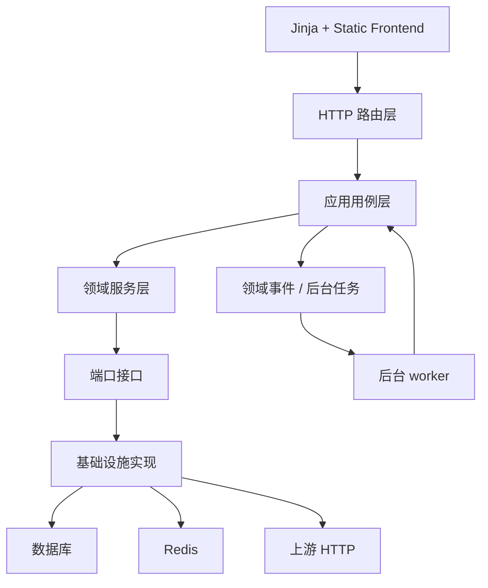

# aotu-gpt 完整改进方案

## 1. 改进目标

本方案目标是在不改变现有前端界面和现有功能的前提下，把项目逐步改造成更清晰的分层分模块架构，使不同层和不同模块之间相对独立，减少循环依赖，降低耦合，提高扩展性与可测试性。

目标状态：

- 路由层只处理 HTTP、Session、鉴权依赖、请求响应转换。
- 应用服务层负责编排用例。
- 领域服务层负责纯业务决策。
- 基础设施层负责数据库、Redis、HTTP 上游、队列、文件存储。
- 日志、计费、健康、内容防护、路由、provider、模型、API Key 各有清晰边界。
- 核心服务依赖方向单向。
- 新功能通过新增小模块或策略类接入，而不是继续扩大超大文件。
- 现有回归脚本继续通过，并逐步迁移到标准测试体系。

## 2. 改造原则

1. 禁止一次性推倒重写。
2. 每一阶段都必须保持现有接口、页面和功能可用。
3. 优先拆依赖和提取纯函数，再移动代码。
4. 每拆一个模块，都要补最小验证。
5. 对外 `/v1/*` 协议兼容性优先级最高。
6. 数据库结构改造必须独立迁移，不在 Web worker 启动时隐式 DDL。
7. 前端界面不做视觉重设计，只做文件组织和可维护性重构。

### 2026-06-08 同步原则

当前工作区已经对模型映射、路由候选和日志计费口径做了局部修正，后续改造必须沿用以下最新边界：

1. 模型映射阶段只选择目标模型，不做提供商级协议、能力、容量、熔断、内容完整性和可信策略筛选。
2. 提供商候选选择阶段统一判断端点协议、流式、视觉、工具调用、图片生成、容量、熔断、内容完整性、可信策略、健康、负载和路由得分。
3. 提供商和提供商模型挂载配置禁止继续维护或对外暴露权重字段；后续路由排序不再设计权重主策略。
4. `/v1/models` 和 `/v1/models/{model_id}` 必须作为同一官方接口族处理，鉴权、计费、Token 补算、用量统计和监控积压复用同一判断函数或等价共享契约。
5. 旧代码若仍读取 `weight`，只能经过 `priority` 兼容别名过渡；目标架构禁止重新引入真实 `weight` 数据库列、Schema 字段或用户可见表单项。
6. 模型目录、模型选项和 provider 运行时缓存必须在写操作、启动同步、迁移回填后主动失效；缓存 key 版本变更要写入对应模块说明，避免前端下拉和引用页面读到旧结构。
7. usage 明细字段必须以 `request_logs` 为事实来源，Token 补全、计费、导出、指标和用户门户展示使用同一提取规则，`stage35_logging_usage_accuracy_regression_check.py` 的场景必须纳入后续标准测试。
8. Chat Completions / Responses 端点协议支持只能来自 provider_model 挂载级协议配置；健康检查、端点测试、内容探针和能力探针只能记录观测结果，禁止自动改写或收紧协议支持。
9. 内容防护可信检测必须以固定答案、外链广告识别、流式污染检测三类必需探针为基线；人工标记可信时也必须留下可追溯的探针确认明细，但后续领域模型应明确区分人工确认和真实探针。
10. 日志中心类型化日志的筛选、时间线和导出需要拆成查询/导出用例；管理端和用户端可复用时间线构建，但用户端必须始终通过拥有者校验后再读取事件明细。
11. Chat/Responses 自动端点互转 fallback 已禁用，目标架构禁止把自动有损互转重新作为默认行为；Responses→Chat 只能作为显式开启的兼容适配插件，并默认使用 database 或其它共享存储保存会话状态。
12. API Key 不能再作为独立余额主体；余额调整和余额扣减必须落到归属用户共享账户，API Key 只保留成本累计、权限策略和所有者引用。
13. cache write token 必须有独立价格、日志字段和账单流水审计字段；缺失价格时的待解决状态不能伪装为 0 费用。
14. 后台任务必须记录锁状态、跳过原因、processed/success/failed 数量；Redis 分布式锁不可用时禁止无锁执行定时任务。
15. `/v1` CORS 预检和不支持端点兜底必须分别归类为 `v1_preflight` 与 `unsupported_endpoint`，禁止继续混入 `api_client_auth` 或真实鉴权失败日志。
16. 图片生成能力必须来自 provider_model 或模型目录的显式 `supports_image_generation=true`，前端和路由都禁止从模型名、视觉能力或工具能力启发式推断。
17. 前端重构必须把日志高级筛选/详情、provider 更多操作菜单、内容可信探针弹窗、benchmark 模型选择与报告展示拆成独立页面或组件模块；拆分过程中保持现有界面和操作流程不变。
18. 全局设置中仍存在 `route_mode/default_provider_id/manual_allow_fallback` 历史兼容面；目标架构应通过 `RouteSettingsPolicy` 把它们解释为兼容配置或迁移输入，用户可见路由主策略仍收敛为健康优先。
19. `base.html` 与 `auth_base.html` 静态资源版本参数必须随 `app/static/` 可执行资源变化同步更新；当前最新版本为 `app.css?v=20260608-06`、`app.js?v=20260608-32`。
20. `RequestContentGuardEvent` 已经不只存在于 ORM 和请求时间线中，当前已有独立内容防护事件列表、筛选、导出入口和前端 Tab；目标日志体系必须继续把详情、CSV、请求详情摘要、内容防护页面最近事件收敛到同一 projection 和稳定 schema。
21. typed log 导出必须有稳定 schema 和表头版本；计费日志、内容防护日志、后台任务日志不能依赖当前结果集动态推导字段。
22. 后台任务观测必须区分调度任务锁事件和后台队列消费状态。`BackgroundJobEvent` 记录调度运行，队列观测记录 backlog、消费延迟、重试、死信、worker 存活和 stale running。

## 3. 目标架构

建议新增逻辑目录：

- `app/application/`：应用用例编排。
- `app/domain/`：领域对象、策略、纯业务规则。
- `app/infrastructure/`：数据库仓储、Redis、上游 HTTP、队列实现。
- `app/adapters/`：OpenAI 协议适配、provider 协议适配。
- `app/repositories/`：ORM 查询封装，可放在 infrastructure 下。
- `tests/`：标准测试。

此目录不是第一步必须全部新建，可以按模块渐进落地。

## 4. 阶段一：建立架构边界和依赖守卫

### 要改进的地方

当前没有自动化规则阻止 router 直接调用模型、service 互相循环依赖、基础设施反向依赖业务层。

### 如何改进

1. 增加架构依赖检查脚本，例如 `scripts/check_architecture_dependencies.py`。
2. 检查规则先从宽松开始：
   - `app/models` 禁止依赖 `app/services`、`app/routers`。
   - `app/schemas` 禁止依赖 `app/routers`。
   - `app/routers` 允许依赖 `services` 和 `schemas`，但新增代码禁止直接依赖 `models`。
   - `app/services` 暂时允许现有循环，但新增循环要失败。
3. 输出当前循环依赖白名单，把本次发现的 16 模块循环记录为待治理项。
4. 后续每拆掉一个循环，就从白名单移除。

### 改进后的效果

架构不会继续恶化。新增代码必须按目标方向写，避免“边拆边新增耦合”。

### 验收标准

- 执行 `.\.venv\Scripts\python.exe scripts/check_architecture_dependencies.py` 能输出当前依赖图。
- 脚本能识别当前服务层 16 模块循环。
- 新增一个模拟的非法依赖时脚本能失败。
- 不影响任何现有业务接口。

## 5. 阶段二：拆分代理主链路

### 要改进的地方

`app/services/proxy_service.py` 约 9336 行，是最大耦合中心。它同时处理：

- 请求能力识别。
- 模型映射，且只解析源模型到目标模型。
- 路由候选，负责提供商级协议、能力、容量、熔断、信任和内容完整性判断。
- Token 预检。
- legacy images 转换。
- Responses/Chat endpoint fallback。
- 上游请求。
- 流式响应。
- 内容防护。
- 请求日志。
- Token/计费入队。
- provider 状态更新。
- 错误分类和重试。

### 如何改进

第一步不移动大块业务，只抽类型和流程对象：

1. 新增 `app/application/proxy_context.py`
   - `ProxyRequestContext`
   - `ProxyRouteContext`
   - `ProxyAttemptResult`
   - `ProxyResponseContext`

2. 新增 `app/application/proxy_pipeline.py`
   - `prepare_request_context`
   - `resolve_model_mapping`
   - `select_route_candidates`
   - `execute_upstream_attempt`
   - `finalize_proxy_result`

   其中 `resolve_model_mapping` 只允许返回目标模型和映射 trace；`select_route_candidates` 才允许调用提供商挂载、容量租约、健康熔断、内容完整性、可信策略和端点协议判断。

3. 从 `ProxyService._forward_json_request_once` 和 `_forward_stream_request_once` 中提取共同前置逻辑：
   - reasoning 字段规范化。
   - 模型名和 requested_model 解析。
   - 图片、工具、图片生成能力识别。
   - route_context 内容防护策略注入。
   - request_id、conversation_key、session_id 构造。
   - required_capabilities_json 生成。

4. 图片接口单独拆出：
   - `app/adapters/openai/images_adapter.py`
   - 包含 legacy image generation/edit/variation payload 构造和响应合并。

5. 管理类接口单独拆出：
   - `app/adapters/openai/management_adapter.py`
   - 包含 Files、Responses retrieve/cancel/delete、Chat completion management 等请求转发。

### 改进后的效果

- `ProxyService` 从“所有逻辑中心”变为“兼容入口 facade”。
- Chat 和 Responses 的流式/非流式前置流程复用。
- 图片接口、管理接口后续可独立测试。

### 验收标准

- `/v1/chat/completions` 非流式和流式回归通过。
- `/v1/responses` 非流式和流式回归通过。
- `/v1/images/generations`、`edits`、`variations` 回归通过。
- `stage7`、`stage9`、`stage10`、`stage11`、`stage12`、`stage19`、`stage21`、`stage23`、`stage31` 至少通过。
- `proxy_service.py` 行数下降，或新增模块承接明确职责。

## 6. 阶段三：解耦 Responses Chat Adapter

### 要改进的地方

`ResponsesChatAdapterService` 依赖 `ProxyService`，而 `ProxyService` 也调用适配器，形成双向依赖。

### 如何改进

1. 定义端口接口：
   - `UpstreamJsonSender`
   - `UpstreamStreamSender`
   - `ProviderResolver`

2. `ResponsesChatAdapterService` 不再 import `ProxyService`，而是接收 sender 函数或接口实例。

3. 在应用层编排中注入：
   - 原生 Responses 转发 sender。
   - Chat Completions 转发 sender。

4. 将适配器内部状态存储拆成：
   - `AdapterStateMemoryStore`
   - `AdapterStateRedisStore`
   - `AdapterStateDatabaseStore`

5. 正式代理流程禁止默认自动 Chat/Responses 端点互转；应用层只在管理员显式启用 Responses→Chat 兼容适配时调用适配器。

### 改进后的效果

协议适配器成为可替换模块。代理层依赖适配器接口，适配器不反向依赖代理服务。

### 验收标准

- import 图中不存在 `responses_chat_adapter_service -> proxy_service`。
- `stage31_responses_chat_adapter_regression_check.py` 通过。
- adapter 的 memory/redis/database 存储单元测试通过。
- 未显式启用 Responses→Chat 适配时，Chat-only 上游收到 `/v1/responses` 请求必须返回端点不支持诊断，而不是自动有损 fallback。
- database 存储为默认配置时，`previous_response_id` 状态能跨 worker 读取，并且过期清理由后台任务记录 processed 数。
- `stage31_responses_chat_adapter_regression_check.py` 必须同时断言运行时默认值和 `Settings` schema 默认值均为 `database`，禁止配置层和运行层默认值漂移。

## 7. 阶段四：重构路由决策模块

### 要改进的地方

路由决策分散在 `ProxyService`、`RouterService`、`ModelMappingService`、`ProviderCapacityService`、`ProviderHealthStateService`、`ApiKeyService`。

### 如何改进

1. 新增领域对象：
   - `RouteRequest`
   - `RouteCandidate`
   - `RouteConstraint`
   - `RouteDecision`
   - `RouteRejectReason`

2. 新增 `RoutingEngine`，只负责纯排序和过滤。

3. 输入数据由应用层提前准备：
   - 已授权模型。
   - 已授权 provider。
   - provider 能力快照。
   - provider 容量快照。
   - 健康状态快照。
   - 内容完整性状态快照。

4. `RouterService` 逐步退化为数据加载和调用 `RoutingEngine` 的 facade。

5. 重试策略拆成 `RetryPolicy`：
   - 不可恢复错误直接失败。
   - 可恢复错误按等待窗口重试。
   - 无限重试仅在显式启用时允许。

6. 新增 `RouteSettingsPolicy`：
   - 消化历史全局 `route_mode`、`default_provider_id`、`manual_allow_fallback`。
   - 正式 `/v1/*` 候选选择只暴露健康优先、容量、候选数、重试等待、可信策略等仍有效配置。
   - 若需要保留默认 provider 直连测试，只允许作为内部 playground 或 provider 测试入口，不作为正式路由主策略。

### 改进后的效果

- 路由策略可用纯单元测试覆盖。
- 新增策略不需要改代理主链路。
- API Key 权限、容量和健康状态的职责边界更清楚。

### 验收标准

- `RoutingEngine` 单元测试覆盖健康优先、会话粘性、容量硬过滤、provider RPM/QPS、内容完整性过滤、候选数上限。
- `RoutingEngine` 单元测试必须覆盖“模型映射已选定目标模型后，提供商候选阶段再判断端点协议、流式、视觉、工具调用、图片生成、容量、熔断、内容完整性和可信策略”。
- 权重字段不得作为候选排序输入；排序输入应收敛为健康、当前负载、路由得分、失败率、成本、会话粘性和硬约束过滤结果。
- 内容完整性、可信等级和内容违规次数不得作为软排序加减分重复参与评分；它们只能通过候选硬过滤、诊断原因、运行时内容防护策略或事件证据表达。
- 路由单元测试必须覆盖端点协议权威来源：Chat 请求只命中挂载级配置支持 `chat_completions` 的 provider_model，Responses 请求只命中挂载级配置支持 `responses` 的 provider_model；健康探针失败不得自动修改协议支持。
- 路由和能力测试必须覆盖图片生成能力只接受显式 `supports_image_generation=true`；未显式开启时，即使模型名包含 image、具备 vision 或 tools，也不得进入图片生成候选。
- 设置页和对外文档不得继续把手动、权重、默认 provider、故障切换当作正式路由主策略；若历史字段仍保留，必须有迁移测试证明正式候选选择不受旧主策略分支影响。
- `stage14`、`stage25`、`stage28`、`stage30`、`stage33` 通过。
- `RouterService` 不再直接依赖 `LogService`，诊断信息作为返回值交给上层写日志。

## 8. 阶段五：拆分 Provider 与模型目录模块

### 要改进的地方

`ProviderService` 和 `ModelCatalogService` 相互依赖，并且 provider 写操作会同步影响模型目录、API Key 授权、缓存等。

### 如何改进

1. 拆分 `ProviderService`：
   - `ProviderCrudService`
   - `ProviderImportService`
   - `ProviderCredentialService`
   - `ProviderModelMountService`
   - `ProviderCapabilityService`
   - `ProviderQueryService`

2. 拆分 `ModelCatalogService`：
   - `ModelCatalogCrudService`
   - `ModelCatalogQueryService`
   - `ModelPricingSyncService`
   - `ModelHealthAggregationService`

3. 建立领域事件：
   - `ProviderCreated`
   - `ProviderUpdated`
   - `ProviderDeleted`
   - `ProviderModelsChanged`
   - `ModelCatalogChanged`

4. API Key 授权同步、缓存失效、模型价格同步通过事件处理，不由 provider 服务直接调用 API Key 管理服务。

### 改进后的效果

- provider 模块不再反向依赖 API Key 管理模块。
- 模型目录和 provider 挂载的同步逻辑可追踪。
- 批量导入、模型发现、价格同步可以独立测试。

### 验收标准

- import 图中不存在 `provider_service -> api_key_admin_service`。
- import 图中不存在 `provider_service <-> model_catalog_service` 双向依赖。
- provider CRUD、批量导入、模型发现、模型目录页面回归通过。
- `stage22`、`stage24`、`stage29`、`stage30` 通过。

## 9. 阶段六：重构 API Key 与用户额度模块

### 要改进的地方

API Key 模块同时包含凭据、鉴权、权限、限额、余额、用量回写、管理端批量操作和缓存失效。

### 如何改进

1. 拆分服务：
   - `ApiKeyCredentialService`：生成、hash、加密、轮换、格式校验。
   - `ApiKeyAuthService`：Bearer 解析、鉴权、AuthContext 构造。
   - `ApiKeyPolicyService`：模型/端点/provider/source IP 权限判断。
   - `ApiKeyAdminCommandService`：创建、更新、批量操作。
   - `ApiKeyAdminQueryService`：分页、详情、统计、导出。
   - `ApiKeyUsageService`：用量累加与缓存失效。

2. `UserQuotaService` 只处理用户额度策略，不直接调用日志和计费服务取复杂数据；需要的数据由 query service 提供。

3. API Key 与用户账户余额边界：
   - API Key 创建和更新必须显式绑定 `owner_user_id`，未绑定时不得创建可计费正式 Key。
   - API Key 不再支持独立充值或独立余额调整。
   - API Key 查询可以展示共享账户余额快照，但余额来源必须标明为归属用户。
   - 历史 `balance_amount`、`total_recharge_amount`、`token_limit_total`、`request_limit_daily`、`cost_limit_daily` 等字段必须通过迁移删除或在旧库残留检查中标记为不可用；目标数据模型、表单提交和账单命令禁止把 `balance_amount`、`total_recharge_amount` 作为 API Key 自有余额字段读取或写入。查询 DTO 仅可展示归属用户余额快照，并必须在展示文案中明确其共享账户来源。

4. API Key 策略模板边界：
   - 策略模板允许沉淀 `content_guard_required`，并在按模板创建或更新 API Key 时传递到 Key 策略。
   - 模板中的 `content_guard_required=false` 只能表达关闭运行时内容检测，不得表达绕过 blocked、低分或可信策略硬过滤。
   - 正式 migration、启动期兼容 DDL、Schema、序列化和模板应用服务必须同时覆盖该字段，禁止出现旧库有字段但模板 API 丢字段，或新库无字段但服务读写字段的漂移。

5. 缓存失效通过事件：
   - `ApiKeyPolicyChanged`
   - `ApiKeyCredentialRotated`
   - `UserQuotaChanged`
   - `BillingFinalized`

### 改进后的效果

- 鉴权链路可独立测试。
- 管理端批量操作不污染对外请求链路。
- 用量和余额更新有明确入口。
- API Key 管理模块只处理凭据和策略，不再夹带账本写入或充值逻辑。

### 验收标准

- `ApiKeyAuthService` 单元测试覆盖有效 Key、禁用、过期、来源 IP、端点、模型、余额不足、限额超限。
- `stage8`、`stage10`、`stage25`、`stage34` 通过。
- import 图中 `api_key_service` 不再依赖 `billing_service` 和 `user_quota_service`，而由应用层组合。
- API Key 独立余额调整入口不可用；用户余额调整、请求扣费和账单导出均以用户账户账本为准。

## 10. 阶段七：统一日志和事件系统

### 要改进的地方

当前存在旧的 `LogService.create_log` 和新的 `app/logging/*` 事件系统并存，且 `request_adapter` 与 `LogService` 互相依赖。

### 如何改进

1. 明确三类日志：
   - 请求摘要：`request_logs`
   - 请求链路事件：`request_*_events`
   - 系统/审计事件：exception、health、billing、background、user operation、asset

2. 新增 `RequestLogWriter`：
   - 只负责写 `request_logs`。
   - 不负责查询、指标、CSV。

3. 新增 `RequestEventWriter`：
   - 通过 `LoggingDispatcher` 写事件表。

4. 拆分 `LogService`：
   - `RequestLogQueryService`
   - `LogMetricService`
   - `LogExportService`
   - `ConversationReplayService`

5. `request_adapter` 不再调用 `LogService`，只生成事件或调用 writer。

6. 入口日志类型单独建模：
   - `unsupported_endpoint`：外部请求命中了项目不支持的 `/v1/*` 路径。
   - `v1_preflight`：CORS OPTIONS 预检。
   - `api_client_auth`：只表示 API Key 解析、鉴权或授权相关事件。

7. 前端日志详情的原始 JSON 截断上限、计费 token/价格分组和后台任务/素材事件展示必须由 DTO 或展示策略驱动，避免 `app.js` 手写多套字段解释。

8. 在现有内容防护 typed event 入口基础上补齐查询服务、投影和详情：
   - 保留当前 `/api/logging/content-guard-events` 或等价接口作为基线，不再把“新增接口”作为后续架构升级目标。
   - 支持时间、trace、request_log_id、guard_stage、guard_result、risk_level、action、provider/model 筛选。
   - 保留前端日志页已有“内容防护日志”Tab，并把字段解释迁出 `app.js` 的硬编码列配置。
   - 请求日志详情中的内容防护摘要可以展开或关联到对应 typed event 证据。

9. 为 typed CSV 导出建立稳定字段契约：
   - 每类日志定义固定表头和字段顺序。
   - 空结果也输出表头。
   - 字段新增必须通过 schema version 或兼容字段追加方式处理。
   - 计费日志若继续合并 token finalize 与 billing process，必须在导出和前端详情中明确事件族；若无法保持清晰，则拆成两个 Tab。

### 改进后的效果

- 日志写入路径单向。
- 查询、导出、指标不会影响代理主链路。
- 新增事件类型时只扩展 registry 和模型。
- CORS 预检、不支持端点、鉴权失败和授权失败能在日志列表、类型化筛选、CSV 导出和时间线中清晰区分。
- 内容防护事件成为日志中心一等对象，管理员可以不进入请求详情也能按内容防护事件筛选、审计和导出。
- CSV 导出可被长期审计或脚本消费，不会因为当前查询结果为空或字段稀疏而丢失表头。

### 验收标准

- import 图中不存在 `log_service -> request_adapter -> log_service`。
- 管理端日志列表、用户日志列表、日志详情、会话回放、CSV 导出功能不变。
- `unsupported_endpoint` 与 `v1_preflight` 不出现在鉴权失败统计中；日志中心中文标签分别显示为“不支持端点日志”和“CORS 预检日志”或等价中文文案。
- `/api/logging/content-guard-events` 或等价接口保持可用；日志页面已有内容防护 typed event Tab；架构升级后的内容防护事件查询、详情和 CSV 导出都由统一 projection 驱动，且 CSV 拥有稳定表头。
- typed log 导出空结果时仍输出固定表头；计费事件导出能区分 token finalize 与 billing process 字段。
- `stage8_log_regression_check.py`、`stage16_observability_regression_check.py`、`stage32_error_catalog_completeness_check.py`、`stage34_logging_system_regression_check.py` 通过。

## 11. 阶段八：拆分 Token 与计费状态机

### 要改进的地方

`TokenUsageService` 和 `BillingService` 与日志、API Key 缓存、用户额度相互耦合，计费状态靠多个字段组合表达。当前代码已经把 API Key 独立余额迁向归属用户共享账户，并通过 `2026-06-08_fix_billing_owner_and_cache_write.sql` 回填 owner 与 cache read/write 账单字段，通过 `2026-06-08_drop_api_key_legacy_route_quota_fields.sql` 删除历史 Key 级路由/额度/余额字段；这说明目标不是再做功能改动，而是把已形成的新账本口径抽成稳定领域模块。

### 如何改进

1. 拆分：
   - `TokenEstimator`
   - `UsageExtractor`
   - `TokenFinalizeWorker`
   - `CostCalculator`
   - `BillingCommandService`
   - `BalanceLedgerService`

2. 引入明确状态机：
   - `usage_pending`
   - `usage_finalized`
   - `billing_pending`
   - `billing_completed`
   - `billing_retryable_failed`
   - `billing_final_failed`

3. 所有余额变动使用 ledger 命令，确保幂等：
   - 幂等键可使用 `request_log_id + billing_stage`。

4. 费用计算纯函数化，输入模型价格、provider multiplier、usage，输出费用明细。
   - input token
   - output token
   - cache read token
   - cache write token
   - 后续可扩展 reasoning/audio/prediction token

5. 保持现有业务功能不变的前提下重排职责：
   - API Key 鉴权只读取归属用户余额快照、授权策略和实时限流快照。
   - `UsageExtractor` 只解释上游官方 usage，不写账单、不读用户余额。
   - `CostCalculator` 只计算费用明细，不落库、不失效缓存。
   - `BillingCommandService` 负责幂等扣费、账单流水、`billing_status` 状态推进和缓存失效事件。
   - `QuotaCounter` 负责 Redis request/token/cost 的 total/day/month 计数，避免计数散落在 Token 补全和鉴权服务中。

### 改进后的效果

- Token 提取和费用计算可高覆盖测试。
- 计费失败和重试状态更清晰。
- API Key 缓存失效由计费完成事件触发。
- 账单流水能完整追溯 cache read/write token 与读写单价，用户门户、管理端和 CSV 导出展示一致。
- API Key 管理、用户账户余额、请求日志 usage 和账单流水的边界更清楚：Key 是凭据和授权主体，用户账户是余额主体，request_logs 是 usage 与请求事实来源，账单记录是资金变动审计来源。

### 验收标准

- 费用计算单元测试覆盖普通 token、cache read/write、图片生成、多价格层、缺失 usage。
- `stage27_prompt_cache_usage_regression_check.py` 通过。
- `stage35_logging_usage_accuracy_regression_check.py` 覆盖 usage 明细、cache write 价格、模型发现接口族排除、非计费日志排除和待解决价格状态。
- 重复执行同一 billing finalize 不会重复扣费。
- `price_unresolved`、`price_unset`、`pending_tokens` 必须保持待处理状态，禁止被当作 0 费用完成账单。
- API Key 表、创建/更新 Schema、表单提交、导出和账单命令不得继续把旧 `balance_amount`、`total_recharge_amount`、`route_mode`、`default_provider_id`、`max_candidate_count`、历史总额/日额限额字段当作 Key 自有配置读取或写入；旧字段若在兼容迁移前残留，只能由迁移检查报告读取。API Key 查询响应若继续暴露 `balance_amount`、`total_recharge_amount`，必须表示归属用户共享余额快照，并与用户账户余额事实来源一致。
- 归属用户为空的 API Key 不得通过正式鉴权；修复迁移必须先回填或阻断，而不是在请求链路临时猜测 owner。

## 12. 阶段九：拆分健康检查模块

### 要改进的地方

`HealthService` 约 3682 行，并依赖代理主链路，导致健康检查不是独立模块。

### 如何改进

1. 拆分：
   - `ProviderConnectivityProbe`
   - `ModelTextProbe`
   - `CapabilityProbe`
   - `ContentIntegrityProbe`
   - `HealthProbeRunner`
   - `HealthResultWriter`
   - `CircuitBreakerService`

2. 探针只依赖：
   - provider 配置。
   - provider model 配置。
   - upstream client。
   - content guard detector。

3. 探针结果通过统一 DTO 返回：
   - success
   - status_code
   - latency_ms
   - capability
   - endpoint_path
   - error_code
   - evidence

4. 状态更新由 `HealthResultWriter` 统一执行。

### 改进后的效果

- 健康检查可脱离完整代理链路测试。
- 调度任务只调用 health facade，不感知细节。
- 新增能力探针只需注册 probe。

### 验收标准

- import 图中不存在 `health_service -> proxy_service`。
- 手动 provider 测试、单模型测试、批量测试、定时 L0/L1/L2/L3 探测功能不变。
- `stage14`、`stage27_provider_partial_health`、`stage33` 通过。

## 13. 阶段十：内容防护模块边界治理

### 要改进的地方

内容防护检测、处置、provider 状态更新、路由排除、监控自动隔离分布在多个服务中。当前代码已经开始向目标边界移动：`ContentGuardRuleService` 承接规则与算法入口，`ContentRuntimeGuardService` 承接正式请求过程中的防护，`ContentTrustProbeService` 承接预先可信探针和路由可信决策。但这仍是过渡态，`ContentGuardRuleService` 还继承原 `ContentGuardService`，`ContentRuntimeGuardService` 仍导入 `ProxyService` 复用 SSE 解析、错误构造和违规落库 helper。

根目录 `内容防护模块问题全审查.md` 已把内容防护问题扩展归档到 700 条，后续阶段十必须把其中共性问题纳入验收范围：配置缓存失效、规则引擎语义、`content_guard_required=false` 可选检测语义、运行时策略动作、可信探针选择与恢复闭环、外部渠道 SSRF 与密钥安全、typed event 投影和稳定 schema、日志详情证据展示和内容防护前端交互可用性。

根目录 `问题.md` 进一步暴露了当前中间态风险：内容防护 typed event 的独立列表、日志 Tab、导出入口和正式迁移已经补齐，但事件详情、请求摘要、内容防护页面最近事件和 CSV 表头仍缺少统一投影；手动健康测试的内容探针未完整写入健康事件；SSE 探针、文本检测和 JSON 检测可能使用不同规则口径；`record_only` 或关闭高风险拦截时仍可能提前污染 provider 治理状态；规则基础校验已有改善，`image_url` 已开始进入响应扫描，外部目标也已做 DNS 解析私网拒绝，但规则 JSON 损坏提示、ReDoS 复杂度、工具参数/复杂 Responses 扫描一致性、外部检测 API Key 生命周期和 DNS 解析到真实请求之间的绑定仍需要治理。

### 如何改进

1. 定义：
   - `GuardInput`
   - `GuardResult`
   - `GuardDecision`
   - `GuardAction`

2. 保留并完善当前三段拆分：
   - `ContentGuardRuleService` 继续作为规则注册、规则解析、文本/JSON/SSE 检测和风险评分入口，但要逐步摆脱对原巨型 `ContentGuardService` 的继承关系。
   - `ContentRuntimeGuardService` 继续作为非流式响应检测、流式首段预缓冲检测、后续 chunk 检测、运行时动作决策入口。
   - `ContentTrustProbeService` 继续作为固定答案、外链广告识别、流式污染检测三类必需探针的编排入口，并负责聚合可信检测结果。

3. `ContentGuardService` 逐步退化为兼容门面或被拆空，最终只保留检测能力到 `ContentGuardRuleService` / `ContentInspector`。

4. 新增或收敛 `ContentGuardPolicyService` 负责把检测结果转成动作：
   - allow
   - block
   - switch_provider
   - alert_only

5. 新增 `ContentIntegrityStatusService` 负责 provider / provider_model 内容完整性状态更新。

6. 把 `ContentRuntimeGuardService` 中对 `ProxyService` 的反向调用拆出：
   - SSE payload 解析迁入 `SseEventParser` 或协议基础设施工具。
   - `_append_limited_bytes` 迁入通用流式缓冲工具。
   - 内容防护错误对象构造迁入统一错误目录或 `ContentGuardErrorFactory`。
   - 违规落库迁入 `ContentGuardViolationWriter` 端口，由应用层注入实现。

7. 路由层只读取内容完整性状态和 `ContentTrustProbeService.get_trust_decision_for_route` 产出的决策，不负责实时计算探针。

8. 新增 `ContentGuardConfigApplicationService` 或等价用例，统一保存设置、规则、URL 白名单、自动预检间隔和外部检测配置；写入后必须失效 settings、provider runtime、route candidates、v1 models、模型选项等受影响缓存。

9. 在现有外部目标 `https`、localhost/内网/IP 地址校验和 DNS 解析私网拒绝基础上新增 `ExternalContentProbePolicy`，继续补齐 DNS 解析结果与真实请求绑定、响应大小、总超时、API Key 清理、base_url 日志脱敏和稳定外部目标 ID，禁止外部检测成为 SSRF、密钥泄露或审计不可追踪入口。

10. 新增 `ContentGuardEventProjection`，统一 request_logs 摘要、request_content_guard_events、日志详情和 CSV 导出的字段口径，必须包含 stage、action、final_strategy、retry_count、buffer_wait_ms、matched_rules、matched_excerpt、provider/model 状态变化等可追溯证据。

11. 内容防护前端拆成页面模块和组件：配置表单、规则表、规则编辑器、探针选择、内部/外部检测、结果详情、危险操作确认、密钥输入清理和移动端详情披露分开维护。

12. 新增 `ContentGuardActionStateMachine` 或等价策略矩阵，明确以下关系：
   - `guard_result=block` 不等于一定拦截请求。
   - `record_only` 只写证据，不得扣分、熔断或自动隔离。
   - `switch_provider` 只在尚未向客户端发送 SSE 数据前允许。
   - `safe_error` 必须写终态事件，但不得重复写多条 summary 请求日志污染一次用户请求统计。
   - provider/model 状态更新必须由策略矩阵输出的 `state_change` 驱动，禁止检测函数直接写状态。
   - 当前 `ContentGuardProbeService` 已在单次 `block` 或连续失败达到阈值时直接写入 provider_model `blocked` 和熔断打开；重构后该行为必须迁入状态机，由探针来源、全局开关、高风险策略、`record_only` 语义和恢复策略共同决定。

13. 把当前 schema 层已有的规则校验上移为 `ContentGuardRuleValidationService`：
    - 继续复用已落地的 regex、枚举、动作语义、`allow`/`block` 约束和 `reason` 保留规则。
    - 规则 JSON 损坏时返回明确错误，不静默回退默认规则。
    - URL 白名单继续保持“仅显式配置域名”策略，禁止把用户请求里的任意域名自动提升为长期允许域。
    - 增加重复 ID、导入/重置预览、ReDoS 复杂度和文本、JSON、SSE、工具参数、复杂 Responses 输出、`image_url` 等结构化输出字段的同一提取与扫描规则；当前 `image_url` 已开始扫描，重构要把该能力固化为规则引擎契约而不是单点 helper。

14. 新增 `HealthContentProbeProjection`：
   - 手动模型健康测试附带的 `content_probe_results` 必须展开为健康探针事件或内容防护事件。
   - 健康日志详情、健康导出、手动测试弹窗看到同一份内容探针明细。
   - 内容污染不得默认计入普通 provider 健康失败；需要单独事件分类和统计口径。

### 改进后的效果

- 检测、决策、状态写入、告警各自独立。
- 规则扩展不会影响代理和监控。
- 代理主链路只编排内容防护输入输出，不再被内容防护服务反向依赖。
- 可信探针、运行时检测和规则算法可以分别测试，且三类必需探针口径不会被健康检查或路由层重复实现。
- 配置变更、规则变更、可信状态变更和自动隔离都能触发明确缓存失效，避免路由候选、模型列表和前端展示继续读旧状态。
- 外部渠道检测具备安全边界，日志中能追踪目标但不泄露密钥或敏感 base_url。
- 内容防护事件、请求日志摘要、健康探针事件和 provider/model 状态变化具备统一证据链，管理员能从一次污染请求追溯到命中规则、动作策略、是否切换 provider、是否更新状态、是否触发告警。
- 仅记录策略、关闭高风险拦截、关闭内容防护总开关时，系统不会继续隐式隔离或降级 provider；历史 blocked 状态的处理有明确兼容策略和恢复入口。

### 验收标准

- 内容规则注册表单元测试通过。
- 流式高风险首段前切换、首段后 error 结束行为不变。
- `ContentRuntimeGuardService` 不再 import `ProxyService`。
- `ContentGuardRuleService` 不再继承原巨型 `ContentGuardService`，规则解析、默认规则、检测算法都有独立单元测试。
- `/api/content-guard/trust-probe`、`/api/content-guard/precheck/probe`、路由可信筛选和健康内容探针均复用同一探针聚合逻辑。
- `stage33_content_guard_regression_check.py` 覆盖 `ContentTrustProbeService`、`ContentRuntimeGuardService`、`/trust-probe` 和内容防护路由联动，并保持通过。
- `stage33_content_guard_regression_check.py` 通过。
- `content_guard_required=false` 的目标语义按当前代码收敛为关闭该请求的运行时内容检测；它不得被解释为允许绕过 blocked、低分或可信策略硬过滤。前端、后端、路由缓存 key 和文档必须统一表达这一区分。
- `run_trust_probe` 若固定执行必需三件套，前端不得展示可被误解为会改变后端必需探针的复选项；若允许用户选择可选探针，结果中必须区分“必需探针”和“附加探针”。
- blocked provider/model 必须有明确恢复路径，探针通过、管理员手动恢复和自动恢复三种来源都要写入可追溯原因。
- 内部可信探针只有在本次 probe_keys 覆盖完整必需探针时才允许持久化可信状态；缺少任一必需探针时只能展示本次结果，不能更新 provider_model 可信状态。
- 外部渠道检测必须继续拒绝内网地址、非法协议和解析到内网的域名，并补齐 DNS 解析结果与真实请求绑定、超长响应、总超时、日志脱敏与检测完成后前端 API Key 清理。
- 类型化日志表已有正式 migration；后续验收必须从空库执行迁移后验证 `/api/logging/*`、内容防护事件查询、详情投影和 CSV 稳定表头可用。
- 内容防护页面必须有浏览器 smoke：规则新增/编辑/删除确认、探针执行、外部检测、空 provider 状态、加载失败重试、移动端规则详情不溢出。
- `record_only`、关闭高风险拦截、关闭内容防护总开关三种场景必须有回归测试，证明不会误扣 provider 内容完整性分、误熔断、误写 blocked 或误计入健康失败。
- 单次 `block` 探针、连续失败 3 次、手动可信探针、自动健康探针四类场景必须分别测试：只有状态机允许的自动处置才能写入 `blocked`、打开熔断或触发路由排除；仅记录和关闭开关场景只能写事件证据。
- 健康检查回归必须证明手动模型测试中的内容探针会落到可查询事件，且健康日志详情能展示固定答案、外链广告识别、流式污染检测的结果。
- SSE 探针、文本检测、JSON 检测必须复用同一规则 JSON；自定义规则保存后，三条检测链路都能命中同一规则。
- 规则编辑回归必须覆盖 `reason` 字段保存、非法 regex 拒绝、规则 JSON 损坏提示、重复 ID、ReDoS 复杂度、`image_url` 外链扫描、工具参数/复杂 Responses 输出扫描和 URL 白名单显式域边界。
- 内容防护切换 provider 时，一次外部用户请求在请求统计中只能形成一个用户可见 summary，候选切换过程通过 typed event 表达。

## 14. 阶段十一：前端静态资源模块化

### 要改进的地方

`app/static/js/app.js` 约 15820 行，`app/static/css/app.css` 约 12461 行，所有页面逻辑集中在单文件。当前新增的日志高级筛选、类型化日志详情、provider 固定定位操作菜单、内容防护可信探针弹窗、内容防护 Tab 切换、治理列表恢复/隔离操作、探针结果自动切 Tab、benchmark 模型选择器和报告工作流都继续堆在同一脚本中，前端模块化已不仅是代码整洁问题，而是后续功能可测试性问题。

### 如何改进

在不改变视觉和功能前提下拆分文件：

1. JS 拆分建议：
   - `static/js/core/api.js`
   - `static/js/core/theme.js`
   - `static/js/core/navigation.js`
   - `static/js/core/modal.js`
   - `static/js/core/toast.js`
   - `static/js/core/table.js`
   - `static/js/components/tooltip.js`
   - `static/js/components/action_menu.js`
   - `static/js/components/log_detail_modal.js`
   - `static/js/components/charts.js`
   - `static/js/pages/dashboard.js`
   - `static/js/pages/providers.js`
   - `static/js/pages/models.js`
   - `static/js/pages/api_keys.js`
   - `static/js/pages/logs.js`
   - `static/js/pages/benchmark.js`
   - `static/js/pages/content_guard.js`
   - `static/js/pages/provider_models.js`
   - `static/js/pages/user_home.js`
   - `static/js/pages/user_api_keys.js`
   - `static/js/app_bootstrap.js`

2. CSS 拆分建议：
   - `tokens.css`
   - `base.css`
   - `layout.css`
   - `components.css`
   - `tables.css`
   - `forms.css`
   - `pages/*.css`

3. 先可以继续在 `base.html` 多 script 引入，不强制引入构建工具。

4. 拆分时保持资源版本参数更新，避免缓存问题。

5. 模型能力展示拆成共享能力展示组件：`supports_stream`、`supports_tools`、`supports_vision`、`supports_image_generation` 都从后端 DTO 读取，其中图片生成只接受显式 true。

6. benchmark 页面拆分时保留模型选择、端点过滤、任务启动/停止、轮询进度、报告链接和 token 单位展示，禁止把真实并发探测退回为纯脚本入口。

### 改进后的效果

- 页面逻辑边界清晰。
- 修改一个页面时不必加载和理解 15000 行全局脚本。
- 后续可以逐步加前端测试。
- provider 操作菜单、日志详情弹窗、内容防护探针弹窗和 benchmark 页面可分别做 DOM smoke 测试。

### 验收标准

- 页面视觉不变。
- 主题切换、风格预设、导航、弹窗、Toast、Tooltip、复制、表格响应式仍正常。
- dashboard、providers、models、api keys、logs、user home、user api keys、user self test 等核心页面手工或 Playwright smoke 通过。
- `base.html` 与 `auth_base.html` 静态资源版本参数已同步更新到 `app.js?v=20260608-32`。
- provider 更多操作菜单在表格滚动容器内不被裁切；日志详情原始 JSON 超长时被截断展示；benchmark 任务可启动、停止、轮询并打开 HTML/JSON 报告。
- 前端页面不得重新出现对图片生成能力的模型名启发式推断。
- 日志页面必须包含内容防护 typed event Tab；类型化日志导出按钮对每种事件类型都使用稳定表头。
- 内容防护页面不得继续使用“渠道”作为 provider 的中文业务名称；外部检测若必须输入外部 API Key，提交后必须清空、脱敏或提供明显清除动作。

## 15. 阶段十二：迁移体系标准化

### 要改进的地方

迁移逻辑同时存在于 `app/main.py` 和 `migrations/*.sql`，缺少版本状态。

### 如何改进

1. 新增迁移状态表：
   - `schema_migrations`
   - fields: version、name、checksum、applied_at

2. 新增迁移执行器：
   - `scripts/apply_migrations.py`
   - 读取 `migrations/*.sql`
   - 校验 checksum
   - 按版本执行

3. 将 `app/main.py` 中 `_migrate_*` 函数逐步迁出。

4. 本地 `init_database` 可保留 `create_all`，但补字段必须转向迁移执行器。

5. 生产部署脚本只在显式 `RUN_DB_INIT=1` 时调用迁移执行器。

### 改进后的效果

- 每个环境迁移状态可追踪。
- Web worker 启动不再承担结构变更。
- 数据库变更回顾更清楚。

### 验收标准

- 新库初始化成功。
- 旧库从当前结构执行迁移不重复报错。
- `schema_migrations` 能看到已应用版本。
- 生产默认启动不执行 DDL。

## 16. 阶段十三：测试体系标准化

### 要改进的地方

当前有丰富 stage 回归脚本，但缺少标准测试目录和分层。

### 如何改进

1. 新建 `tests/`：
   - `tests/unit/`
   - `tests/integration/`
   - `tests/e2e/`
   - `tests/performance/`

2. 迁移阶段脚本：
   - 先保留根目录 stage 文件。
   - 在 `tests/regression/` 中包装调用。
   - 后续逐个拆成 pytest case。

3. 建立 fixture：
   - 临时 SQLite / PostgreSQL。
   - fake Redis。
   - mock upstream。
   - admin/user 登录。
   - provider/model/api key 初始化。

4. 为核心纯函数补单元测试：
   - Token 估算。
   - 费用计算。
   - 路由排序。
   - 内容检测。
   - 错误目录。
   - API Key 格式和权限。

### 改进后的效果

- 重构时可以快速定位是哪层失败。
- 单元测试覆盖架构拆分后的纯模块。
- stage 脚本继续作为历史回归入口。

### 验收标准

- `pytest` 可运行。
- stage7 到 stage35 仍可单独运行。
- 新增架构拆分模块有对应 unit tests。

## 17. 推荐实施顺序

1. 建立架构依赖检查和当前循环白名单。
2. 提取代理主链路上下文对象，先不移动业务。
3. 解开 `ResponsesChatAdapterService <-> ProxyService`。
4. 抽 `RoutingEngine` 和 `RetryPolicy`。
5. 拆 provider 与模型目录互相依赖。
6. 拆 API Key 鉴权、策略、管理查询、用量。
7. 统一日志事件写入路径。
8. 拆 Token 和计费状态机。
9. 拆健康检查探针。
10. 在现有 `ContentGuardRuleService`、`ContentRuntimeGuardService`、`ContentTrustProbeService` 基础上继续拆内容防护决策、处置、SSE 工具和状态写入端口。
11. 前端 JS/CSS 模块化。
12. 数据库迁移标准化。
13. stage 回归迁移到 pytest 分层。

## 18. 总体验收标准

完成全部改造后，应满足：

- 服务层强连通循环从当前 16 模块降为 0。
- `proxy_service.py`、`health_service.py`、`log_service.py`、`provider_service.py` 单文件行数显著下降，且每个新模块职责单一。
- 对外 `/v1/*` 已有兼容行为不变。
- `/v1/models` 与 `/v1/models/{model_id}` 的鉴权、计费、Token 补算、统计和监控积压口径一致，模型列表与详情类请求不被误计为正式计费模型调用。
- 管理端与用户端页面视觉不变、功能不变。
- 所有 stage 回归脚本通过，或已迁移为等价 pytest 并通过。
- 架构依赖检查脚本通过。
- 新增功能能通过新增策略、适配器或用例服务接入，不需要修改多个核心大文件。

## 19. 小问题顺手改进建议

以下问题可在架构改造过程中顺手处理，但不应优先于架构主线：

- 根目录历史临时文档较多，可整理到 `docs/archive/`，但需先确认是否仍需保留。
- `package.json` 目前没有有效前端测试或构建脚本，可在前端模块化后补充 lint/test。
- `migrations/2026-06-06_add_performance_indexes.sql` 和 fixed 版本需要明确哪个是正式使用版本。
- `run.ps1`、`start_aliyun.sh`、`start_tencent.sh` 的共同逻辑可抽成共享片段，但 shell 脚本跨平台维护需谨慎。
- 根目录存在名为 `=` 的空文件，应确认来源后再决定是否删除；本次未删除，避免误动用户文件。
