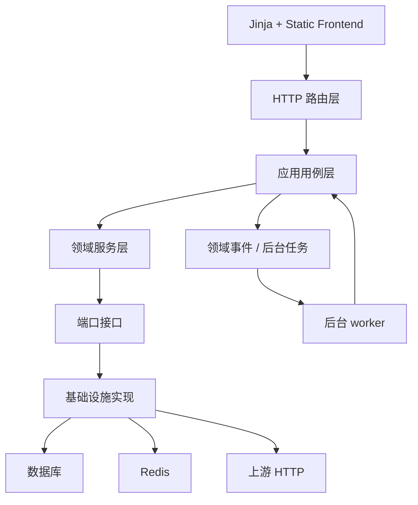

# aotu-gpt 完整改进方案

## 1. 改进目标

本方案目标是在不改变现有前端界面和现有功能的前提下，把项目逐步改造成更清晰的分层分模块架构，使不同层和不同模块之间相对独立，减少循环依赖，降低耦合，提高扩展性与可测试性。

目标状态：

- 路由层只处理 HTTP、Session、鉴权依赖、请求响应转换。
- 应用服务层负责编排用例。
- 领域服务层负责纯业务决策。
- 基础设施层负责数据库、Redis、HTTP 上游、队列、文件存储。
- 日志、计费、健康、内容防护、路由、provider、模型、API Key 各有清晰边界。
- 核心服务依赖方向单向。
- 新功能通过新增小模块或策略类接入，而不是继续扩大超大文件。
- 现有回归脚本继续通过，并逐步迁移到标准测试体系。

## 2. 改造原则

1. 禁止一次性推倒重写。
2. 每一阶段都必须保持现有接口、页面和功能可用。
3. 优先拆依赖和提取纯函数，再移动代码。
4. 每拆一个模块，都要补最小验证。
5. 对外 `/v1/*` 协议兼容性优先级最高。
6. 数据库结构改造必须独立迁移，不在 Web worker 启动时隐式 DDL。
7. 前端界面不做视觉重设计，只做文件组织和可维护性重构。

## 3. 目标架构

建议新增逻辑目录：

- `app/application/`：应用用例编排。
- `app/domain/`：领域对象、策略、纯业务规则。
- `app/infrastructure/`：数据库仓储、Redis、上游 HTTP、队列实现。
- `app/adapters/`：OpenAI 协议适配、provider 协议适配。
- `app/repositories/`：ORM 查询封装，可放在 infrastructure 下。
- `tests/`：标准测试。

此目录不是第一步必须全部新建，可以按模块渐进落地。

## 4. 阶段一：建立架构边界和依赖守卫

### 要改进的地方

当前没有自动化规则阻止 router 直接调用模型、service 互相循环依赖、基础设施反向依赖业务层。

### 如何改进

1. 增加架构依赖检查脚本，例如 `scripts/check_architecture_dependencies.py`。
2. 检查规则先从宽松开始：
   - `app/models` 禁止依赖 `app/services`、`app/routers`。
   - `app/schemas` 禁止依赖 `app/routers`。
   - `app/routers` 允许依赖 `services` 和 `schemas`，但新增代码禁止直接依赖 `models`。
   - `app/services` 暂时允许现有循环，但新增循环要失败。
3. 输出当前循环依赖白名单，把本次发现的 16 模块循环记录为待治理项。
4. 后续每拆掉一个循环，就从白名单移除。

### 改进后的效果

架构不会继续恶化。新增代码必须按目标方向写，避免“边拆边新增耦合”。

### 验收标准

- 执行 `.\.venv\Scripts\python.exe scripts/check_architecture_dependencies.py` 能输出当前依赖图。
- 脚本能识别当前服务层 16 模块循环。
- 新增一个模拟的非法依赖时脚本能失败。
- 不影响任何现有业务接口。

## 5. 阶段二：拆分代理主链路

### 要改进的地方

`app/services/proxy_service.py` 约 9336 行，是最大耦合中心。它同时处理：

- 请求能力识别。
- 模型映射。
- 路由候选。
- Token 预检。
- legacy images 转换。
- Responses/Chat endpoint fallback。
- 上游请求。
- 流式响应。
- 内容防护。
- 请求日志。
- Token/计费入队。
- provider 状态更新。
- 错误分类和重试。

### 如何改进

第一步不移动大块业务，只抽类型和流程对象：

1. 新增 `app/application/proxy_context.py`
   - `ProxyRequestContext`
   - `ProxyRouteContext`
   - `ProxyAttemptResult`
   - `ProxyResponseContext`

2. 新增 `app/application/proxy_pipeline.py`
   - `prepare_request_context`
   - `resolve_model_mapping`
   - `select_route_candidates`
   - `execute_upstream_attempt`
   - `finalize_proxy_result`

3. 从 `ProxyService._forward_json_request_once` 和 `_forward_stream_request_once` 中提取共同前置逻辑：
   - reasoning 字段规范化。
   - 模型名和 requested_model 解析。
   - 图片、工具、图片生成能力识别。
   - route_context 内容防护策略注入。
   - request_id、conversation_key、session_id 构造。
   - required_capabilities_json 生成。

4. 图片接口单独拆出：
   - `app/adapters/openai/images_adapter.py`
   - 包含 legacy image generation/edit/variation payload 构造和响应合并。

5. 管理类接口单独拆出：
   - `app/adapters/openai/management_adapter.py`
   - 包含 Files、Responses retrieve/cancel/delete、Chat completion management 等请求转发。

### 改进后的效果

- `ProxyService` 从“所有逻辑中心”变为“兼容入口 facade”。
- Chat 和 Responses 的流式/非流式前置流程复用。
- 图片接口、管理接口后续可独立测试。

### 验收标准

- `/v1/chat/completions` 非流式和流式回归通过。
- `/v1/responses` 非流式和流式回归通过。
- `/v1/images/generations`、`edits`、`variations` 回归通过。
- `stage7`、`stage9`、`stage10`、`stage11`、`stage12`、`stage19`、`stage21`、`stage23`、`stage31` 至少通过。
- `proxy_service.py` 行数下降，或新增模块承接明确职责。

## 6. 阶段三：解耦 Responses Chat Adapter

### 要改进的地方

`ResponsesChatAdapterService` 依赖 `ProxyService`，而 `ProxyService` 也调用适配器，形成双向依赖。

### 如何改进

1. 定义端口接口：
   - `UpstreamJsonSender`
   - `UpstreamStreamSender`
   - `ProviderResolver`

2. `ResponsesChatAdapterService` 不再 import `ProxyService`，而是接收 sender 函数或接口实例。

3. 在应用层编排中注入：
   - 原生 Responses 转发 sender。
   - Chat Completions 转发 sender。

4. 将适配器内部状态存储拆成：
   - `AdapterStateMemoryStore`
   - `AdapterStateRedisStore`
   - `AdapterStateDatabaseStore`

### 改进后的效果

协议适配器成为可替换模块。代理层依赖适配器接口，适配器不反向依赖代理服务。

### 验收标准

- import 图中不存在 `responses_chat_adapter_service -> proxy_service`。
- `stage31_responses_chat_adapter_regression_check.py` 通过。
- adapter 的 memory/redis/database 存储单元测试通过。

## 7. 阶段四：重构路由决策模块

### 要改进的地方

路由决策分散在 `ProxyService`、`RouterService`、`ModelMappingService`、`ProviderCapacityService`、`ProviderHealthStateService`、`ApiKeyService`。

### 如何改进

1. 新增领域对象：
   - `RouteRequest`
   - `RouteCandidate`
   - `RouteConstraint`
   - `RouteDecision`
   - `RouteRejectReason`

2. 新增 `RoutingEngine`，只负责纯排序和过滤。

3. 输入数据由应用层提前准备：
   - 已授权模型。
   - 已授权 provider。
   - provider 能力快照。
   - provider 容量快照。
   - 健康状态快照。
   - 内容完整性状态快照。

4. `RouterService` 逐步退化为数据加载和调用 `RoutingEngine` 的 facade。

5. 重试策略拆成 `RetryPolicy`：
   - 不可恢复错误直接失败。
   - 可恢复错误按等待窗口重试。
   - 无限重试仅在显式启用时允许。

### 改进后的效果

- 路由策略可用纯单元测试覆盖。
- 新增策略不需要改代理主链路。
- API Key 权限、容量和健康状态的职责边界更清楚。

### 验收标准

- `RoutingEngine` 单元测试覆盖健康优先、会话粘性、容量硬过滤、provider RPM/QPS、内容完整性过滤、候选数上限。
- `stage14`、`stage25`、`stage28`、`stage30`、`stage33` 通过。
- `RouterService` 不再直接依赖 `LogService`，诊断信息作为返回值交给上层写日志。

## 8. 阶段五：拆分 Provider 与模型目录模块

### 要改进的地方

`ProviderService` 和 `ModelCatalogService` 相互依赖，并且 provider 写操作会同步影响模型目录、API Key 授权、缓存等。

### 如何改进

1. 拆分 `ProviderService`：
   - `ProviderCrudService`
   - `ProviderImportService`
   - `ProviderCredentialService`
   - `ProviderModelMountService`
   - `ProviderCapabilityService`
   - `ProviderQueryService`

2. 拆分 `ModelCatalogService`：
   - `ModelCatalogCrudService`
   - `ModelCatalogQueryService`
   - `ModelPricingSyncService`
   - `ModelHealthAggregationService`

3. 建立领域事件：
   - `ProviderCreated`
   - `ProviderUpdated`
   - `ProviderDeleted`
   - `ProviderModelsChanged`
   - `ModelCatalogChanged`

4. API Key 授权同步、缓存失效、模型价格同步通过事件处理，不由 provider 服务直接调用 API Key 管理服务。

### 改进后的效果

- provider 模块不再反向依赖 API Key 管理模块。
- 模型目录和 provider 挂载的同步逻辑可追踪。
- 批量导入、模型发现、价格同步可以独立测试。

### 验收标准

- import 图中不存在 `provider_service -> api_key_admin_service`。
- import 图中不存在 `provider_service <-> model_catalog_service` 双向依赖。
- provider CRUD、批量导入、模型发现、模型目录页面回归通过。
- `stage22`、`stage24`、`stage29`、`stage30` 通过。

## 9. 阶段六：重构 API Key 与用户额度模块

### 要改进的地方

API Key 模块同时包含凭据、鉴权、权限、限额、余额、用量回写、管理端批量操作和缓存失效。

### 如何改进

1. 拆分服务：
   - `ApiKeyCredentialService`：生成、hash、加密、轮换、格式校验。
   - `ApiKeyAuthService`：Bearer 解析、鉴权、AuthContext 构造。
   - `ApiKeyPolicyService`：模型/端点/provider/source IP 权限判断。
   - `ApiKeyAdminCommandService`：创建、更新、批量操作。
   - `ApiKeyAdminQueryService`：分页、详情、统计、导出。
   - `ApiKeyUsageService`：用量累加与缓存失效。

2. `UserQuotaService` 只处理用户额度策略，不直接调用日志和计费服务取复杂数据；需要的数据由 query service 提供。

3. 缓存失效通过事件：
   - `ApiKeyPolicyChanged`
   - `ApiKeyCredentialRotated`
   - `UserQuotaChanged`
   - `BillingFinalized`

### 改进后的效果

- 鉴权链路可独立测试。
- 管理端批量操作不污染对外请求链路。
- 用量和余额更新有明确入口。

### 验收标准

- `ApiKeyAuthService` 单元测试覆盖有效 Key、禁用、过期、来源 IP、端点、模型、余额不足、限额超限。
- `stage8`、`stage10`、`stage25`、`stage34` 通过。
- import 图中 `api_key_service` 不再依赖 `billing_service` 和 `user_quota_service`，而由应用层组合。

## 10. 阶段七：统一日志和事件系统

### 要改进的地方

当前存在旧的 `LogService.create_log` 和新的 `app/logging/*` 事件系统并存，且 `request_adapter` 与 `LogService` 互相依赖。

### 如何改进

1. 明确三类日志：
   - 请求摘要：`request_logs`
   - 请求链路事件：`request_*_events`
   - 系统/审计事件：exception、health、billing、background、user operation、asset

2. 新增 `RequestLogWriter`：
   - 只负责写 `request_logs`。
   - 不负责查询、指标、CSV。

3. 新增 `RequestEventWriter`：
   - 通过 `LoggingDispatcher` 写事件表。

4. 拆分 `LogService`：
   - `RequestLogQueryService`
   - `LogMetricService`
   - `LogExportService`
   - `ConversationReplayService`

5. `request_adapter` 不再调用 `LogService`，只生成事件或调用 writer。

### 改进后的效果

- 日志写入路径单向。
- 查询、导出、指标不会影响代理主链路。
- 新增事件类型时只扩展 registry 和模型。

### 验收标准

- import 图中不存在 `log_service -> request_adapter -> log_service`。
- 管理端日志列表、用户日志列表、日志详情、会话回放、CSV 导出功能不变。
- `stage8_log_regression_check.py`、`stage16_observability_regression_check.py`、`stage32_error_catalog_completeness_check.py`、`stage34_logging_system_regression_check.py` 通过。

## 11. 阶段八：拆分 Token 与计费状态机

### 要改进的地方

`TokenUsageService` 和 `BillingService` 与日志、API Key 缓存、用户额度相互耦合，计费状态靠多个字段组合表达。

### 如何改进

1. 拆分：
   - `TokenEstimator`
   - `UsageExtractor`
   - `TokenFinalizeWorker`
   - `CostCalculator`
   - `BillingCommandService`
   - `BalanceLedgerService`

2. 引入明确状态机：
   - `usage_pending`
   - `usage_finalized`
   - `billing_pending`
   - `billing_completed`
   - `billing_retryable_failed`
   - `billing_final_failed`

3. 所有余额变动使用 ledger 命令，确保幂等：
   - 幂等键可使用 `request_log_id + billing_stage`。

4. 费用计算纯函数化，输入模型价格、provider multiplier、usage，输出费用明细。

### 改进后的效果

- Token 提取和费用计算可高覆盖测试。
- 计费失败和重试状态更清晰。
- API Key 缓存失效由计费完成事件触发。

### 验收标准

- 费用计算单元测试覆盖普通 token、cache read/write、图片生成、多价格层、缺失 usage。
- `stage27_prompt_cache_usage_regression_check.py` 通过。
- 重复执行同一 billing finalize 不会重复扣费。

## 12. 阶段九：拆分健康检查模块

### 要改进的地方

`HealthService` 约 3682 行，并依赖代理主链路，导致健康检查不是独立模块。

### 如何改进

1. 拆分：
   - `ProviderConnectivityProbe`
   - `ModelTextProbe`
   - `CapabilityProbe`
   - `ContentIntegrityProbe`
   - `HealthProbeRunner`
   - `HealthResultWriter`
   - `CircuitBreakerService`

2. 探针只依赖：
   - provider 配置。
   - provider model 配置。
   - upstream client。
   - content guard detector。

3. 探针结果通过统一 DTO 返回：
   - success
   - status_code
   - latency_ms
   - capability
   - endpoint_path
   - error_code
   - evidence

4. 状态更新由 `HealthResultWriter` 统一执行。

### 改进后的效果

- 健康检查可脱离完整代理链路测试。
- 调度任务只调用 health facade，不感知细节。
- 新增能力探针只需注册 probe。

### 验收标准

- import 图中不存在 `health_service -> proxy_service`。
- 手动 provider 测试、单模型测试、批量测试、定时 L0/L1/L2/L3 探测功能不变。
- `stage14`、`stage27_provider_partial_health`、`stage33` 通过。

## 13. 阶段十：内容防护模块边界治理

### 要改进的地方

内容防护检测、处置、provider 状态更新、路由排除、监控自动隔离分布在多个服务中。

### 如何改进

1. 定义：
   - `GuardInput`
   - `GuardResult`
   - `GuardDecision`
   - `GuardAction`

2. `ContentGuardService` 只负责检测。

3. 新增 `ContentGuardPolicyService` 负责把检测结果转成动作：
   - allow
   - block
   - switch_provider
   - alert_only

4. 新增 `ContentIntegrityStatusService` 负责 provider / provider_model 内容完整性状态更新。

5. 路由层只读取内容完整性状态，不负责计算。

### 改进后的效果

- 检测、决策、状态写入、告警各自独立。
- 规则扩展不会影响代理和监控。

### 验收标准

- 内容规则注册表单元测试通过。
- 流式高风险首段前切换、首段后 error 结束行为不变。
- `stage33_content_guard_regression_check.py` 通过。

## 14. 阶段十一：前端静态资源模块化

### 要改进的地方

`app/static/js/app.js` 约 15003 行，`app/static/css/app.css` 约 12284 行，所有页面逻辑集中在单文件。

### 如何改进

在不改变视觉和功能前提下拆分文件：

1. JS 拆分建议：
   - `static/js/core/api.js`
   - `static/js/core/theme.js`
   - `static/js/core/navigation.js`
   - `static/js/core/modal.js`
   - `static/js/core/toast.js`
   - `static/js/core/table.js`
   - `static/js/components/tooltip.js`
   - `static/js/components/charts.js`
   - `static/js/pages/dashboard.js`
   - `static/js/pages/providers.js`
   - `static/js/pages/models.js`
   - `static/js/pages/api_keys.js`
   - `static/js/pages/logs.js`
   - `static/js/pages/user_home.js`
   - `static/js/pages/user_api_keys.js`
   - `static/js/app_bootstrap.js`

2. CSS 拆分建议：
   - `tokens.css`
   - `base.css`
   - `layout.css`
   - `components.css`
   - `tables.css`
   - `forms.css`
   - `pages/*.css`

3. 先可以继续在 `base.html` 多 script 引入，不强制引入构建工具。

4. 拆分时保持资源版本参数更新，避免缓存问题。

### 改进后的效果

- 页面逻辑边界清晰。
- 修改一个页面时不必加载和理解 15000 行全局脚本。
- 后续可以逐步加前端测试。

### 验收标准

- 页面视觉不变。
- 主题切换、风格预设、导航、弹窗、Toast、Tooltip、复制、表格响应式仍正常。
- dashboard、providers、models、api keys、logs、user home、user api keys、user self test 等核心页面手工或 Playwright smoke 通过。
- `base.html` 静态资源版本参数已同步更新。

## 15. 阶段十二：迁移体系标准化

### 要改进的地方

迁移逻辑同时存在于 `app/main.py` 和 `migrations/*.sql`，缺少版本状态。

### 如何改进

1. 新增迁移状态表：
   - `schema_migrations`
   - fields: version、name、checksum、applied_at

2. 新增迁移执行器：
   - `scripts/apply_migrations.py`
   - 读取 `migrations/*.sql`
   - 校验 checksum
   - 按版本执行

3. 将 `app/main.py` 中 `_migrate_*` 函数逐步迁出。

4. 本地 `init_database` 可保留 `create_all`，但补字段必须转向迁移执行器。

5. 生产部署脚本只在显式 `RUN_DB_INIT=1` 时调用迁移执行器。

### 改进后的效果

- 每个环境迁移状态可追踪。
- Web worker 启动不再承担结构变更。
- 数据库变更回顾更清楚。

### 验收标准

- 新库初始化成功。
- 旧库从当前结构执行迁移不重复报错。
- `schema_migrations` 能看到已应用版本。
- 生产默认启动不执行 DDL。

## 16. 阶段十三：测试体系标准化

### 要改进的地方

当前有丰富 stage 回归脚本，但缺少标准测试目录和分层。

### 如何改进

1. 新建 `tests/`：
   - `tests/unit/`
   - `tests/integration/`
   - `tests/e2e/`
   - `tests/performance/`

2. 迁移阶段脚本：
   - 先保留根目录 stage 文件。
   - 在 `tests/regression/` 中包装调用。
   - 后续逐个拆成 pytest case。

3. 建立 fixture：
   - 临时 SQLite / PostgreSQL。
   - fake Redis。
   - mock upstream。
   - admin/user 登录。
   - provider/model/api key 初始化。

4. 为核心纯函数补单元测试：
   - Token 估算。
   - 费用计算。
   - 路由排序。
   - 内容检测。
   - 错误目录。
   - API Key 格式和权限。

### 改进后的效果

- 重构时可以快速定位是哪层失败。
- 单元测试覆盖架构拆分后的纯模块。
- stage 脚本继续作为历史回归入口。

### 验收标准

- `pytest` 可运行。
- stage7 到 stage34 仍可单独运行。
- 新增架构拆分模块有对应 unit tests。

## 17. 推荐实施顺序

1. 建立架构依赖检查和当前循环白名单。
2. 提取代理主链路上下文对象，先不移动业务。
3. 解开 `ResponsesChatAdapterService <-> ProxyService`。
4. 抽 `RoutingEngine` 和 `RetryPolicy`。
5. 拆 provider 与模型目录互相依赖。
6. 拆 API Key 鉴权、策略、管理查询、用量。
7. 统一日志事件写入路径。
8. 拆 Token 和计费状态机。
9. 拆健康检查探针。
10. 拆内容防护决策与处置。
11. 前端 JS/CSS 模块化。
12. 数据库迁移标准化。
13. stage 回归迁移到 pytest 分层。

## 18. 总体验收标准

完成全部改造后，应满足：

- 服务层强连通循环从当前 16 模块降为 0。
- `proxy_service.py`、`health_service.py`、`log_service.py`、`provider_service.py` 单文件行数显著下降，且每个新模块职责单一。
- 对外 `/v1/*` 已有兼容行为不变。
- 管理端与用户端页面视觉不变、功能不变。
- 所有 stage 回归脚本通过，或已迁移为等价 pytest 并通过。
- 架构依赖检查脚本通过。
- 新增功能能通过新增策略、适配器或用例服务接入，不需要修改多个核心大文件。

## 19. 小问题顺手改进建议

以下问题可在架构改造过程中顺手处理，但不应优先于架构主线：

- 根目录历史临时文档较多，可整理到 `docs/archive/`，但需先确认是否仍需保留。
- `package.json` 目前没有有效前端测试或构建脚本，可在前端模块化后补充 lint/test。
- `migrations/2026-06-06_add_performance_indexes.sql` 和 fixed 版本需要明确哪个是正式使用版本。
- `run.ps1`、`start_aliyun.sh`、`start_tencent.sh` 的共同逻辑可抽成共享片段，但 shell 脚本跨平台维护需谨慎。
- 根目录存在名为 `=` 的空文件，应确认来源后再决定是否删除；本次未删除，避免误动用户文件。

