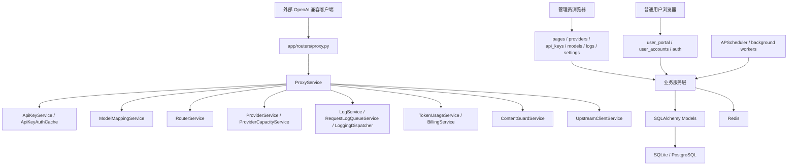

# aotu-gpt 项目完整架构分析

## 1. 分析结论

当前项目具备明显的分层雏形，但尚未达到“不同层、不同模块之间相对独立、无循环依赖、低耦合、易扩展、易测试”的理想状态。

项目现有分层大致如下：

- 表现层：`app/templates/`、`app/static/`、`app/routers/pages.py`、`auth.py`、`user_portal.py`、`user_accounts.py`
- API 路由层：`app/routers/*.py`
- 服务层：`app/services/*.py`
- 数据模型层：`app/models/*.py`
- Schema 层：`app/schemas/*.py`
- 基础设施层：`app/database.py`、`app/config.py`、`app/logging/*`、`redis_service.py`、`upstream_client.py`
- 后台任务层：`app/tasks.py`、`app/scheduler.py`
- 运维与验证层：`scripts/*`、`stage*_regression_check.py`、`migrations/*`

但从实际依赖图看，服务层存在一个 16 个模块的强连通循环，说明核心业务模块不是单向依赖：

- `app.logging.adapters.request_adapter`
- `app.services.api_key_admin_service`
- `app.services.api_key_auth_cache`
- `app.services.api_key_service`
- `app.services.billing_service`
- `app.services.content_guard_service`
- `app.services.health_service`
- `app.services.log_service`
- `app.services.model_catalog_service`
- `app.services.model_mapping_service`
- `app.services.provider_service`
- `app.services.proxy_service`
- `app.services.request_log_queue_service`
- `app.services.router_service`
- `app.services.token_usage_service`
- `app.services.user_quota_service`

因此，项目当前是“目录分层清晰，但领域依赖交织”的架构。它可以运行并支撑复杂功能，但继续扩展时会面临回归范围大、模块替换难、单元测试难、重构风险高的问题。

### 2026-06-08 同步说明

本文件已按当前工作区最新规范与代码改动同步。需要特别注意以下几点：

1. 模型映射阶段已经从“提前调用提供商候选路由做能力、容量、熔断、内容完整性筛选”，收敛为“只选择目标模型”。端点协议、流式、视觉、工具调用、图片生成、容量、熔断、内容完整性和可信策略统一交给选定目标模型后的提供商候选选择阶段判断。
2. 提供商和提供商模型挂载的用户可见权重字段已从规范口径中移除。后续架构分析中的路由排序不再把权重作为主策略，而应描述为健康优先、当前负载、路由得分、容量硬约束、失败率、信任与内容完整性等因素。
3. `/v1/models` 与 `/v1/models/{model_id}` 属于同一官方接口族。鉴权白名单、计费、Token 补算、统计和监控积压应复用统一路径判断，避免精确匹配 `/v1/models` 时漏掉详情子路径。
4. `Provider.weight` 与 `ProviderModel.weight` 当前仅作为向后兼容 ORM 属性别名保留，读写都映射到 `priority`，数据库真实权重列已不再作为目标结构的一部分。
5. 模型选项缓存 key 已升级为 `model-options:v2:list`，启动同步模型目录和提供商数据后会主动失效运行时缓存，避免旧缓存继续携带已移除字段。
6. `request_logs` 已扩展 usage 明细字段，日志、Token 补全、计费和导出链路需要统一从官方 usage 结构读取 reasoning/audio/prediction/cache 明细，禁止从文本摘要反推。
7. Chat Completions / Responses 端点协议支持的权威来源已收敛为管理员在提供商模型挂载矩阵中的挂载级协议配置；健康检查、端点测试和探针结果只能记录可用性或能力观测，禁止自动反推或收紧协议支持。
8. 内容防护新增可信检测三件套：固定答案、外链广告识别、流式污染检测。可信检测由 `/api/content-guard/trust-probe` 触发，并可从提供商、挂载矩阵和模型绑定预览入口执行。
9. 日志中心类型化查询继续增强，`logging_api.py` 现在同时承担多类型日志筛选、时间线构建、CSV 导出；用户端日志也复用同一时间线构建函数。这改善复用，但也放大了日志查询控制器继续膨胀的风险。当前 `RequestContentGuardEvent` 已进入请求时间线 registry，并已补齐 `/api/logging/content-guard-events`、日志页“内容防护日志”Tab 和 `log_type=content-guard-events` 导出入口；剩余问题已从“有没有入口”转为“查询服务、事件投影、详情展示和稳定 CSV schema 是否统一”。
10. 内容防护服务已经开始三段拆分：`ContentGuardRuleService` 承接规则算法入口，`ContentRuntimeGuardService` 承接正式代理请求过程中的非流式与流式防护，`ContentTrustProbeService` 承接预先可信探针和路由可信决策。这是正确方向，但运行时防护仍反向调用 `ProxyService` helper，边界还没有完全独立。
11. Chat/Responses 自动端点互转 fallback 已禁用，正式路由要求上游原生支持请求端点；Responses→Chat 只作为显式开启的兼容适配存在，且默认会话存储已改为 database。这让协议边界更清晰，但 `ResponsesChatAdapterService <-> ProxyService` 的双向依赖仍未解除。
12. API Key 的局部路由、局部可信开关和独立余额正在退出：可信 provider、候选数、候选耗尽等待、无限重试等策略只走全局系统设置或路由领域；API Key 余额收敛为归属用户共享账户余额。`2026-06-08_drop_api_key_legacy_route_quota_fields.sql` 删除旧 route/quota/balance 字段，`2026-06-08_fix_billing_owner_and_cache_write.sql` 负责回填 owner 与 cache read/write 账单字段。
13. 计费账本新增 cache write 单价和 cache read/write 流水审计字段，`TokenUsageService` 同步 Redis 请求次数计数，说明 usage、计费、额度缓存和用户门户展示之间的共享规则更多，更需要抽出统一 `UsageExtractor`、`CostCalculator` 和 `QuotaCounter`。
14. 后台任务事件增强了运行中、跳过、Redis 锁不可用、processed/success/failed 计数；这是观测性进步，但 `app/tasks.py` 仍直接调用多个业务服务，后台任务层尚未形成独立 job handler 边界。
15. `/v1` 预检和不支持端点日志已从 `api_client_auth` 中拆出，分别落为 `v1_preflight` 与 `unsupported_endpoint`。这说明代理入口日志分类正在变细，后续日志领域应把端点兜底、CORS 预检、鉴权失败、授权失败建成不同事件类型，禁止再用鉴权日志兜底所有入口异常。
16. 前端模型能力展示已停止对图片生成做启发式推断，`supports_image_generation` 只有显式为 `true` 才展示生图能力。目标能力领域必须把图片生成作为 provider_model 挂载级显式能力处理，禁止从模型名、视觉能力或工具能力间接推断。
17. API Key 侧旧路由策略字段已退出，但全局设置 schema、`SettingService` 和设置页仍保留 `route_mode`、`default_provider_id`、`manual_allow_fallback` 兼容入口。目标架构应把这些历史输入收敛到 `RouteSettingsPolicy`，并让用户可见路由主策略稳定展示为健康优先。
18. `app/static/js/app.js` 已增长到约 15796 行，`app/static/css/app.css` 已增长到约 12461 行；新增日志高级筛选、类型化详情、provider 固定定位操作菜单、内容可信探针弹窗和 benchmark 模型选择/报告工作流后，前端单文件控制器继续膨胀，前端模块化优先级上升。
19. `base.html` 静态资源版本已同步到 `app.css?v=20260608-06` 与 `app.js?v=20260608-29`，壳层移除了顶部上下文标题块。前端重构时应保持资源版本与 shell 导航职责独立，不再让页面切换逻辑依赖 `#topbar-title` 这类易漂移 DOM。
20. 根目录新增 `内容防护模块问题全审查.md`，已将内容防护模块问题归档到 700 条。新增证据说明内容防护风险不只是“服务拆分未完成”，还包括配置缓存失效、规则编辑语义、运行时策略、可信探针恢复闭环、外部渠道安全剩余边界、typed event 投影一致性、日志详情证据不足和前端页面可用性问题。
21. 根目录 `问题.md` 进一步补充了内容防护与日志中心的细粒度缺口：内容防护 typed event 的列表、Tab、导出和迁移已补齐，但稳定投影、详情证据和固定 CSV 表头仍未完成；健康日志未完整展开 `content_probe_results`，SSE 探针与普通检测可能使用不同规则口径，`record_only` 仍可能污染 provider 治理状态，后台任务日志只覆盖调度锁事件而不是完整队列观测。这些都说明后续架构改造不能只“拆文件”，必须同时建立事件投影、策略状态机和观测模型。

## 2. 当前架构视图

## 3. 入口层分析

### 现状

`app/main.py` 承担以下职责：

- 创建 FastAPI 应用。
- 注册 SessionMiddleware、静态资源和上传目录。
- 启动生命周期中初始化 Redis、上游客户端、后台 worker 和 scheduler。
- 根据配置执行开发环境数据库初始化。
- 注册全局中间件，生成 trace_id，维护 RuntimeStateService 活跃请求计数。
- 对 `/v1/*` 执行 Content-Length 预检、CORS 响应头、统一异常响应。
- 注册 ApiClientAuthError、RequestValidationError、HTTPException、Exception 处理器。
- 引入并注册所有 router。
- 内置大量 `_migrate_*` 补字段函数和基础数据同步。

### 评价

入口层职责过重。应用启动、数据库迁移、异常处理、中间件、路由注册、日志拒绝写入都在同一个文件中，导致 `app/main.py` 达到 1600 行以上。它是系统全局依赖汇聚点，fan-out 约 47。

### 风险

- 任意迁移或异常处理修改都可能影响应用启动。
- 生产环境迁移策略与应用入口耦合，容易出现 Web worker 启动时误执行 DDL 的风险。
- 中间件和异常处理难以单独测试。

## 4. 路由层分析

### 做得好的地方

- 大部分后台 API 按资源拆分为独立 router，如 `api_keys.py`、`providers.py`、`models.py`、`logs.py`、`metrics.py`。
- 外部 `/v1/*` 路由集中在 `proxy.py`，与内部 `/api/*` 管理接口分离。
- 管理端路由多数通过 `require_admin_api_user` 统一依赖保护。
- 用户端与管理员端页面入口分开，用户端使用 Session 角色控制。

### 主要问题

1. 路由层包含较多业务逻辑。

`proxy.py` 中不仅定义路由，还包含请求体读取、multipart 解析、图片上传转 data URL、legacy image batch 合并、并发租约获取释放、不支持端点日志写入等逻辑。

当前较新的入口日志改动把 `_log_unsupported_v1_endpoint` 与 `_log_v1_preflight` 分别记为 `unsupported_endpoint` 和 `v1_preflight`，这比过去混入 `api_client_auth` 更准确。但日志对象仍由路由层直接拼装，说明“入口事件分类”和“请求日志写入”还没有完全下沉到统一日志用例。

`user_portal.py` 中包含大量页面查询、表单处理、自检 payload 构造、上传文件处理和流式消费。

`providers.py` 中包含健康检查流式事件、批量 worker 和进度输出。

2. 页面路由和 API 路由混合。

`user_portal.py` 同时提供 HTML 页面和 `/api/user/*` JSON 接口；`pages.py` 同时提供页面和 alerts API；`user_accounts.py` 同时处理 HTML 表单和 API options。

3. 路由层直接导入模型。

例如 `dashboard.py`、`logging_api.py`、`provider_models.py`、`user_accounts.py`、`user_portal.py` 直接使用 SQLAlchemy 模型，绕过服务层封装。

### 影响

- 业务规则散落在 route handler 中，测试必须走 Web 层。
- 页面表单变更容易影响服务逻辑。
- 未来如果要提供纯 API 或 CLI 复用能力，会受到路由层耦合限制。

## 5. 服务层分析

### 当前服务层优势

项目已经把许多业务能力放入服务类，例如：

- `ProxyService` 代理主链路。
- `ProviderService` provider 管理。
- `RouterService` 候选选择。
- `ModelCatalogService` 模型目录。
- `ApiKeyService` 鉴权。
- `ApiKeyAdminService` 管理端 Key 治理。
- `LogService` 请求日志和统计。
- `TokenUsageService` Token 补全。
- `BillingService` 计费。
- `HealthService` 健康检查。
- `ContentGuardService` / `ContentGuardRuleService` / `ContentRuntimeGuardService` / `ContentTrustProbeService` 内容防护。
- `SystemMetricsService` 监控指标。

这比把所有逻辑写在路由里更好，也为后续重构提供了落点。

### 服务层核心问题

#### 5.1 存在强循环依赖

审查当前 Python import 图得到一个 16 模块强连通分量。关键边包括：

- `ProxyService -> ApiKeyService / ContentGuardService / LogService / ModelMappingService / ProviderService / RequestLogQueueService / RouterService / TokenUsageService`
- `RouterService -> LogService / ModelCatalogService / ProviderService`
- `ProviderService -> ApiKeyAdminService / ApiKeyAuthCache / LogService / ModelCatalogService`
- `ModelCatalogService -> ApiKeyAuthCache / HealthService / ProviderService`
- `HealthService -> ContentGuardService / LogService / ProviderService / ProxyService`
- 新增内容防护拆分后，`ProxyService -> ContentRuntimeGuardService`、`RouterService -> ContentTrustProbeService`、`HealthService -> ContentTrustProbeService / ContentGuardRuleService` 的方向更清晰；但 `ContentRuntimeGuardService` 仍在方法内部导入 `ProxyService` 复用 SSE 与落库 helper，因此内容防护和代理之间仍存在未消除的反向耦合。更细地看，`record_only`、`block`、`switch_provider` 与 provider 状态写入还没有统一策略状态机，导致“检测结果为 block”和“是否真正拦截/是否降级 provider”之间容易被不同服务提前或重复解释。
- `LogService -> RequestLogAdapter / TokenUsageService`
- `RequestLogAdapter -> LogService`
- `BillingService -> ApiKeyAuthCache`
- `ApiKeyService -> BillingService / RouterService / UserQuotaService`
- `UserQuotaService -> BillingService / LogService`

这说明当前服务层不是单向依赖，而是互相调用。

当前工作区已经出现一个值得肯定的局部改善：`ModelMappingService` 不再在映射阶段调用 `RouterService.order_candidates` 做提供商级候选过滤，而是把提供商协议、能力、容量、熔断、内容完整性和可信策略后移到路由候选选择阶段。这能减少模型映射与路由领域的职责混淆。但它仍会读取 API Key 白名单和同会话近期成功目标，服务层循环依赖没有因此完全消失，后续仍应按用例层输入快照、领域层纯决策的方向继续拆分。

另一个最新变化是端点协议支持不再由健康探针反推。`stage14` 已把“探针缓存默认影响 endpoint 路由”的旧假设替换为“端点协议以管理员挂载级配置为准”。这能降低健康探针误伤正式流量的风险，但也要求模型挂载矩阵、provider_model schema、路由诊断和前端编辑弹窗保持同一个协议配置口径。

#### 5.2 超大服务聚合过多职责

典型文件规模：

- `app/services/proxy_service.py`：约 9336 行。
- `app/services/health_service.py`：约 3682 行。
- `app/services/error_catalog_service.py`：约 2135 行。
- `app/services/log_service.py`：约 2047 行。
- `app/services/provider_service.py`：约 1872 行。
- `app/services/token_usage_service.py`：约 1398 行。
- `app/services/system_metrics_service.py`：约 1361 行。
- `app/services/model_catalog_service.py`：约 1229 行。
- `app/services/api_key_admin_service.py`：约 1184 行。

这些服务不是单一职责，而是多个子领域的集合体。

#### 5.3 领域对象偏弱

大量跨模块参数以 dict、list、trace dict、payload dict 传递。虽然灵活，但也带来：

- 字段含义靠约定而非类型约束。
- 深层字段访问分散。
- 测试时难以构造最小上下文。
- 字段改名影响面难以静态发现。

#### 5.4 服务直接管理事务和 Session

部分服务接收 `db: Session`，部分服务自行创建 `SessionLocal`，部分异步函数通过线程执行同步 DB 写入。事务边界不统一，导致：

- 难以保证同一业务命令的原子性。
- 测试中需要 patch 较多全局状态。
- 失败恢复和幂等策略不集中。

## 6. 数据模型层分析

### 做得好的地方

数据模型覆盖完整，核心实体清晰：

- `providers` / `provider_models`
- `model_catalogs` / `model_mappings`
- `api_client_keys` / `api_client_key_provider_bindings` / `api_key_policy_templates`
- `user_accounts`
- `request_logs`
- `api_client_billing_records` / `user_account_billing_records`
- `alert_events` / `alert_subscriptions`
- `logging_events` 相关事件表
- `responses_chat_adapter_sessions`
- `uploaded_assets`

字段设计能支撑复杂治理能力，如协议、能力、容量、内容完整性、费用、缓存 token、trace、会话等。

### 问题

- 模型字段数量很大，尤其 `AppSetting`、`RequestLog`、`ApiClientKey`、`Provider`，已经成为“配置/日志大宽表”。
- 业务概念存在重复表达，例如模型能力、provider 挂载能力、健康探测能力、路由能力之间没有统一类型。
- 模型层只有 SQLAlchemy ORM，没有 repository 或 query object，导致查询散落在多个服务和 router 中。

## 7. Schema 层分析

### 现状

Pydantic schema 主要用于 API 入参出参，文件包括：

- `api_key.py`
- `api_key_policy_template.py`
- `content_guard.py`
- `conversation.py`
- `log.py`
- `model_catalog.py`
- `model_mapping.py`
- `provider.py`
- `proxy.py`
- `setting.py`

### 优点

- 管理接口的请求和响应结构有一定约束。
- 包含较多 validator，能在边界清洗名称、模型列表、provider id、协议类型等。

### 问题

- 代理主链路的内部 payload 仍主要是 dict，没有充分利用内部 DTO。
- Schema 有时承担业务规范化，如 provider protocol label、模型名能力判断等，容易和 service 重复。
- Schema 文件与前端展示字段、数据库字段之间缺少自动一致性校验。

## 8. 前端架构分析

### 现状

前端采用服务端模板 + 单个大型 JS + 单个大型 CSS：

- HTML 模板 33 个。
- `app/static/js/app.js` 约 15796 行。
- `app/static/css/app.css` 约 12461 行。

### 优点

- 不依赖复杂前端构建工具，部署简单。
- 全局主题、风格预设、导航、Toast、Modal、Tooltip、响应式表格等基础交互统一在一个脚本里。
- 页面初始化按 `body.dataset.page` 分发，能够支持多页面应用。
- 前端已补充不少实际业务交互：日志高级筛选、类型化日志详情、原始 JSON 截断、provider 更多操作固定浮层、内容防护可信检测弹窗、benchmark 模型选择器和报告链接等，这些都提升了业务可用性。

### 问题

- 单文件 JS 和 CSS 过大，已经不适合长期维护。
- 所有页面共享同一全局作用域，页面逻辑之间存在隐式耦合。
- 前端功能难以做局部自动化测试。
- 页面模板中仍有较多业务展示逻辑，部分页面直接依赖后端传入复杂聚合数据。
- 同一脚本中同时维护日志详情、压测任务、模型能力展示、provider 操作菜单和内容防护探针，新增一个页面功能会触碰全局 bootstrap 与共享工具，后续应按页面和组件拆分。
- `supports_image_generation` 的前端展示已改为只信显式字段，这是好变化；但也暴露出能力展示与后端路由能力必须有统一 DTO，否则前端容易重新出现启发式判断。

## 9. 后台任务与基础设施分析

### 做得好的地方

- Redis 用于缓存、并发租约、限流和分布式任务锁。
- `RequestLogQueueService`、`LoggingQueue`、`TokenUsageService` 支持后台 worker。
- `scripts/run_background_workers.py` 支持独立 worker 形态。
- APScheduler 定时任务包含健康检查、Token 回填、数据清理、Responses adapter 会话清理。

### 问题

- 队列体系不统一，request log queue、logging queue、token finalize queue 各自维护。
- 任务 payload、幂等键、重试、死信、可观测性没有统一协议。
- 一些后台任务仍直接调用大服务，导致依赖复杂度传递到任务层。
- `BackgroundJobEvent` 主要记录 `distributed_job_lock` 包裹的调度任务，不能代表请求日志队列、统一日志队列、Token finalize 队列和独立 worker 的完整运行状态。当前后台任务 Tab 的观测边界仍偏窄，缺少队列 backlog、消费延迟、重试、死信、worker 存活和 stale running 任务的统一模型。

## 10. 数据库迁移架构分析

### 现状

项目同时存在：

- `app/main.py` 内置 `_migrate_*` 函数。
- `migrations/*.sql` 手工 SQL 文件。
- `scripts/run_startup_db_init.py` 调用 `init_database`。
- 部署脚本中通过 `RUN_DB_INIT=1` 控制初始化。

### 优点

- 本地环境可自动补齐表结构，开发友好。
- 生产环境通过配置禁止 Web worker 默认 DDL，符合现有规范。

### 问题

- 迁移来源不唯一，无法清晰知道某环境已执行到哪一版本。
- 内置迁移和 SQL 迁移可能重复维护同一字段。
- 缺少标准迁移回滚、依赖顺序和校验机制。

## 11. 可测试性分析

### 优势

项目有大量阶段回归脚本，覆盖历史关键功能。这说明维护者已经在用可执行脚本固化问题。

### 问题

- 测试脚本不在标准 `tests/` 结构中，无法自然使用 pytest 发现、marker、fixture、覆盖率。
- 大服务静态方法多、全局状态多、直接调用 Redis/DB/上游客户端多，单元测试需要大量 monkeypatch。
- 服务循环依赖导致很难单独测试某个领域模块。

## 12. 是否低耦合、易扩展、易测试

### 分层

部分满足。目录层面有 routers、services、models、schemas、templates、static、scripts；但入口层、路由层和服务层职责仍混杂。

### 分模块

部分满足。项目按功能命名了服务和路由，但核心模块之间依赖交织。

### 相对独立

不充分。代理、路由、provider、模型、日志、计费、健康、内容防护之间存在双向或环形依赖。

### 无循环依赖

不满足。服务层存在 16 模块强循环依赖。

### 低耦合

不满足。`ProxyService`、`HealthService`、`LogService`、`ProviderService`、`ModelCatalogService` 等是高耦合中心。

### 易扩展

中等偏弱。新增功能可以继续堆到现有服务中，但要做到低风险扩展较难。新增 provider 协议、端点类型、日志事件、计费策略、内容防护策略时需要修改多个大文件。

### 易测试

中等偏弱。已有回归脚本提供端到端保障，但单元测试和模块测试不容易。

## 13. 架构核心问题清单

1. `ProxyService` 过大，是代理、路由、协议、日志、计费、内容防护、重试、响应处理的混合体。
2. `HealthService` 过大，并且反向依赖 `ProxyService`。
3. `LogService` 和 `app/logging/*` 新旧日志体系并存，甚至形成内部循环。
4. `ProviderService` 与 `ModelCatalogService`、`ApiKeyAdminService` 相互调用，provider 模块不独立。
5. `ApiKeyService` 既管凭据又管鉴权、限额、用量回写，与计费和路由耦合。
6. `TokenUsageService` 与 `BillingService`、`LogService`、`ApiKeyAuthCache` 循环。
7. `ResponsesChatAdapterService` 与 `ProxyService` 双向依赖。
8. 路由层承担过多业务逻辑。
9. 内容防护已开始从单体服务拆出三层职责，但 `ContentGuardRuleService` 仍继承原 `ContentGuardService`，`ContentRuntimeGuardService` 仍依赖 `ProxyService` helper，尚未形成纯领域规则、运行时策略、状态写入端口完全分离的结构。
10. 单文件前端 JS/CSS 过大，页面之间隐式耦合。
11. 数据库迁移来源不唯一。
12. 后台队列协议不统一。
13. 标准测试分层不足。
14. 模型映射和提供商候选选择的边界已开始拆分，但还缺少明确的应用层 DTO、领域决策对象和依赖守卫来防止旧耦合回流。
15. 官方接口族路径判断正在向统一函数收敛，后续仍需把该口径作为日志、计费、鉴权、统计和监控模块的共享契约。
16. API Key 共享用户余额、用户账单流水、Redis 额度缓存和请求日志计费字段仍由多个服务共同维护，账本边界和幂等状态机需要继续强化。
17. Responses→Chat 兼容适配已经从默认 fallback 改为显式能力，但适配器仍反向依赖代理服务，协议适配模块尚未做到插件化。
18. 入口日志分类正在细化，但 `unsupported_endpoint`、`v1_preflight` 等日志仍在 `proxy.py` 中构造，日志事件分类、OpenAI 错误响应和 request_logs 写入之间还缺少统一入口事件用例。
19. 前端单文件控制器继续膨胀，日志、provider 操作、内容防护和 benchmark 交互都应拆成组件/页面模块；否则后续即使后端分层完成，前端仍会成为重构瓶颈。
20. 内容防护模块的配置写入、规则写入、可信探针、运行时检测、路由筛选、监控自动隔离和日志展示仍没有统一状态机。`content_guard_required=false`、provider 内容防护开关、全局可信提供商策略、blocked/低分硬排除之间的语义需要重新建模，否则用户界面、路由候选和实际检测行为会继续不一致。
21. 全局路由设置仍带有历史 `route_mode/default_provider_id/manual_allow_fallback` 兼容面，而目标用户可见策略已经是健康优先。后续需要迁移为 `RouteSettingsPolicy`，把历史字段变成兼容解析或废弃迁移，而不是继续让路由领域、设置页和文档并行维护两套路由主策略。
22. 内容防护外部渠道检测和 typed logging 仍属于高风险基础设施点。外部检测已经具备 `https`、localhost/内网/IP 地址和长度校验，但仍需要 DNS rebinding、响应大小、总超时、前端密钥清理、base_url 脱敏和稳定外部目标 ID；类型化日志表已有正式迁移，后续重点是空库验证、字段版本和导出 schema。
23. 内容防护 typed event 当前处于“模型、迁移、列表、Tab、导出入口已存在，但统一投影和稳定 schema 未完成”的中间态。日志中心、内容防护页面和请求详情没有统一 `ContentGuardEventProjection`，因此 matched_rules、matched_excerpt、buffer_wait_ms、retry_provider_count、final_strategy、provider/model 状态变化等证据字段仍无法稳定展示和导出。
24. 健康检查与内容防护的事件边界仍不清。手动模型健康测试会执行内容探针，但健康事件主要展开端点探针；流式内容污染也可能被计入 provider/model 健康失败。这会让健康失败、内容污染、路由隔离三个领域的统计相互污染。
25. typed log 导出缺稳定 schema，计费日志合并两类不同结构事件，后台任务日志无法覆盖完整后台队列，说明“可观测性模块”需要从页面查询功能升级为统一事件目录、事件投影和审计导出契约。

## 14. 架构结论

当前项目适合被评价为“功能型单体应用，目录分层明确，但核心领域服务高度耦合”。它已经有大量工程化能力和业务功能，不建议推倒重写；更适合采用渐进式模块化重构：先建立边界和接口，再拆核心服务，最后治理前端和迁移体系。
