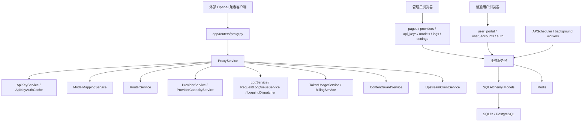

# aotu-gpt 项目完整架构分析

## 1. 分析结论

当前项目具备明显的分层雏形，但尚未达到“不同层、不同模块之间相对独立、无循环依赖、低耦合、易扩展、易测试”的理想状态。

项目现有分层大致如下：

- 表现层：`app/templates/`、`app/static/`、`app/routers/pages.py`、`auth.py`、`user_portal.py`、`user_accounts.py`
- API 路由层：`app/routers/*.py`
- 服务层：`app/services/*.py`
- 数据模型层：`app/models/*.py`
- Schema 层：`app/schemas/*.py`
- 基础设施层：`app/database.py`、`app/config.py`、`app/logging/*`、`redis_service.py`、`upstream_client.py`
- 后台任务层：`app/tasks.py`、`app/scheduler.py`
- 运维与验证层：`scripts/*`、`stage*_regression_check.py`、`migrations/*`

但从实际依赖图看，服务层存在一个 16 个模块的强连通循环，说明核心业务模块不是单向依赖：

- `app.logging.adapters.request_adapter`
- `app.services.api_key_admin_service`
- `app.services.api_key_auth_cache`
- `app.services.api_key_service`
- `app.services.billing_service`
- `app.services.content_guard_service`
- `app.services.health_service`
- `app.services.log_service`
- `app.services.model_catalog_service`
- `app.services.model_mapping_service`
- `app.services.provider_service`
- `app.services.proxy_service`
- `app.services.request_log_queue_service`
- `app.services.router_service`
- `app.services.token_usage_service`
- `app.services.user_quota_service`

因此，项目当前是“目录分层清晰，但领域依赖交织”的架构。它可以运行并支撑复杂功能，但继续扩展时会面临回归范围大、模块替换难、单元测试难、重构风险高的问题。

## 2. 当前架构视图

## 3. 入口层分析

### 现状

`app/main.py` 承担以下职责：

- 创建 FastAPI 应用。
- 注册 SessionMiddleware、静态资源和上传目录。
- 启动生命周期中初始化 Redis、上游客户端、后台 worker 和 scheduler。
- 根据配置执行开发环境数据库初始化。
- 注册全局中间件，生成 trace_id，维护 RuntimeStateService 活跃请求计数。
- 对 `/v1/*` 执行 Content-Length 预检、CORS 响应头、统一异常响应。
- 注册 ApiClientAuthError、RequestValidationError、HTTPException、Exception 处理器。
- 引入并注册所有 router。
- 内置大量 `_migrate_*` 补字段函数和基础数据同步。

### 评价

入口层职责过重。应用启动、数据库迁移、异常处理、中间件、路由注册、日志拒绝写入都在同一个文件中，导致 `app/main.py` 达到 1600 行以上。它是系统全局依赖汇聚点，fan-out 约 47。

### 风险

- 任意迁移或异常处理修改都可能影响应用启动。
- 生产环境迁移策略与应用入口耦合，容易出现 Web worker 启动时误执行 DDL 的风险。
- 中间件和异常处理难以单独测试。

## 4. 路由层分析

### 做得好的地方

- 大部分后台 API 按资源拆分为独立 router，如 `api_keys.py`、`providers.py`、`models.py`、`logs.py`、`metrics.py`。
- 外部 `/v1/*` 路由集中在 `proxy.py`，与内部 `/api/*` 管理接口分离。
- 管理端路由多数通过 `require_admin_api_user` 统一依赖保护。
- 用户端与管理员端页面入口分开，用户端使用 Session 角色控制。

### 主要问题

1. 路由层包含较多业务逻辑。

`proxy.py` 中不仅定义路由，还包含请求体读取、multipart 解析、图片上传转 data URL、legacy image batch 合并、并发租约获取释放、不支持端点日志写入等逻辑。

`user_portal.py` 中包含大量页面查询、表单处理、自检 payload 构造、上传文件处理和流式消费。

`providers.py` 中包含健康检查流式事件、批量 worker 和进度输出。

2. 页面路由和 API 路由混合。

`user_portal.py` 同时提供 HTML 页面和 `/api/user/*` JSON 接口；`pages.py` 同时提供页面和 alerts API；`user_accounts.py` 同时处理 HTML 表单和 API options。

3. 路由层直接导入模型。

例如 `dashboard.py`、`logging_api.py`、`provider_models.py`、`user_accounts.py`、`user_portal.py` 直接使用 SQLAlchemy 模型，绕过服务层封装。

### 影响

- 业务规则散落在 route handler 中，测试必须走 Web 层。
- 页面表单变更容易影响服务逻辑。
- 未来如果要提供纯 API 或 CLI 复用能力，会受到路由层耦合限制。

## 5. 服务层分析

### 当前服务层优势

项目已经把许多业务能力放入服务类，例如：

- `ProxyService` 代理主链路。
- `ProviderService` provider 管理。
- `RouterService` 候选选择。
- `ModelCatalogService` 模型目录。
- `ApiKeyService` 鉴权。
- `ApiKeyAdminService` 管理端 Key 治理。
- `LogService` 请求日志和统计。
- `TokenUsageService` Token 补全。
- `BillingService` 计费。
- `HealthService` 健康检查。
- `ContentGuardService` 内容防护。
- `SystemMetricsService` 监控指标。

这比把所有逻辑写在路由里更好，也为后续重构提供了落点。

### 服务层核心问题

#### 5.1 存在强循环依赖

审查当前 Python import 图得到一个 16 模块强连通分量。关键边包括：

- `ProxyService -> ApiKeyService / ContentGuardService / LogService / ModelMappingService / ProviderService / RequestLogQueueService / RouterService / TokenUsageService`
- `RouterService -> LogService / ModelCatalogService / ProviderService`
- `ProviderService -> ApiKeyAdminService / ApiKeyAuthCache / LogService / ModelCatalogService`
- `ModelCatalogService -> ApiKeyAuthCache / HealthService / ProviderService`
- `HealthService -> ContentGuardService / LogService / ProviderService / ProxyService`
- `LogService -> RequestLogAdapter / TokenUsageService`
- `RequestLogAdapter -> LogService`
- `BillingService -> ApiKeyAuthCache`
- `ApiKeyService -> BillingService / RouterService / UserQuotaService`
- `UserQuotaService -> BillingService / LogService`

这说明当前服务层不是单向依赖，而是互相调用。

#### 5.2 超大服务聚合过多职责

典型文件规模：

- `app/services/proxy_service.py`：约 9336 行。
- `app/services/health_service.py`：约 3682 行。
- `app/services/error_catalog_service.py`：约 2135 行。
- `app/services/log_service.py`：约 2047 行。
- `app/services/provider_service.py`：约 1872 行。
- `app/services/token_usage_service.py`：约 1398 行。
- `app/services/system_metrics_service.py`：约 1361 行。
- `app/services/model_catalog_service.py`：约 1229 行。
- `app/services/api_key_admin_service.py`：约 1184 行。

这些服务不是单一职责，而是多个子领域的集合体。

#### 5.3 领域对象偏弱

大量跨模块参数以 dict、list、trace dict、payload dict 传递。虽然灵活，但也带来：

- 字段含义靠约定而非类型约束。
- 深层字段访问分散。
- 测试时难以构造最小上下文。
- 字段改名影响面难以静态发现。

#### 5.4 服务直接管理事务和 Session

部分服务接收 `db: Session`，部分服务自行创建 `SessionLocal`，部分异步函数通过线程执行同步 DB 写入。事务边界不统一，导致：

- 难以保证同一业务命令的原子性。
- 测试中需要 patch 较多全局状态。
- 失败恢复和幂等策略不集中。

## 6. 数据模型层分析

### 做得好的地方

数据模型覆盖完整，核心实体清晰：

- `providers` / `provider_models`
- `model_catalogs` / `model_mappings`
- `api_client_keys` / `api_client_key_provider_bindings` / `api_key_policy_templates`
- `user_accounts`
- `request_logs`
- `api_client_billing_records` / `user_account_billing_records`
- `alert_events` / `alert_subscriptions`
- `logging_events` 相关事件表
- `responses_chat_adapter_sessions`
- `uploaded_assets`

字段设计能支撑复杂治理能力，如协议、能力、容量、内容完整性、费用、缓存 token、trace、会话等。

### 问题

- 模型字段数量很大，尤其 `AppSetting`、`RequestLog`、`ApiClientKey`、`Provider`，已经成为“配置/日志大宽表”。
- 业务概念存在重复表达，例如模型能力、provider 挂载能力、健康探测能力、路由能力之间没有统一类型。
- 模型层只有 SQLAlchemy ORM，没有 repository 或 query object，导致查询散落在多个服务和 router 中。

## 7. Schema 层分析

### 现状

Pydantic schema 主要用于 API 入参出参，文件包括：

- `api_key.py`
- `api_key_policy_template.py`
- `content_guard.py`
- `conversation.py`
- `log.py`
- `model_catalog.py`
- `model_mapping.py`
- `provider.py`
- `proxy.py`
- `setting.py`

### 优点

- 管理接口的请求和响应结构有一定约束。
- 包含较多 validator，能在边界清洗名称、模型列表、provider id、协议类型等。

### 问题

- 代理主链路的内部 payload 仍主要是 dict，没有充分利用内部 DTO。
- Schema 有时承担业务规范化，如 provider protocol label、模型名能力判断等，容易和 service 重复。
- Schema 文件与前端展示字段、数据库字段之间缺少自动一致性校验。

## 8. 前端架构分析

### 现状

前端采用服务端模板 + 单个大型 JS + 单个大型 CSS：

- HTML 模板 33 个。
- `app/static/js/app.js` 约 15003 行。
- `app/static/css/app.css` 约 12284 行。

### 优点

- 不依赖复杂前端构建工具，部署简单。
- 全局主题、风格预设、导航、Toast、Modal、Tooltip、响应式表格等基础交互统一在一个脚本里。
- 页面初始化按 `body.dataset.page` 分发，能够支持多页面应用。

### 问题

- 单文件 JS 和 CSS 过大，已经不适合长期维护。
- 所有页面共享同一全局作用域，页面逻辑之间存在隐式耦合。
- 前端功能难以做局部自动化测试。
- 页面模板中仍有较多业务展示逻辑，部分页面直接依赖后端传入复杂聚合数据。

## 9. 后台任务与基础设施分析

### 做得好的地方

- Redis 用于缓存、并发租约、限流和分布式任务锁。
- `RequestLogQueueService`、`LoggingQueue`、`TokenUsageService` 支持后台 worker。
- `scripts/run_background_workers.py` 支持独立 worker 形态。
- APScheduler 定时任务包含健康检查、Token 回填、数据清理、Responses adapter 会话清理。

### 问题

- 队列体系不统一，request log queue、logging queue、token finalize queue 各自维护。
- 任务 payload、幂等键、重试、死信、可观测性没有统一协议。
- 一些后台任务仍直接调用大服务，导致依赖复杂度传递到任务层。

## 10. 数据库迁移架构分析

### 现状

项目同时存在：

- `app/main.py` 内置 `_migrate_*` 函数。
- `migrations/*.sql` 手工 SQL 文件。
- `scripts/run_startup_db_init.py` 调用 `init_database`。
- 部署脚本中通过 `RUN_DB_INIT=1` 控制初始化。

### 优点

- 本地环境可自动补齐表结构，开发友好。
- 生产环境通过配置禁止 Web worker 默认 DDL，符合现有规范。

### 问题

- 迁移来源不唯一，无法清晰知道某环境已执行到哪一版本。
- 内置迁移和 SQL 迁移可能重复维护同一字段。
- 缺少标准迁移回滚、依赖顺序和校验机制。

## 11. 可测试性分析

### 优势

项目有大量阶段回归脚本，覆盖历史关键功能。这说明维护者已经在用可执行脚本固化问题。

### 问题

- 测试脚本不在标准 `tests/` 结构中，无法自然使用 pytest 发现、marker、fixture、覆盖率。
- 大服务静态方法多、全局状态多、直接调用 Redis/DB/上游客户端多，单元测试需要大量 monkeypatch。
- 服务循环依赖导致很难单独测试某个领域模块。

## 12. 是否低耦合、易扩展、易测试

### 分层

部分满足。目录层面有 routers、services、models、schemas、templates、static、scripts；但入口层、路由层和服务层职责仍混杂。

### 分模块

部分满足。项目按功能命名了服务和路由，但核心模块之间依赖交织。

### 相对独立

不充分。代理、路由、provider、模型、日志、计费、健康、内容防护之间存在双向或环形依赖。

### 无循环依赖

不满足。服务层存在 16 模块强循环依赖。

### 低耦合

不满足。`ProxyService`、`HealthService`、`LogService`、`ProviderService`、`ModelCatalogService` 等是高耦合中心。

### 易扩展

中等偏弱。新增功能可以继续堆到现有服务中，但要做到低风险扩展较难。新增 provider 协议、端点类型、日志事件、计费策略、内容防护策略时需要修改多个大文件。

### 易测试

中等偏弱。已有回归脚本提供端到端保障，但单元测试和模块测试不容易。

## 13. 架构核心问题清单

1. `ProxyService` 过大，是代理、路由、协议、日志、计费、内容防护、重试、响应处理的混合体。
2. `HealthService` 过大，并且反向依赖 `ProxyService`。
3. `LogService` 和 `app/logging/*` 新旧日志体系并存，甚至形成内部循环。
4. `ProviderService` 与 `ModelCatalogService`、`ApiKeyAdminService` 相互调用，provider 模块不独立。
5. `ApiKeyService` 既管凭据又管鉴权、限额、用量回写，与计费和路由耦合。
6. `TokenUsageService` 与 `BillingService`、`LogService`、`ApiKeyAuthCache` 循环。
7. `ResponsesChatAdapterService` 与 `ProxyService` 双向依赖。
8. 路由层承担过多业务逻辑。
9. 单文件前端 JS/CSS 过大，页面之间隐式耦合。
10. 数据库迁移来源不唯一。
11. 后台队列协议不统一。
12. 标准测试分层不足。

## 14. 架构结论

当前项目适合被评价为“功能型单体应用，目录分层明确，但核心领域服务高度耦合”。它已经有大量工程化能力和业务功能，不建议推倒重写；更适合采用渐进式模块化重构：先建立边界和接口，再拆核心服务，最后治理前端和迁移体系。

