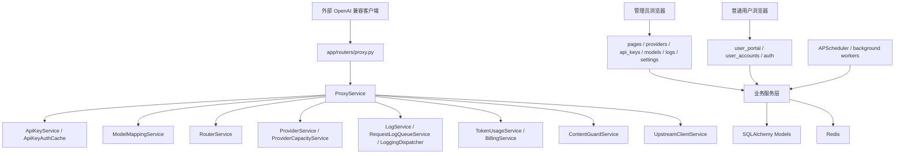

# aotu-gpt 项目完整架构分析

## 1. 分析结论

当前项目具备明显的分层雏形，但尚未达到“不同层、不同模块之间相对独立、无循环依赖、低耦合、易扩展、易测试”的理想状态。

项目现有分层大致如下：

- 表现层：`app/templates/`、`app/static/`、`app/routers/pages.py`、`auth.py`、`user_portal.py`、`user_accounts.py`
- API 路由层：`app/routers/*.py`
- 服务层：`app/services/*.py`
- 数据模型层：`app/models/*.py`
- Schema 层：`app/schemas/*.py`
- 基础设施层：`app/database.py`、`app/config.py`、`app/logging/*`、`redis_service.py`、`upstream_client.py`
- 后台任务层：`app/tasks.py`、`app/scheduler.py`
- 运维与验证层：`scripts/*`、`stage*_regression_check.py`、`migrations/*`

但从实际依赖图看，服务层存在一个 16 个模块的强连通循环，说明核心业务模块不是单向依赖：

- `app.logging.adapters.request_adapter`
- `app.services.api_key_admin_service`
- `app.services.api_key_auth_cache`
- `app.services.api_key_service`
- `app.services.billing_service`
- `app.services.content_guard_service`
- `app.services.health_service`
- `app.services.log_service`
- `app.services.model_catalog_service`
- `app.services.model_mapping_service`
- `app.services.provider_service`
- `app.services.proxy_service`
- `app.services.request_log_queue_service`
- `app.services.router_service`
- `app.services.token_usage_service`
- `app.services.user_quota_service`

因此，项目当前是“目录分层清晰，但领域依赖交织”的架构。它可以运行并支撑复杂功能，但继续扩展时会面临回归范围大、模块替换难、单元测试难、重构风险高的问题。

### 2026-06-08 同步说明

本文件已按当前工作区最新规范与代码改动同步。需要特别注意以下几点：

1. 模型映射阶段已经从“提前调用提供商候选路由做能力、容量、熔断、内容完整性筛选”，收敛为“只选择目标模型”。端点协议、流式、视觉、工具调用、图片生成、容量、熔断、内容完整性和可信策略统一交给选定目标模型后的提供商候选选择阶段判断。
2. 提供商和提供商模型挂载的用户可见权重字段已从规范口径中移除。后续架构分析中的路由排序不再把权重作为主策略，而应描述为可用性优先、当前负载、路由得分、容量硬约束、失败率、信任与内容完整性等因素。
3. `/v1/models` 与 `/v1/models/{model_id}` 属于同一官方接口族。鉴权白名单、计费、Token 补算、统计和监控积压应复用统一路径判断，避免精确匹配 `/v1/models` 时漏掉详情子路径。
4. `Provider.weight` 与 `ProviderModel.weight` 当前仅作为向后兼容 ORM 属性别名保留，读写都映射到 `priority`，数据库真实权重列已不再作为目标结构的一部分。
5. 模型选项缓存 key 已升级为 `model-options:v2:list`，启动同步模型目录和提供商数据后会主动失效运行时缓存，避免旧缓存继续携带已移除字段。
6. `request_logs` 已扩展 usage 明细字段，日志、Token 补全、计费和导出链路需要统一从官方 usage 结构读取 reasoning/audio/prediction/cache 明细，禁止从文本摘要反推。
7. Chat Completions / Responses 端点协议支持的权威来源已收敛为管理员在提供商模型挂载矩阵中的挂载级协议配置；可用性检测、端点测试和探针结果只能记录可用性或能力观测，禁止自动反推或收紧协议支持。
8. 内容防护新增可信检测三件套：固定答案、外链广告识别、流式污染检测。可信检测由 `/api/content-guard/trust-probe` 触发，并可从提供商、挂载矩阵和模型绑定预览入口执行。
9. 日志中心类型化查询继续增强，`logging_api.py` 现在同时承担多类型日志筛选、时间线构建、CSV 导出、time filter 元数据、中文筛选别名、当前页 summary、5000 条导出上限和统一日志队列状态；用户端日志也复用同一时间线构建函数。这改善复用，但也放大了日志查询控制器继续膨胀的风险。当前 `RequestContentGuardEvent` 已进入请求时间线 registry，并已补齐 `/api/logging/content-guard-events`、日志页“内容防护日志”Tab、`matched_rule` 筛选和 `log_type=content-guard-events` 导出入口；内容防护页面的 `/api/content-guard/runtime/events` 也改为直接查询同一 typed event 表，支持分页筛选和 CSV 导出；`TYPED_LOG_EXPORT_FIELDS` 已让 typed CSV 具备固定表头，计费事件也已改为 SQL `union_all` 分页。`asset_events` 新增 `sha256_hex` 后，素材事件已能同时展示完整 SHA256、前缀、唯一哈希统计和 CSV 导出字段。剩余问题已从“有没有入口/有没有固定表头”转为“固定表头注册表是否独立、字段版本是否可追踪、事件投影、summary、队列状态、筛选别名和详情展示是否统一”。
10. 内容防护服务已经开始三段拆分：`ContentGuardRuleService` 承接规则算法入口，`ContentRuntimeGuardService` 承接正式代理请求过程中的非流式与流式防护，`ContentTrustProbeService` 承接预先可信探针和路由可信决策。这是正确方向；当前最新代码已经移除 `ContentRuntimeGuardService` 对 `ProxyService` 的反向导入，但代理服务仍通过兼容包装方法调用运行时防护，边界还没有完全应用层端口化。
11. Chat/Responses 自动端点互转 fallback 已禁用，正式路由要求上游原生支持请求端点；Responses→Chat 只作为显式开启的兼容适配存在，且默认会话存储已改为 database。这让协议边界更清晰，但 `ResponsesChatAdapterService <-> ProxyService` 的双向依赖仍未解除。
12. API Key 的局部路由、局部可信开关和独立余额正在退出：可信 provider、候选数、候选耗尽等待、无限重试等策略只走全局系统设置或路由领域；API Key 余额收敛为归属用户共享账户余额。`2026-06-08_drop_api_key_legacy_route_quota_fields.sql` 删除旧 route/quota/balance 字段，`2026-06-08_fix_billing_owner_and_cache_write.sql` 负责回填 owner 与 cache read/write 账单字段。
13. 计费账本新增 cache write 单价和 cache read/write 流水审计字段，`TokenUsageService` 同步 Redis 请求次数计数，说明 usage、计费、额度缓存和用户门户展示之间的共享规则更多，更需要抽出统一 `UsageExtractor`、`CostCalculator` 和 `QuotaCounter`。
14. 后台任务事件增强了运行中、跳过、Redis 锁不可用、processed/success/failed 计数；IP 管理事件清理也已进入 APScheduler 并复用分布式锁。后台任务摘要现在通过 `dumps_sanitized(max_bytes=8192, max_list_items=50)` 控制体积和敏感字段，数据保留清理与 IP 管理事件清理都改为 5000 条一批按 ID 删除；日志中心已把后台任务 Tab 改名为“调度任务日志”，并对运行超过 2 小时仍为 running 的任务标记 `stale_running`。`RequestLogQueueService` 与 `LoggingQueue` 的 processing 队列恢复也改为每批 500 条回推主队列，避免重启恢复时一次性拉取全部列表。这是观测性和生产清理安全性的进步，但 `app/tasks.py` 仍直接调用多个业务服务，后台任务层尚未形成独立 job handler、heartbeat 和队列观测边界。
15. `/v1` 预检和不支持端点日志已从 `api_client_auth` 中拆出，分别落为 `v1_preflight` 与 `unsupported_endpoint`。这说明代理入口日志分类正在变细，后续日志领域应把端点兜底、CORS 预检、鉴权失败、授权失败建成不同事件类型，禁止再用鉴权日志兜底所有入口异常。
16. 前端模型能力展示已停止对图片生成做启发式推断，`supports_image_generation` 只有显式为 `true` 才展示生图能力。目标能力领域必须把图片生成作为 provider_model 挂载级显式能力处理，禁止从模型名、视觉能力或工具能力间接推断。
17. API Key 侧旧路由策略字段已退出，但全局设置 schema、`SettingService` 和设置页仍保留 `route_mode`、`default_provider_id`、`manual_allow_fallback` 兼容入口。目标架构应把这些历史输入收敛到 `RouteSettingsPolicy`，并让用户可见路由主策略稳定展示为可用性优先。
18. `app/static/js/app.js` 已增长到约 17285 行，`app/static/css/app.css` 已增长到约 12862 行；新增日志高级筛选、类型化详情、类型化 summary/meta strip、素材完整 SHA256 展示、内容防护 `matched_rule` 筛选、调度任务 stale running 展示、provider 固定定位操作菜单、内容可信探针弹窗、内容防护规则筛选分页/删除确认/撤销、内容防护加载失败重试、治理筛选和手动提示、外部检测密钥显示/清除按钮、IP 管理完整页面控制器、benchmark 模型选择/报告工作流和压测参数上限同步后，前端单文件控制器继续膨胀，前端模块化优先级上升。当前基础 API 层已新增 45 秒请求超时、页面切换 abort、壳层导航 abort 和隐藏页暂停自动轮询，这些能力后续应抽成可测试的 `ApiClient` 与 `PageLifecycle`，而不是继续散落在巨型脚本中。
19. `base.html` 静态资源版本已同步到 `app.css?v=20260609-05` 与 `app.js?v=20260609-05`，壳层移除了顶部上下文标题块；`auth_base.html` 仍停留在 `app.css?v=20260608-07` 与 `app.js?v=20260608-36`。前端重构时应保持资源版本与 shell 导航职责独立，不再让页面切换逻辑依赖 `#topbar-title` 这类易漂移 DOM。
20. 根目录新增 `内容防护模块问题全审查.md`，已将内容防护模块问题归档到 700 条。新增证据说明内容防护风险不只是“服务拆分未完成”，还包括配置缓存失效、规则编辑语义、运行时策略、可信探针恢复闭环、外部渠道安全剩余边界、typed event 投影一致性、日志详情证据不足和前端页面可用性问题。
21. 根目录 `问题.md` 进一步补充了内容防护与日志中心的细粒度缺口：内容防护 typed event 的列表、Tab、导出、迁移和固定 CSV 表头已补齐到可用状态，但稳定投影、字段版本、详情证据和跨页面复用仍未完成；可用性日志未完整展开 `content_probe_results`，SSE 探针与普通检测可能使用不同规则口径；`record_violation()` 已让 review/record 不再污染 provider 治理状态，但完整 `ContentGuardActionStateMachine` 仍未形成；后台任务日志已能标记 stale running，但仍只覆盖调度锁事件而不是完整队列观测。这些都说明后续架构改造不能只“拆文件”，必须同时建立事件投影、策略状态机和观测模型。
22. 最新内容防护探针处置规则变为：`ContentGuardProbeService` 遇到单次 `block` 结果时会立即把 provider_model 标为 `blocked` 并打开熔断，连续失败达到 3 次也会触发同类处置。这强化了自动隔离能力，但也让探针结果、运行时动作、可用失败和 provider 治理之间更需要统一状态机，避免不同来源的 block 被无差别解释。
23. 最新安全与可信探针细节也继续推进：外部检测目标会对域名执行 DNS 解析并拒绝解析到内网、回环、链路本地、保留或未指定地址；响应扫描不再跳过 `image_url`，而是把 Chat/Responses 中的 `image_url` 文本或嵌套结构纳入扫描；内部可信状态持久化要求本次 probe_keys 覆盖完整必需探针。
24. IP 管理模块已经从方案进入可操作闭环：`app/models/ip_management.py`、`app/schemas/ip_management.py`、`ClientIpResolver`、`IpManagementRuleService`、`IpManagementRateLimitService`、`IpManagementEventService`、`IpManagementService`、`IpManagementMiddleware`、`app/routers/ip_management.py`、`migrations/2026-06-08_add_ip_management_module.sql` 和错误目录中的 `source_ip_blocked/source_ip_rate_limited/source_ip_resolution_failed` 均已存在，`main.py` 已注册中间件与路由。当前 `app/templates/ip_management.html`、`base.html` 导航入口、`app.css` 页面样式和 `app.js` 的 `initIpManagementPage()` 均已接通，页面覆盖设置、规则、事件和测试分区，并调用 `/api/ip-management/overview/settings/rules/events/events/{event_id}/events/cleanup/test-resolution/test-rule`。事件写入已支持采样、幂等去重、头摘要开关和更多筛选，事件清理已按 5000 条一批删除，Redis 限流后端失败也开始受 `fail_open_enabled` 控制；`IpManagementService` 设置读取加入 5 秒进程内快照缓存，保存后可失效。剩余重点是事件异步化、默认 no-op 验收、全局 fail_open/fail_closed 策略、浏览器 smoke 和与旧 `extract_source_ip()` 口径的切换策略。
25. provider 低信任局部放行继续收敛：`Provider.low_trust_route_enabled` 已从 ORM、provider 创建逻辑和内容完整性自动隔离更新中移除。目标架构应继续避免通过局部 provider/API Key 开关绕过低信任或内容完整性硬过滤。
26. 性能和部署默认值开始向生产口径收敛：`DB_POOL_SIZE=0` 时按 `WEB_CONCURRENCY × DB_CONNECTIONS_PER_WORKER` 动态计算，`DB_MAX_OVERFLOW=0` 时自动补齐；`.env.example` 和 `start_aliyun.sh` 默认 `WEB_CONCURRENCY=2`，阿里云部署入口默认关闭 Web 进程内后台 worker；`RequestLogQueueService` 在入口队列满时会降级写 Redis 主队列，`UpstreamClientService` 重建客户端时会异步关闭旧连接池。`main.py` 已接入 `GZipMiddleware(minimum_size=1024)`，并对 `/static/` 与 `/uploaded-assets/` 设置差异化缓存头。这些改动降低了资源配置漂移、连接泄漏和静态资源重复传输风险，但也要求部署验收明确独立后台 worker 是否实际启用，并确认静态资源版本号能覆盖长期缓存。
27. 缓存与路由候选缓存继续向可控口径收敛：`CacheService.stats_snapshot()` 统计前会先清理过期 L1 项，前缀失效改为 Redis `scan_iter` 分批删除；`ModelCatalogService` 的 `model_list_cache_ttl_sec`、`ProviderService` 与 `RouterService` 的 `route_candidate_cache_ttl_sec` 已允许设置为 `0` 显式关闭对应缓存，正数仍受上限约束；`RouterService` 为候选缓存锁表增加 `CANDIDATE_CACHE_LOCK_LIMIT=2048`，超过上限会清空锁表，避免高基数 cache key 长期堆积。目标缓存模块需要把“TTL=0 表示禁用缓存”“前缀批量失效”“锁表容量上限”写成统一缓存端口语义，而不是继续散落在各服务内部。
28. 日志指标查询也开始使用短缓存：`LogService.api_client_metric_summary()` 与 `api_client_metric_timeseries()` 通过 `CacheService` 缓存 5 秒，key 包含窗口、桶大小、用户作用域和排序后的 API Key ID 列表。该实现能降低重复聚合压力，但也说明指标查询需要正式的 `MetricQueryCachePolicy`，统一缓存 key、TTL、筛选作用域和失效边界。
29. 内容防护总开关关闭时，`RouterService` 已在候选过滤中跳过内容策略路由过滤，并补充了 `model_content_integrity_score_too_low` 的诊断文案。这说明内容防护从“全局开关只影响检测”进一步变为“全局开关影响路由候选过滤”，目标状态必须把全局开关、provider 开关、可信探针、blocked 状态、低分硬排除和诊断原因统一建模，否则关闭开关后页面、路由和日志容易再次出现语义不一致。
30. 内容防护运行时策略继续细分：`safe_error` 已作为 `ContentGuardHighRiskStrategy` 的正式值，`ContentRuntimeGuardService` 会产出 `content_integrity_safe_error`，并与普通 `content_integrity_violation` 进入统一错误目录；非流式代理链路已为 Chat、Completions、Responses 构造协议兼容安全兜底响应，`finish_reason=content_filter`，并用成功日志记录但不安排 Token 补全；`should_record_violation` 也开始覆盖 `record`、`async_review` 和 review 结果。这说明目标 `ContentGuardActionStateMachine` 不能只建模“阻断/切换/放行”，还要建模“安全错误内容、异步复核、仅记录、是否更新 provider 治理状态、是否写 typed event、是否参与计费补全”。
31. 内容防护配置校验继续前移：`ContentGuardSettingsUpdate` 直接校验 `content_guard_url_allowlist_json`，只允许 JSON 字符串数组，会把 URL 规范化为去 `www.`、小写、去尾点的域名并去重；非法 JSON、非数组、非字符串和非法域名在提交阶段拒绝。短期这提高安全性，长期应抽为 `ContentGuardAllowlistPolicy`，避免 Schema 层持续承载复杂业务规则。
32. 日志与任务 payload 安全边界开始加强：`sanitize_value` 支持列表条数截断并追加 `_truncated_items`，`dumps_sanitized` 支持总字节截断；`BackgroundJobLogRecorder` 和 `tasks.py` 对 result summary 使用统一上限。目标日志模块需要把“敏感字段、字符串长度、列表长度、总字节数”做成统一日志脱敏策略，而不是让每个日志写入点自选参数。
33. 内容防护响应扫描继续加强：`ContentGuardService` 新增 `MAX_SCAN_NODES=2000` 与 `MAX_SCAN_DEPTH=32`，扫描深层 JSON 时有节点和深度保护；Chat 多模态 content、Responses summary/reasoning、嵌套 image_url 对象也会进入扫描。目标内容检测引擎需要把“扫描范围、跳过敏感字段、最大字节、最大节点、最大深度”抽为 `ContentGuardScanPolicy`，否则规则引擎、探针和运行时仍可能各自维护扫描边界。
34. 系统监控采集也开始加入轻量缓存和扫描上限：`SystemMetricsService._background_snapshot()` 有 5 秒进程内缓存，scheduler job state 扫描超过 100 个 key 会标记 `_truncated`。这说明运维指标模块需要正式的采集预算、降级摘要和缓存策略，避免实时监控接口在大规模 Redis key 或后台任务积压时成为新热点。
35. 代理链路安全边界继续细化：上游错误体读取限制为 65536 字节，远程图片 URL 自动内联转换改为流式读取并复用素材模块的图片大小和 MIME 白名单；`full_buffer` 流式内容防护模式设置 300-500 ms 的检测等待窗口。这说明代理模块仍承担大量“协议适配 + 安全资源预算”职责，目标应把上游错误体读取、远程素材抓取和流式检测预算迁入独立策略或端口。
36. 压测能力开始从“能发起大压测”转为“有护栏的内部容量验证”：后台接口限制并发、样本数、超时、预热数量，最多保留 20 个已完成 job 和 80 个报告文件；脚本侧限制请求数、并发、响应体大小和 httpx 连接池，并清理专用 benchmark API Key 的请求日志和账单流水。这降低误操作风险，但也说明 benchmark 需要独立 `BenchmarkLimitPolicy`、`BenchmarkJobStore` 和报告清理用例，而不是继续由路由和脚本分别维护上限。
37. 模型目录和模型映射查询开始补资源护栏：`GET /api/models` 默认 `paginated=true`，非分页兼容路径最多返回 500 条；`ModelMappingService.LIST_LIMIT=500`；`ModelCatalogService.MODEL_HEALTH_TEST_ALL_LIMIT=50`，批量可用性测试仍受最大并发 12 控制；`get_model_detail()` 已改为按 `model_name` 精确查询而不是加载全量目录；模型列表缓存 TTL 为 `0` 时显式禁用，正数上限为 300 秒。这些是正确的查询防护，但目标架构应将其沉淀为 `ModelCatalogQueryPolicy`、`ModelMappingQueryPolicy` 和 `ModelHealthBatchPolicy`，避免常量继续散落在服务方法中。
38. API Key 管理查询也开始有显式边界：`GET /api/api-keys` 增加 `limit`，默认和最大均为 500；`GET /api/api-keys/export` 增加 `limit`，默认和最大均为 5000，并把导出数量写入审计 detail；`ApiKeyAdminService.get_summary()` 使用 `CacheService` 短缓存，key 为 `api-key-admin-summary`，TTL 为 10 秒。短缓存能降低首页统计压力，但失效策略还没有成为集中策略，目标应新增 `ApiKeyAdminQueryPolicy` 与 `ApiKeyAdminSummaryCachePolicy`，把列表上限、导出上限、审计字段、缓存 key、TTL 和写操作失效边界一起管理。
39. 会话回放已经具备基础截断保护：`ConversationService.REPLAY_LOG_LIMIT=200`，每轮请求/响应内容 `TURN_CONTENT_MAX_CHARS=4000`，`ConversationReplay` schema 增加 `truncated` 与 `log_limit` 字段，用于区分日志数量截断和内容正文截断。该实现降低了长会话和大 payload 对日志详情页的冲击，但目标日志模块仍应抽出 `ConversationReplayPolicy`，统一日志条数、单 turn 字符数、截断标记、前端提示和导出兼容行为。
40. 内容防护总览、规则和运行时事件查询继续从全量加载向服务端分页收敛：总览 provider 展示限制为 200、延迟采样限制为 1000、最近事件限制为 100；`/api/content-guard/rules` 支持 `keyword/category/enabled/page/page_size`，`page_size` 最大 50，并返回 `categories` 与 `rules_configuration`；规则配置状态会识别 `rule_configuration_error` 解析错误并返回最多 10 条错误；`/api/content-guard/runtime/events` 直接查询 `RequestContentGuardEvent`，支持多维筛选，`page_size` 最大 200；CSV 导出固定上限 5000。手动检测也开始通过 `detection_source=manual_probe` 与 `manual_trust_probe` 标记来源。这些变化说明内容防护查询层正在成形，目标仍需拆出 `ContentGuardOverviewQueryPolicy`、`ContentGuardRuleListPolicy`、`ContentGuardRuntimeEventQueryService`、`ContentGuardProbeSourcePolicy` 和规则配置错误投影，避免内容防护页面、日志中心和探针入口各自解释同一事件。
41. 工作台和告警看板也开始使用短缓存：`dashboard-recent-overview`、`dashboard-provider-status-counts`、`dashboard-model-status-counts` 均为 10 秒 TTL，`dashboard-usage-overview` 为 30 秒 TTL 且 top limit 为 12；`AlertService` 的 `alerts-dashboard-payload:v1` 为 15 秒 TTL，并限制异常用户候选 500、provider 事件 100。这能降低首页刷新压力，但缓存 key、TTL、列表上限和写后失效仍散落在 route/service 中，目标应抽出 `DashboardQueryCachePolicy`、`AlertDashboardQueryPolicy` 或统一 `WorkbenchQueryPolicy`。
42. provider 批量导入已经从逐条同步优化为批内延迟同步：`ProviderService.MAX_BATCH_IMPORT_ITEMS=100`，创建单个 provider 时可传入 `sync_model_catalogs=False`，批量导入结束后统一调用 `ModelCatalogService.sync_model_catalogs()` 与 `ApiKeyAdminService.attach_providers_to_auto_synced_keys()`。这是性能改进，但也暴露 provider 模块仍直接驱动模型目录和 API Key 授权同步，目标应拆出 `ProviderBatchImportPolicy` 与 `ProviderImportCoordinator`，用领域事件替代直接跨服务调用。
43. provider 级熔断时间戳已经补到 `Provider.circuit_opened_at`，并与 `ProviderModel.circuit_opened_at` 一起参与状态恢复判断；`ProviderService.refresh_provider_state()` 会根据可用、内容完整性和挂载模型状态清理或设置 provider 熔断时间，`RouterService` 使用 provider_model 熔断开启时间加恢复间隔判断可恢复性。当前收益是治理状态更可追踪，风险是可用、内容防护、路由和 provider 服务都可能解释熔断语义，目标需要统一 `CircuitStatePolicy` 或 `ProviderCircuitStatePolicy`。
44. typed logging 队列已经具备更明确的失败观测：`LoggingQueue.DEAD_LETTER_KEY=logging_events:dead_letter`、`FAILURE_COUNT_KEY=logging_events:failure_count`、恢复批大小 500、消费批大小上限 1000，worker 失败时统计 processing 总量、采样前 100 条写入一个 dead letter envelope，并保留最近 1000 个 envelope，同时递增 failure count；`queue_lengths()` 已返回 queued、processing、dead_letter、failure_count。`logging_event_queue_require_local_worker` 还能要求本地 worker 存在时才允许入队，该开关对 Web/worker 分离部署很敏感，目标部署验收必须明确本地 worker 强约束和独立 Redis worker 消费模式。`RequestLogQueueService` 也有 500 恢复批、500 消费批和 100000 ingress 队列上限，入口队列满会退到 Redis 主队列。目标应抽出统一 `QueueFailurePolicy`、`TypedLoggingQueuePolicy` 和 `QueueObservationProjection`，避免每条队列各自定义死信、恢复、告警和消费可见性。
45. `DatabaseLogSink.write()` 对未注册 typed event 不再静默忽略，而是写入 `ExceptionEvent`，事件名为 `typed_log_unregistered_event`、错误码为 `typed_log_event_unregistered`。这是避免日志事件丢失的正确方向，但目标必须补 `TypedLogRegistryContractTest`，要求新增 typed event 先注册 adapter、CSV schema、详情投影和导出字段，否则以异常事件暴露并在 CI 中失败。
46. 管理员审计筛选项也进入短缓存：`AdminAuditService.get_filter_options(limit=200)` 会把 limit 规范到 1 到 500，缓存 key 为 `admin-audit:filter-options:limit=<n>`，TTL 为 30 秒。该实现降低重复 distinct 查询压力，但缓存策略仍在 service 方法内部，目标应抽为 `AdminAuditQueryPolicy`，统一筛选项上限、缓存 key、TTL、写操作失效和前端下拉空状态。
47. 请求日志内容防护证据继续补齐：`RequestLog`、`RequestLogOut`、`LogService.create_log()` 和 CSV 导出已新增 `content_guard_confidence`、`content_guard_score_delta`，`ProxyService` 会把内容防护 summary 的 `confidence`、`score_delta`、`final_strategy` 写入请求摘要。收益是日志列表和导出能快速看到命中强度；风险是 `request_logs` 继续向“宽事件表”膨胀。目标应通过 `RequestLogSummaryPolicy` 与 `ContentGuardEvidenceProjection` 明确：请求摘要只保留稳定概要，完整证据进入 typed event。
48. 内容防护扫描/缓冲字节上限已经进入设置校验和运行时规范化：`CONTENT_GUARD_MAX_SCAN_BYTES_LIMIT=262144`、`CONTENT_GUARD_STREAM_BUFFER_MAX_BYTES_LIMIT=262144`，默认 `content_guard_max_scan_bytes=16384`、`content_guard_stream_buffer_max_bytes=16384`；`SettingUpdate` 要求两者在 1024 到 262144 之间，`normalize_content_guard_settings()` 会钳制到硬上限，并在 `full_buffer` 模式下保证 stream buffer 不低于 max scan bytes。目标 `ContentGuardScanPolicy` 不应只写节点数和深度，还必须包括字节预算、默认值、硬上限和 full_buffer 关系约束。
49. typed log 响应元数据继续增加：`_enrich_typed_log_response()` 现在返回 `time_filter`、`summary`、`queue_status`、`retention`。其中队列状态缓存 key 为 `typed-logging:queue-status`、TTL 2 秒，保留策略缓存 key 为 `typed-logging:retention:{log_type}`、TTL 60 秒，并按日志类型映射到系统设置中的异常、可用、计费、请求子事件、后台任务和素材保留天数。收益是页面可解释性更好；问题是路由层同时承担数据保留映射、队列观测和展示投影，应抽为 `TypedLogRetentionPolicy` 与 `TypedLogMetadataProjection`。
50. 请求日志筛选项也进入短缓存：`GET /api/logs/filter-options` 和 `/api/user/logs/filter-options` 默认 limit 200、最大 500；`LogService.get_filter_options()` 会把 limit 规范到 1-500，并用 `logs:filter-options:exclude_health=<0|1>:user=<id>:keys=<scope>:limit=<n>` 这类 key 缓存 10 秒，返回 providers、model_names、requested_models、api_keys、users、tenants、projects、apps、environments 等 distinct 选项。该实现降低热查询压力，但策略仍散落在 `LogService`，目标应抽出 `RequestLogFilterOptionsPolicy`，统一作用域、TTL、字段集合、写后收敛窗口和前端空状态。
51. 回归体系开始进入标准 `tests/`：新增 `tests/test_content_guard_regression.py`，当前以 pytest 用例包装调用 `stage33_content_guard_regression_check.main()`。这是从散落 stage 脚本迁向标准测试发现的第一步，但目前还是单个大用例，目标仍应拆成规则引擎、运行时状态机、typed logging、前端 smoke、迁移空库和设置校验等独立测试。
52. `stage33_content_guard_regression_check.py` 已明显升级为内容防护和 typed logging 的架构契约脚本：新增规则服务委托边界、损坏规则 JSON、重复 ID、非法枚举/正则、ReDoS、allow 短路、正向评分、SSE 非 JSON 复核、模型级 blocked 硬排除、路由打分禁止 trust/content_integrity、safe_error、record_only/review 不污染状态、内容防护设置校验、API route smoke、typed event 回填、typed_log_type 导出兼容和日志页分页/summary/meta strip 契约。收益是重构保护更强；风险是一个脚本跨越内容防护、日志、前端和迁移多个模块，边界越来越模糊。
53. 压测脚本侧资源护栏进一步明确：`benchmark_proxy.py` 限制请求 10000、并发 500、超时 600 秒、预热 1000、响应 1 MiB、HTTP 连接 1000/500，并按 1000 条批量清理专用 Key 日志和账单；`real_concurrency_benchmark.py` 限制基准并发 1000、探测并发 2000、样本 10000、每并发 20、单 stage 10000、预热 1000、超时 600 秒、HTTP 连接 2000/1000；`benchmark_content_guard_overhead.py` 限制迭代 20000、并发 256、扫描字节 262144；`real_upstream_functional_test.py` 限制上游模型候选最多 1000，并按 1000 条批量清理功能测试数据。目标应把这些收敛为 `BenchmarkProfilePolicy`，按脚本/页面/真实上游 profile 管理，而不是只写一个笼统 `BenchmarkLimitPolicy`。
54. 容量默认回填脚本开始控制认证缓存失效成本：`apply_capacity_defaults.py` 删除认证缓存时单批 500 个 key、单前缀最多扫描 10000 个。该实现避免一次性删除大量 Redis key，但也说明认证缓存失效策略不应只在脚本中存在，目标需要 `AuthCacheInvalidationPolicy` 统一 API Key、用户、授权绑定和容量回填后的缓存失效边界。
55. `migrations/2026-06-09_extend_typed_logging_details.sql` 已把 request auth、validation、model permission、route decision、provider attempt、upstream response、stream、error response、content guard、billing、exception、health、token finalize、billing process、background job、user operation、asset 等 typed event 表和索引正式化，并补充 `request_logs.content_guard_confidence`、`request_logs.content_guard_score_delta` 与 `asset_events.sha256_hex`。目标日志模块需要 `TypedLogMigrationRegistryPolicy`，确保 ORM、adapter、projection、CSV schema、backfill 脚本和 SQL migration 字段一致。
56. 模型目录查询资源边界继续细化：`MODEL_OPTIONS_LIMIT=500`、`MODEL_HEALTH_FILTER_SCAN_LIMIT=1000`、summary 缓存 key 为 `model-catalog-summary:v2`、模型映射规范化批次 `MODEL_MAPPING_NORMALIZE_BATCH_SIZE=500`。目标应拆成 `ModelCatalogOptionPolicy`、`ModelHealthFilterPolicy`、`ModelCatalogSummaryCachePolicy` 和 `ModelMappingMaintenancePolicy`，避免模型目录服务继续承担所有查询与维护策略。
57. API Key 授权维护已有批处理边界：`AUTO_PROVIDER_BINDING_BATCH_SIZE=200` 用于自动 provider 绑定、全量 provider 授权和回填流程。目标需要 `ApiKeyProviderBindingBatchPolicy` 与 `ApiKeyAuthorizationMaintenanceService`，把 provider 导入后的授权同步从 provider 服务内部调用改成可测试应用用例或领域事件。
58. 用户门户查询也开始补资源护栏：会话数量缓存 TTL 为 `USER_CONVERSATION_COUNT_CACHE_TTL_SECONDS=30`，用户自检模型选项限制为 `USER_SELF_TEST_MODEL_OPTION_LIMIT=500`。当前 conversation count 缓存 key 依赖用户 ID、Key 数量和最大 Key ID，目标 `UserPortalQueryCachePolicy` 应改用完整 API Key 集合 digest，避免同数量同最大 ID 但集合不同的缓存碰撞。
59. 内容防护运行时事件和 IP 管理事件都开始默认限制无筛选查询窗口：`DEFAULT_RUNTIME_EVENT_WINDOW_DAYS=7`，`/api/content-guard/runtime/events` 与导出无筛选时默认最近 7 天，导出通过 `_runtime_event_export_query()` 只选择固定列；`/api/ip-management/events` 无筛选时也默认最近 7 天。目标应建立 `ContentGuardRuntimeEventWindowPolicy`、`ContentGuardEventExportProjection` 和 `IpManagementEventWindowPolicy`，避免不同页面各自定义默认时间窗。
60. IP 管理请求热路径已有规则快照缓存：`IpManagementService._RULE_CACHE_TTL_SECONDS=5`，规则创建、更新、启停和删除后主动失效；总览接口开始使用条件聚合。目标需要 `IpRuleCachePolicy` 与 `IpManagementOverviewProjection`，把规则缓存、写后失效、总览字段和 stage36 验收放到同一契约。
61. 自动可用性扫描开始限制后台资源：`HealthService.SCHEDULED_PROVIDER_SCAN_LIMIT=200`，自动 L0/L1/L2/L3 每轮最多扫描 200 个 provider；当前手动流式和非流式全部检查也通过 `MANUAL_PROVIDER_SCAN_LIMIT=200` 保留单次上限。目标 `HealthScanBudgetPolicy` 必须统一自动/手动扫描预算、分页游标、跳过原因和后台任务 processed/success/failed 统计，真正全量诊断应通过多批任务完成。
62. Responses→Chat 适配器已有明确资源上限：memory session 最多 10000，环境变量上游规格最多 500，数据库清理 5000 条一批且最多 100 批。目标 `ResponsesChatAdapterResourcePolicy` 应统一这些上限，并由 stage31 或 pytest 验证默认 database 存储和清理边界。
63. 数据保留清理增加最大批次数：`DataRetentionService.CLEANUP_MAX_BATCHES_PER_MODEL=100`，与 5000 条批大小共同防止定时清理无限占用数据库。目标 `DataRetentionBatchPolicy` 应让后台任务摘要能说明本轮是否达到最大批次、剩余数据如何继续处理。
64. 请求日志筛选项缓存 key 已把 API Key scope 列表改为 SHA256 digest 前 16 位，降低长 key 和泄露风险；但日志指标缓存仍可能拼完整 API Key 列表。目标 `RequestLogFilterScopeDigestPolicy` 应统一筛选项、指标、用户日志和导出缓存 key 的作用域 digest 口径。
65. 路由和代理热路径继续补资源护栏：`ProxyService.MODEL_CATALOG_LIMIT_LOCK_LIMIT=2048`、`RouterService.RAW_CANDIDATE_LIMIT=5000`、`ProxyService.ROUTE_RETRY_TRACE_LIMIT=100`；`RouterService._cache_list_digest()` 已把 allowed/preferred provider 列表和地域标签等策略列表转换为 SHA256 16 位摘要，候选容量读取前也会先按启用、维护/熔断、授权、端点协议和能力支持预过滤 provider。目标需要 `ProxyModelCatalogLimitLockPolicy`、`RouteRawCandidatePolicy`、`RouteCandidateCacheKeyPolicy`、`RouteRetryTracePolicy` 与 `RouteCapacitySnapshotPolicy`，避免路由领域抽取时只迁移排序算法而漏掉热路径预算。
66. 队列恢复和死信迁移进一步受控：`LoggingQueue.RECOVERY_MAX_BATCHES=100`、`RequestLogQueueService.RECOVERY_MAX_BATCHES=100`，启动恢复 processing 队列时最多处理 100 批；`LoggingQueue.DEAD_LETTER_ITEM_LIMIT=100`，死信迁移只保留前 100 条样本并记录总数和截断标记。目标 `QueueRecoveryLimitPolicy` 与 `DeadLetterSamplePolicy` 应把恢复批次、达到上限告警、样本数量和剩余 processing 处理方式纳入统一队列观测。
67. 维护类任务开始统一出现“单轮最多 100 批”的生产预算：`IpManagementEventService.CLEANUP_MAX_BATCHES=100`、`AlertService.ALERT_RESOLVE_MAX_BATCHES=100`、`SystemMetricsService.MONITORING_ALERT_RESOLVE_MAX_BATCHES=100`、`LogService.CLEAR_LOGS_MAX_BATCHES=100`、`ModelMappingService.NORMALIZE_MAX_BATCHES=100`。这些常量分布在不同服务里，说明需要抽象 `MaintenanceBatchBudgetPolicy`，否则新增清理、恢复、规范化任务时很容易回到无上限循环或不可解释的长事务。
68. API Key 自动 provider 授权维护除了 200 批大小外，又新增 `AUTO_PROVIDER_BINDING_MAX_BATCHES=10000`，为异常规模或错误循环提供单次运行保护。目标 `ApiKeyAuthorizationMaintenanceService` 应输出游标、批次数、达到上限标记、失败重试和鉴权缓存失效摘要，而不是把这些信息埋在 `ApiKeyAdminService` 循环中。
69. Provider 管理查询继续向“样本化 + 截断投影 + 短缓存”收敛：质量指标样本 `QUALITY_LOG_SAMPLE_LIMIT=10000`，可用性指标样本 `AVAILABILITY_LOG_SAMPLE_LIMIT=10000`，最近内容防护事件 `RECENT_CONTENT_GUARD_EVENT_LIMIT=500`，主列表模型配置 `PROVIDER_LIST_MODEL_CONFIG_LIMIT=500` 并返回 `model_config_count/model_configs_truncated`；轻量 provider 列表使用 `provider-light-lists:*`，TTL 15 秒，并随 provider runtime cache 失效同步清理。目标 `ProviderMetricSamplePolicy`、`ProviderListProjectionPolicy` 和 `ProviderLightListCachePolicy` 应统一这些边界。
70. 系统监控 provider 指标也开始限流：`SystemMetricsService.PROVIDER_METRIC_LIMIT=200`，provider 分组按事件数排序并最多采集 200 个。目标 `ProviderMetricSamplePolicy` 或 `SystemMetricCollectionBudgetPolicy` 应同时覆盖 provider 服务侧质量/可用性样本和运维监控侧 provider metric limit，避免页面、监控和告警各自定义不同采样口径。
71. IP 管理中间件新增快路径：不属于 IP 管理作用域的路径，或关闭状态设置缓存仍新鲜时，会提前短路并避免创建数据库会话。该实现符合默认 no-op 目标，但快路径判断目前仍嵌在中间件内，目标应抽出 `IpMiddlewareFastPathPolicy`，把路径作用域、关闭缓存、DB session 短路和 fail-open/fail-closed 边界写入 stage36 验收。
72. 这些新增护栏有共同架构信号：当前项目已经开始给热点查询、队列恢复、维护任务和页面列表补上限，但上限仍散落在 `ProxyService`、`RouterService`、`ProviderService`、`SystemMetricsService`、`AlertService`、`LogService`、`ApiKeyAdminService`、`IpManagementEventService` 等大服务中。架构改造的重点不能只是“拆文件”，还要把每个资源预算提炼成可命名、可测试、可解释的 policy。
73. 当前架构仍未完全分层：热路径预算、查询投影、缓存 key、维护任务批次、队列恢复和告警恢复都混在业务服务方法内，路由层、应用服务层、领域策略和基础设施边界不清。向低耦合、易扩展、易测试方向改造时，必须为每一类资源护栏补契约测试，并让页面和日志能展示“是否截断、是否达到批次上限、剩余如何处理”。
74. 可用性检测和 provider 测试继续从完整对象加载转向查询投影：provider 状态汇总使用 SQL 条件聚合，自动 L0 连通性检查通过 `_scheduled_enabled_providers(include_models=False)` 避免预加载模型挂载，单 provider 模型测试直接按 `(provider_model_id, provider_id)` 查询 `ProviderModel`，选中 provider 连通性检查只查询选中 ID，流式进度队列通过 `HEALTH_STREAM_PROGRESS_QUEUE_SIZE=200` 限制内存。这说明目标可用模块需要 `ProviderHealthQueryProjection`、`ScheduledProviderLoadPolicy`、`ProviderModelDirectTestPolicy`、`SelectedProviderConnectivityPolicy` 和 `HealthStreamProgressPolicy`。
75. API Key 输入边界继续收紧：`allowed_provider_ids`、`allowed_model_names`、`allowed_source_ips` 限制为 500，端点、偏好 provider 和区域标签限制为 100，策略模板 provider/model 白名单各限制 500。自动同步 provider 绑定时，如果 provider ID 来源是刚查询到的全量同步列表，则跳过重复 `_validate_provider_ids()` 大 `IN` 校验。目标 API Key 模块必须新增 `ApiKeyListFieldLimitPolicy`、`ApiKeyTemplateListFieldLimitPolicy` 和 `AutoProviderBindingValidationPolicy`，否则创建、模板套用、批量授权和自动同步会继续各自维护输入边界。
76. 用户门户继续向轻量投影收敛：用户操作记录列表不再读取 `detail_json`；用户详情近期日志使用轻量加载并关闭 payload 字段；用户自检流式消费限制为 1MB、512 个 SSE data 事件、4000 字符输出；日志过滤选项只查 API Key 的 `id/name/key_prefix`；用户指标 summary/timeseries、用户日志导出和过滤选项在已有 `user_account_id` 范围时不再重复构造 API Key ID 大列表；`/api/user/logs` 还可传 `include_api_key_options=False` 跳过被丢弃的选项。目标应把这些合并到 `UserOperationListProjectionPolicy`、`UserSelfTestStreamPolicy`、`UserLogFilterKeyOptionPolicy`、`UserMetricScopePolicy`、`UserLogApiOptionPolicy`、`UserLogExportScopePolicy` 和 `UserLogFilterScopePolicy`。
77. 日志中心和会话查询进一步减少大字段读取：后台任务覆盖状态只选 `job_name/status/started_at`，会话列表预览用 SQL `substr` 截断到 180 字符，会话回放用 `load_only()` 读取最多 200 条所需字段，typed log 多值筛选最多 50 项，时间线响应和管理端/用户端时间线路由都改为轻量日志加载与轻量序列化。这说明目标日志模块不能只拆写入路径，还必须把 `BackgroundJobStatusProjectionPolicy`、`ConversationPreviewProjectionPolicy`、`ConversationReplayLoadPolicy`、`TypedLogFilterValuePolicy`、`RequestLogTimelineProjectionPolicy` 和 `RequestLogTimelineLoadPolicy` 纳入查询契约。
78. 压测与真实上游脚本正在形成“报告前等待后台收敛”的工程口径：真实并发报告只写一次，真实上游日志等待用 `load_only()` 和 `time.monotonic()`，流式读取限制 1024 事件/1MB，代理压测报告前等待请求日志队列与 token finalize 空闲，内容防护开销基准复用线程本地 event loop。目标工程治理模块需要 `BenchmarkReportWritePolicy`、`FunctionalTestLogSummaryLoadPolicy`、`FunctionalStreamReadPolicy`、`BenchmarkBackgroundIdlePolicy` 和 `BenchmarkAsyncLoopReusePolicy`，并把它们登记到 `BenchmarkProfilePolicy` 下。
79. 启动生命周期清理开始在 Web worker 和独立 worker 两端同时出现：`app/main.py` lifespan 与 `scripts/run_background_workers.py` 都通过启动阶段标记和共享 `try/finally` 只关闭已经成功启动的组件。短期提高重启稳定性，长期应抽出 `WebLifespanStartupCleanupPolicy` 与 `BackgroundWorkerStartupCleanupPolicy`，否则新增 Redis 队列、上游客户端或 scheduler 时容易只在其中一个入口补清理逻辑。
81. 第 74-80 项共同说明，项目正在给查询、列表、流式读取、脚本输出、生命周期和后台收敛补“局部安全阀”。这些安全阀目前分布在 route、service、schema 和 script 中，架构升级要把它们提升为策略对象和验收清单；否则重构后即使循环依赖减少，也可能因为漏掉某个局部上限而产生新的性能回归。
82. 第 243-252 项继续把轻量投影推进到 API Key、provider 和模型目录：API Key CSV 导出不再解密未导出的明文 Key，API Key 分析近期错误使用 `load_only()`，分析模型分布和错误列表服务层最多 50，近期用量窗口最多 720 小时，内部 API Key 列表最多 5000；provider 下拉和概览只读取摘要字段与模型名列表，模型发现能力只推断一次，近期内容防护事件只查事件和日志摘要；模型目录用户授权范围只加载 Key 摘要和绑定 provider id，删除模型后的授权清理先按 JSON contains 过滤候选。目标架构需要新增 `ApiKeyExportSerializationPolicy`、`ApiKeyAnalyticsQueryPolicy`、`ApiKeyRecentUsageWindowPolicy`、`ApiKeyServiceListLimitPolicy`、`ProviderOptionProjectionPolicy`、`ProviderSummaryProjectionPolicy`、`ProviderCapabilityInferencePolicy`、`ProviderContentGuardEventProjectionPolicy`、`ModelCatalogAuthorizationScopePolicy` 和 `ModelAuthorizationCleanupPolicy`，避免后续拆分模块时重新回到全行 ORM、无界窗口、重复能力推断或全表 JSON 遍历。
83. 第 253-257 项继续收紧 provider 调试和可用性检测流式链路：Playground provider 列表改用 `_list_providers_for_playground_lists()` 只加载调试页所需摘要、Base URL 和模型能力字段；`HealthService.check_all()` 在需要模型挂载时一次性预加载 provider models，避免全部可用性检测构建阶段 N+1；手动流式和非流式全部可用性检测都受 `MANUAL_PROVIDER_SCAN_LIMIT=200` 约束；可用性检测 SSE 通过 `request.is_disconnected()` 感知客户端断开并取消后台任务；进度队列使用 `offer_event()` 与 `put_nowait()` 非阻塞投递，避免慢客户端把背压传给探测任务。目标架构需要新增 `ProviderPlaygroundProjectionPolicy`、`HealthCheckModelPreloadPolicy`、`ManualProviderScanLimitPolicy`、`HealthStreamDisconnectPolicy` 和 `HealthStreamNonBlockingQueuePolicy`，并把原来“手动检查全量”的旧口径修正为“单次手动检查有上限，真正全量应走分页/游标多批执行”。
84. 运行时配置边界继续细化：`ApiKeyAuthCache` 的本地 L1 缓存默认最多 10000 条，并被配置归一化钳制在 100-100000；用户级鉴权缓存失效默认最多扫描 5000 个用户 API Key，也被钳制在 100-100000。`TokenUsageService` 的 token finalize worker 默认单批 50，服务层最大 500，立即补算延迟限制在 0-5000 ms，定时 backfill 周期最小 15 秒。目标架构需要新增 `AuthCacheRuntimePolicy`、`TokenFinalizeQueuePolicy`、`TokenFinalizeBatchPolicy` 和 `TokenUsageBackfillSchedulePolicy`，把鉴权热路径缓存、用户级失效、实时补算队列和兜底 backfill 从服务内部常量提升为可部署、可观测、可测试的策略。
85. 启动期职责继续从 Web worker 中剥离：生产环境 `_should_run_startup_database_init()` 会忽略启动期 DDL；`enable_startup_heavy_sync` 默认关闭，只有显式开启才执行 API Key 自动 provider 绑定、历史 provider model 同步和模型目录同步；启动补账回填 `startup_billing_backfill_batch_size` 默认 5000、最大 50000。目标架构需要 `StartupDatabaseInitPolicy`、`StartupHeavySyncPolicy` 和 `StartupBillingBackfillPolicy`，避免 Web 多 worker 启动重复执行 DDL、重同步和历史补账，把这类操作迁往独立迁移、初始化或维护任务。
86. `stage36_ip_management_regression_check.py` 已经从“页面和 API 存在”升级为 IP 管理架构验收基线：它验证未信任转发头忽略、可信代理链右向解析、`Forwarded` IPv6 方括号语义、未括号 IPv6 拒绝、规则优先级与具体度、事件采样和 trace 幂等去重、默认关闭 no-op、管理页和 API smoke、外部 `/v1/*` OpenAI 错误与内部 `/api/*` JSON 错误分离，以及 `api_key` 事件筛选 422 拒绝。目标 IP 管理模块不能只拆服务，还必须把这些行为写入 `TrustedProxyPolicy`、`IpDecisionPolicy`、`IpManagementEventProjection` 和 `IpManagementRegressionSuite`。
87. 用户账户管理端继续补上有界查询和投影：批量额度更新/预览由 `MAX_USER_QUOTA_BATCH_SIZE=200` 约束，目标用户一次 `IN` 查询加载；用户删除的最后管理员保护改用 SQL count；用户 CSV 导出默认/最大 5000 并记录审计 limit；用户账单导出最大 5000 且只查询本次记录涉及的用户和 Key；用户选项接口最多 500 且只返回启用用户。目标用户模块需要 `UserQuotaBatchPolicy`、`UserExportProjectionPolicy`、`UserBillingExportProjectionPolicy` 和 `UserOptionProjectionPolicy`，否则路由层常量会继续散落。
88. 监控采集从“实时全扫”继续转向有预算快照：`PROCESS_SCAN_LIMIT=500`、`PROJECT_PROCESS_CACHE_SECONDS=30`、`BACKGROUND_SNAPSHOT_CACHE_SECONDS=5`、`PROVIDER_METRIC_LIMIT=200`、普通告警和监控告警恢复均最多 100 批；告警看板 payload 15 秒 TTL、异常用户候选 500、provider 事件 100、事件列表 500。目标监控模块需要 `SystemMetricCollectionBudgetPolicy`、`ProcessScanPolicy`、`BackgroundSnapshotCachePolicy`、`AlertDashboardQueryPolicy`、`AlertEventListPolicy` 和 `MonitoringAlertResolvePolicy`，并让响应暴露缓存新鲜度、截断和达到批次上限信息。
89. 运行时资源默认值继续向低配生产形态收敛：`DB_POOL_SIZE=0` 按 `WEB_CONCURRENCY × DB_CONNECTIONS_PER_WORKER` 计算，`DB_MAX_OVERFLOW=0` 自动补齐；上游池默认从 1200/300 收敛为 200/50，最大连接数钳制 10-5000，keepalive 钳制 1-max，aiohttp `limit_per_host=min(keepalive,max)`；阿里云入口默认 Web worker 为 2 且 Web 内置后台 worker 关闭。目标工程治理层需要 `RuntimeResourceProfile`、`DatabasePoolSizingPolicy` 和 `UpstreamClientPoolPolicy`，让部署脚本、配置校验、监控页和验收脚本读取同一资源预算。
90. 调度任务开始有显式并发和误触发策略：provider L0、model L1/L2、content L3、token backfill、data retention、responses cleanup、IP management cleanup 均设置 `max_instances=1` 与 `coalesce=True`，misfire grace time 分别为 30/60/120/120/15/300/120/300 秒；`distributed_job_lock` 写入 `trigger_type`，任务摘要限制为 8192 字节、字符串 500、列表 50。目标后台任务模块需要 `SchedulerJobConcurrencyPolicy`、`SchedulerMisfirePolicy`、`JobTriggerPolicy`、`IpManagementEventRetentionJobPolicy` 和 `JobResultSummaryPolicy`，避免新增任务绕过这些生产边界。
91. 日志服务的查询和补算 payload 边界继续明确：指标分组上限为 `METRIC_GROUP_LIMIT=500`，请求日志导出上限为 `EXPORT_LIMIT=5000`，Token/计费补全 job payload 上限为 `TOKEN_JOB_MAX_PAYLOAD_BYTES=65536`，轻量查询默认排除 `request_body_json/response_body_json/response_text/api_client_policy_snapshot_json/trace_json/usage_details_json` 等重字段。目标日志模块需要 `LogMetricGroupPolicy`、`RequestLogExportPolicy`、`TokenFinalizePayloadPolicy` 和 `RequestLogHeavyFieldPolicy`，防止日志查询拆分后回到无界分组、无界导出或列表加载大 payload。

## 2. 当前架构视图

## 3. 入口层分析

### 现状

`app/main.py` 承担以下职责：

- 创建 FastAPI 应用。
- 注册 GZipMiddleware、SessionMiddleware、IP 管理中间件、静态资源和上传目录。
- 启动生命周期中初始化 Redis、上游客户端、后台 worker 和 scheduler。
- 根据配置执行开发环境数据库初始化。
- 注册全局中间件，生成 trace_id，维护 RuntimeStateService 活跃请求计数。
- 对静态资源和上传素材设置 Cache-Control 响应头。
- 对 `/v1/*` 执行 Content-Length 预检、CORS 响应头、统一异常响应。
- 注册 ApiClientAuthError、RequestValidationError、HTTPException、Exception 处理器。
- 引入并注册所有 router。
- 内置大量 `_migrate_*` 补字段函数和基础数据同步。

### 评价

入口层职责过重。应用启动、数据库迁移、异常处理、中间件、路由注册、日志拒绝写入都在同一个文件中，导致 `app/main.py` 达到 1600 行以上。它是系统全局依赖汇聚点，fan-out 约 47。

### 风险

- 任意迁移或异常处理修改都可能影响应用启动。
- 生产环境迁移策略与应用入口耦合，容易出现 Web worker 启动时误执行 DDL 的风险。
- 中间件和异常处理难以单独测试；IP 管理中间件、trace 中间件、静态缓存头和 GZip 的顺序关系也需要集成测试固定下来。

## 4. 路由层分析

### 做得好的地方

- 大部分后台 API 按资源拆分为独立 router，如 `api_keys.py`、`providers.py`、`models.py`、`logs.py`、`metrics.py`。
- 外部 `/v1/*` 路由集中在 `proxy.py`，与内部 `/api/*` 管理接口分离。
- 管理端路由多数通过 `require_admin_api_user` 统一依赖保护。
- 用户端与管理员端页面入口分开，用户端使用 Session 角色控制。

### 主要问题

1. 路由层包含较多业务逻辑。

`proxy.py` 中不仅定义路由，还包含请求体读取、multipart 解析、图片上传转 data URL、legacy image batch 合并、并发租约获取释放、不支持端点日志写入等逻辑。

当前较新的入口日志改动把 `_log_unsupported_v1_endpoint` 与 `_log_v1_preflight` 分别记为 `unsupported_endpoint` 和 `v1_preflight`，这比过去混入 `api_client_auth` 更准确。但日志对象仍由路由层直接拼装，说明“入口事件分类”和“请求日志写入”还没有完全下沉到统一日志用例。

`user_portal.py` 中包含大量页面查询、表单处理、自检 payload 构造、上传文件处理和流式消费。

`providers.py` 中包含可用性检测流式事件、批量 worker 和进度输出。

2. 页面路由和 API 路由混合。

`user_portal.py` 同时提供 HTML 页面和 `/api/user/*` JSON 接口；`pages.py` 同时提供页面和 alerts API；`user_accounts.py` 同时处理 HTML 表单和 API options。

3. 路由层直接导入模型。

例如 `dashboard.py`、`logging_api.py`、`provider_models.py`、`user_accounts.py`、`user_portal.py` 直接使用 SQLAlchemy 模型，绕过服务层封装。

### 影响

- 业务规则散落在 route handler 中，测试必须走 Web 层。
- 页面表单变更容易影响服务逻辑。
- 未来如果要提供纯 API 或 CLI 复用能力，会受到路由层耦合限制。

## 5. 服务层分析

### 当前服务层优势

项目已经把许多业务能力放入服务类，例如：

- `ProxyService` 代理主链路。
- `ProviderService` provider 管理。
- `RouterService` 候选选择。
- `ModelCatalogService` 模型目录。
- `ApiKeyService` 鉴权。
- `ApiKeyAdminService` 管理端 Key 治理。
- `LogService` 请求日志和统计。
- `TokenUsageService` Token 补全。
- `BillingService` 计费。
- `HealthService` 可用性检测。
- `ContentGuardService` / `ContentGuardRuleService` / `ContentRuntimeGuardService` / `ContentTrustProbeService` 内容防护。
- `SystemMetricsService` 监控指标。
- `IpManagementService` / `ClientIpResolver` / `IpManagementRuleService` / `IpManagementRateLimitService` / `IpManagementEventService` IP 管理。

这比把所有逻辑写在路由里更好，也为后续重构提供了落点。

### 服务层核心问题

#### 5.1 存在强循环依赖

审查当前 Python import 图得到一个 16 模块强连通分量。关键边包括：

- `ProxyService -> ApiKeyService / ContentGuardService / LogService / ModelMappingService / ProviderService / RequestLogQueueService / RouterService / TokenUsageService`
- `RouterService -> LogService / ModelCatalogService / ProviderService`
- `ProviderService -> ApiKeyAdminService / ApiKeyAuthCache / LogService / ModelCatalogService`
- `ModelCatalogService -> ApiKeyAuthCache / HealthService / ProviderService`
- `HealthService -> ContentGuardService / LogService / ProviderService / ProxyService`
- 新增内容防护拆分后，`ProxyService -> ContentRuntimeGuardService`、`RouterService -> ContentTrustProbeService`、`HealthService -> ContentTrustProbeService / ContentGuardRuleService` 的方向更清晰；最新代码已把 SSE payload 消费、有限字节缓冲、内容防护错误构造和违规记录 ID 写入迁入 `ContentRuntimeGuardService`，消除了运行时防护服务对代理服务的直接反向导入。更细地看，`record_only`、`block`、`switch_provider` 与 provider 状态写入还没有统一策略状态机，导致“检测结果为 block”和“是否真正拦截/是否降级 provider”之间仍可能被不同服务提前或重复解释。
- `ContentGuardProbeService` 现在会在单次探针 `block` 或连续失败阈值命中时直接写 provider_model `blocked` 和 `circuit_state=open`，这说明内容探针与可用熔断也存在状态写入耦合，目标架构需要让它们通过同一个内容治理状态机输出状态变更。
- `LogService -> RequestLogAdapter / TokenUsageService`
- `RequestLogAdapter -> LogService`
- `BillingService -> ApiKeyAuthCache`
- `ApiKeyService -> BillingService / RouterService / UserQuotaService`
- `UserQuotaService -> BillingService / LogService`

这说明当前服务层不是单向依赖，而是互相调用。

当前工作区已经出现一个值得肯定的局部改善：`ModelMappingService` 不再在映射阶段调用 `RouterService.order_candidates` 做提供商级候选过滤，而是把提供商协议、能力、容量、熔断、内容完整性和可信策略后移到路由候选选择阶段。这能减少模型映射与路由领域的职责混淆。但它仍会读取 API Key 白名单和同会话近期成功目标，服务层循环依赖没有因此完全消失，后续仍应按用例层输入快照、领域层纯决策的方向继续拆分。

最新路由评分也进一步从内容治理中解耦：`RouterService._route_score` 已移除 `content_integrity_score` 软加分、`trust_level` 软加减分和 `content_violation_count` 惩罚，`RoutePolicyContext` 也移除了 `content_guard_required`。这说明内容完整性和可信策略应作为候选硬过滤、诊断原因或运行时策略，而不是在排序分或 API Key 局部策略中重复解释。

另一个最新变化是端点协议支持不再由可用性探针反推。`stage14` 已把“探针缓存默认影响 endpoint 路由”的旧假设替换为“端点协议以管理员挂载级配置为准”。这能降低可用性探针误伤正式流量的风险，但也要求模型挂载矩阵、provider_model schema、路由诊断和前端编辑弹窗保持同一个协议配置口径。

最新代理链路又向“请求摘要与事件明细分离”推进了一步：非流式响应命中内容防护高风险时，`ProxyService` 仍会记录 `request_content_guard` typed event 和 `content_integrity_violation` trace item；但在可切换 provider 的场景下，已不再先调用 `_log_content_guard_violation` 额外写一条失败请求日志，而是抛出 `ContentGuardBlockedError` 交给候选切换或候选耗尽逻辑。这个改动有助于避免一次外部请求因为内容防护切换 provider 而产生多条用户可见 summary，但也要求后续 `ContentGuardEventProjection` 能完整承载候选失败、命中规则、最终策略和重试 provider 数。

#### 5.2 超大服务聚合过多职责

典型文件规模：

- `app/services/proxy_service.py`：约 9336 行。
- `app/services/health_service.py`：约 3682 行。
- `app/services/error_catalog_service.py`：约 2135 行。
- `app/services/log_service.py`：约 2047 行。
- `app/services/provider_service.py`：约 1872 行。
- `app/services/token_usage_service.py`：约 1398 行。
- `app/services/system_metrics_service.py`：约 1361 行。
- `app/services/model_catalog_service.py`：约 1229 行。
- `app/services/api_key_admin_service.py`：约 1184 行。

这些服务不是单一职责，而是多个子领域的集合体。

#### 5.3 领域对象偏弱

大量跨模块参数以 dict、list、trace dict、payload dict 传递。虽然灵活，但也带来：

- 字段含义靠约定而非类型约束。
- 深层字段访问分散。
- 测试时难以构造最小上下文。
- 字段改名影响面难以静态发现。

#### 5.4 服务直接管理事务和 Session

部分服务接收 `db: Session`，部分服务自行创建 `SessionLocal`，部分异步函数通过线程执行同步 DB 写入。事务边界不统一，导致：

- 难以保证同一业务命令的原子性。
- 测试中需要 patch 较多全局状态。
- 失败恢复和幂等策略不集中。

## 6. 数据模型层分析

### 做得好的地方

数据模型覆盖完整，核心实体清晰：

- `providers` / `provider_models`
- `model_catalogs` / `model_mappings`
- `api_client_keys` / `api_client_key_provider_bindings` / `api_key_policy_templates`
- `user_accounts`
- `request_logs`
- `api_client_billing_records` / `user_account_billing_records`
- `alert_events` / `alert_subscriptions`
- `logging_events` 相关事件表
- `responses_chat_adapter_sessions`
- `uploaded_assets`
- `ip_management_settings` / `ip_access_rules` / `ip_management_events`

字段设计能支撑复杂治理能力，如协议、能力、容量、内容完整性、费用、缓存 token、trace、会话等。
最新 API Key 策略继续收敛：`content_guard_required` 已从 API Key Schema、查询接口、鉴权缓存、路由上下文、用户门户、策略模板应用服务、ORM 模型和启动期兼容 DDL 中移除；当前应视为历史库清理与迁移验证问题，而不是有效 Key 级策略。

### 问题

- 模型字段数量很大，尤其 `AppSetting`、`RequestLog`、`ApiClientKey`、`Provider`，已经成为“配置/日志大宽表”。
- 业务概念存在重复表达，例如模型能力、provider 挂载能力、可用探测能力、路由能力之间没有统一类型。
- 模型层只有 SQLAlchemy ORM，没有 repository 或 query object，导致查询散落在多个服务和 router 中。
- API Key 策略模板已经停止在后端 Schema、应用模板流程、ORM 模型、启动期兼容 DDL 和前端表单中承载内容防护要求；后续重点是用迁移验证历史库字段清理，并防止该字段重新进入用户可见策略链路。

## 7. Schema 层分析

### 现状

Pydantic schema 主要用于 API 入参出参，文件包括：

- `api_key.py`
- `api_key_policy_template.py`
- `content_guard.py`
- `conversation.py`
- `log.py`
- `model_catalog.py`
- `model_mapping.py`
- `provider.py`
- `proxy.py`
- `setting.py`

### 优点

- 管理接口的请求和响应结构有一定约束。
- 包含较多 validator，能在边界清洗名称、模型列表、provider id、协议类型等。

### 问题

- 代理主链路的内部 payload 仍主要是 dict，没有充分利用内部 DTO。
- Schema 有时承担业务规范化，如 provider protocol label、模型名能力判断等，容易和 service 重复。
- Schema 文件与前端展示字段、数据库字段之间缺少自动一致性校验。

## 8. 前端架构分析

### 现状

前端采用服务端模板 + 单个大型 JS + 单个大型 CSS：

- HTML 模板 35 个。
- `app/static/js/app.js` 约 17285 行。
- `app/static/css/app.css` 约 12862 行。

### 优点

- 不依赖复杂前端构建工具，部署简单。
- 全局主题、风格预设、导航、Toast、Modal、Tooltip、响应式表格等基础交互统一在一个脚本里。
- 页面初始化按 `body.dataset.page` 分发，能够支持多页面应用。
- 前端已补充不少实际业务交互：日志高级筛选、类型化日志详情、原始 JSON 截断、provider 更多操作固定浮层、内容防护可信检测弹窗、内容防护规则筛选分页、删除确认/撤销、加载失败重试、benchmark 模型选择器、报告链接和 IP 管理完整页面控制器等，这些都提升了业务可用性。

### 问题

- 单文件 JS 和 CSS 过大，已经不适合长期维护。
- 所有页面共享同一全局作用域，页面逻辑之间存在隐式耦合。
- 前端功能难以做局部自动化测试。
- 页面模板中仍有较多业务展示逻辑，部分页面直接依赖后端传入复杂聚合数据。
- 同一脚本中同时维护日志详情、压测任务、模型能力展示、provider 操作菜单、内容防护探针和 IP 管理页面控制器，新增一个页面功能会触碰全局 bootstrap 与共享工具；当前 IP 管理已补齐初始化分支，也反向证明后续应按页面和组件拆分，把“页面壳、控制器、API 契约、浏览器 smoke”固定为同一验收闭环。
- `supports_image_generation` 的前端展示已改为只信显式字段，这是好变化；但也暴露出能力展示与后端路由能力必须有统一 DTO，否则前端容易重新出现启发式判断。

## 9. 后台任务与基础设施分析

### 做得好的地方

- Redis 用于缓存、并发租约、限流和分布式任务锁。
- `RequestLogQueueService`、`LoggingQueue`、`TokenUsageService` 支持后台 worker。
- `scripts/run_background_workers.py` 支持独立 worker 形态。
- APScheduler 定时任务包含可用性检测、Token 回填、数据清理、Responses adapter 会话清理。
- IP 管理事件保留清理已成为 `ip_management_event_cleanup` 定时任务。
- 请求日志 ingress 队列满载时已降级写 Redis 主队列，增强 Web/worker 分离时的可靠入队能力。

### 问题

- 队列体系不统一，request log queue、logging queue、token finalize queue 各自维护。
- 任务 payload、幂等键、重试、死信、可观测性没有统一协议。
- 一些后台任务仍直接调用大服务，导致依赖复杂度传递到任务层。
- `BackgroundJobEvent` 主要记录 `distributed_job_lock` 包裹的调度任务，不能代表请求日志队列、统一日志队列、Token finalize 队列和独立 worker 的完整运行状态。当前后台任务 Tab 的观测边界仍偏窄，缺少队列 backlog、消费延迟、重试、死信、worker 存活和 stale running 任务的统一模型。
- Web 进程默认关闭内置后台 worker 后，架构必须把“可靠入队”和“有人消费”拆开验收；仅看到 Web worker 正常启动不能证明请求日志、Token finalize 和计费队列已经被消费。

## 10. 数据库迁移架构分析

### 现状

项目同时存在：

- `app/main.py` 内置 `_migrate_*` 函数。
- `migrations/*.sql` 手工 SQL 文件。
- `scripts/run_startup_db_init.py` 调用 `init_database`。
- 部署脚本中通过 `RUN_DB_INIT=1` 控制初始化。

### 优点

- 本地环境可自动补齐表结构，开发友好。
- 生产环境通过配置禁止 Web worker 默认 DDL，符合现有规范。
- `app/config.py` 已支持按 Web worker 动态计算数据库连接池，`.env.example` 与阿里云脚本也已改为动态默认，低配部署更容易控制资源占用。
- `UpstreamClientService` 在连接池配置变化时会释放旧 httpx/aiohttp 客户端，减少长期运行中的旧连接池残留。

### 问题

- 迁移来源不唯一，无法清晰知道某环境已执行到哪一版本。
- 内置迁移和 SQL 迁移可能重复维护同一字段。
- 缺少标准迁移回滚、依赖顺序和校验机制。
- 部署脚本默认参数已经更保守，但独立后台 worker 是否启用、数据库连接池实际计算值、队列是否排空仍需要进入部署验收清单。

## 11. 可测试性分析

### 优势

项目有大量阶段回归脚本，覆盖历史关键功能。这说明维护者已经在用可执行脚本固化问题。

### 问题

- 测试脚本不在标准 `tests/` 结构中，无法自然使用 pytest 发现、marker、fixture、覆盖率。
- 大服务静态方法多、全局状态多、直接调用 Redis/DB/上游客户端多，单元测试需要大量 monkeypatch。
- 服务循环依赖导致很难单独测试某个领域模块。

## 12. 是否低耦合、易扩展、易测试

### 分层

部分满足。目录层面有 routers、services、models、schemas、templates、static、scripts；但入口层、路由层和服务层职责仍混杂。

### 分模块

部分满足。项目按功能命名了服务和路由，但核心模块之间依赖交织。

### 相对独立

不充分。代理、路由、provider、模型、日志、计费、可用、内容防护之间存在双向或环形依赖。

### 无循环依赖

不满足。服务层存在 16 模块强循环依赖。

### 低耦合

不满足。`ProxyService`、`HealthService`、`LogService`、`ProviderService`、`ModelCatalogService` 等是高耦合中心。

### 易扩展

中等偏弱。新增功能可以继续堆到现有服务中，但要做到低风险扩展较难。新增 provider 协议、端点类型、日志事件、计费策略、内容防护策略时需要修改多个大文件。

### 易测试

中等偏弱。已有回归脚本提供端到端保障，但单元测试和模块测试不容易。

## 13. 架构核心问题清单

1. `ProxyService` 过大，是代理、路由、协议、日志、计费、内容防护、重试、响应处理的混合体。
2. `HealthService` 过大，并且反向依赖 `ProxyService`。
3. `LogService` 和 `app/logging/*` 新旧日志体系并存，甚至形成内部循环。
4. `ProviderService` 与 `ModelCatalogService`、`ApiKeyAdminService` 相互调用，provider 模块不独立。
5. `ApiKeyService` 既管凭据又管鉴权、限额、用量回写，与计费和路由耦合。
6. `TokenUsageService` 与 `BillingService`、`LogService`、`ApiKeyAuthCache` 循环。
7. `ResponsesChatAdapterService` 与 `ProxyService` 双向依赖。
8. 路由层承担过多业务逻辑。
9. 内容防护已开始从单体服务拆出三层职责，且 `ContentGuardRuleService` 已从继承改为组合式门面，`ContentRuntimeGuardService` 已移除对 `ProxyService` 的直接反向导入；但原 `ContentGuardService` 仍是底层规则实现来源，代理层仍保留兼容包装方法，状态写入端口和动作状态机尚未完全分离。
10. 单文件前端 JS/CSS 过大，页面之间隐式耦合。
11. 数据库迁移来源不唯一。
12. 后台队列协议不统一。
13. 标准测试分层不足。
14. 模型映射和提供商候选选择的边界已开始拆分，但还缺少明确的应用层 DTO、领域决策对象和依赖守卫来防止旧耦合回流。
15. 官方接口族路径判断正在向统一函数收敛，后续仍需把该口径作为日志、计费、鉴权、统计和监控模块的共享契约。
16. API Key 共享用户余额、用户账单流水、Redis 额度缓存和请求日志计费字段仍由多个服务共同维护，账本边界和幂等状态机需要继续强化。
17. Responses→Chat 兼容适配已经从默认 fallback 改为显式能力，但适配器仍反向依赖代理服务，协议适配模块尚未做到插件化。
18. 入口日志分类正在细化，但 `unsupported_endpoint`、`v1_preflight` 等日志仍在 `proxy.py` 中构造，日志事件分类、OpenAI 错误响应和 request_logs 写入之间还缺少统一入口事件用例。
19. 前端单文件控制器继续膨胀，日志、provider 操作、内容防护、IP 管理和 benchmark 交互都应拆成组件/页面模块；否则后续即使后端分层完成，前端仍会成为重构瓶颈。当前已经有统一 `fetchWithTimeout()`、页面级 abort 和隐藏页暂停轮询雏形，应该作为拆分优先项抽到核心层。
20. 内容防护模块的配置写入、规则写入、可信探针、运行时检测、路由筛选、监控自动隔离和日志展示仍没有统一状态机。API Key 级 `content_guard_required` 已从有效策略链路移除，运行时检测改由全局开关和 provider 开关决定；provider 内容防护开关、全局可信提供商策略、blocked/低分硬排除仍属于独立路由硬过滤语义，这些边界需要继续建模，否则用户界面、路由候选和实际检测行为会继续不一致。
21. 全局路由设置仍带有历史 `route_mode/default_provider_id/manual_allow_fallback` 兼容面，而目标用户可见策略已经是可用性优先。后续需要迁移为 `RouteSettingsPolicy`，把历史字段变成兼容解析或废弃迁移，而不是继续让路由领域、设置页和文档并行维护两套路由主策略。
22. 内容防护外部渠道检测和 typed logging 仍属于高风险基础设施点。外部检测已经具备 `https`、localhost/内网/IP 地址、域名 DNS 解析私网拒绝、长度校验、稳定 `target_id`、负数临时对象标识和 target 返回脱敏，但仍需要解析结果与实际请求绑定、响应大小、总超时、前端密钥清理；类型化日志表已有正式迁移，后续重点是空库验证、字段版本和导出 schema。
23. 内容防护 typed event 当前处于“模型、迁移、列表、Tab、导出入口已存在，但统一投影和稳定 schema 未完成”的中间态。非流式内容防护切换 provider 前已避免额外写孤立失败 summary 日志，但日志中心、内容防护页面和请求详情仍没有统一 `ContentGuardEventProjection`，因此 matched_rules、matched_excerpt、buffer_wait_ms、retry_provider_count、final_strategy、provider/model 状态变化、候选切换过程等证据字段仍无法稳定展示和导出。
24. 可用性检测与内容防护的事件边界仍不清。手动模型可用性测试会执行内容探针，但可用事件主要展开端点探针；流式内容污染也可能被计入 provider/model 可用失败。这会让可用失败、内容污染、路由隔离三个领域的统计相互污染。
25. 内容探针单次 `block` 已可立即写 provider_model `blocked` 和熔断打开，说明“自动隔离”不再只是监控定时任务的后置动作；如果没有统一状态机，运行时检测、可用性探针、可信探针和监控任务会继续各自解释何时扣分、何时熔断、何时恢复。
26. typed log 导出已有固定表头注册表，计费日志合并查询也改为 SQL union 分页，素材日志也开始记录完整 SHA256；但这些能力仍在 `logging_api.py` 路由层内实现，且 summary、time filter、中文筛选别名、导出上限、queue status 与字段解释都混在同一控制器里。后台任务日志虽然能识别 stale running，仍无法覆盖完整后台队列，说明“可观测性模块”需要从页面查询功能升级为统一事件目录、事件投影、CSV schema registry、summary registry、filter alias registry 和队列观测契约。
27. IP 管理模块当前处于“运行闭环已形成、架构边界仍需抽离”的中间态：中间件直接创建数据库 Session，服务层同步写事件，采样、头摘要和部分 fail_open 行为已开始生效，但还没有统一应用用例和后台事件队列；`app/templates/ip_management.html`、导航入口、CSS 与 `app.js` 页面控制器已经覆盖总览、配置、可信头优先级、规则、事件详情、事件清理和测试提交，但控制器仍位于巨型 `app.js` 中，缺少独立页面模块和浏览器 smoke；`ClientIpResolver` 已收紧 `Forwarded for=` 解析，拒绝 `unknown`、obfuscated identifier 和未括号 IPv6，并修正全链可信状态为“每个转发 IP 命中任一可信网段”；事件接口当前支持状态码和时间范围筛选，但显式拒绝 `api_key` 查询参数，API Key 前缀筛选尚未落地；旧 `ApiKeyService.extract_source_ip()` 与 `ProxySafeHelpers.extract_source_ip()` 仍直接信任 `X-Forwarded-For` 最左侧地址。后续需要把 IP 管理收敛为独立应用用例、领域规则、事件投影和可测试前端模块，默认关闭时不得改变 API Key 白名单、请求日志和路由行为。
28. 多个列表、导出、回放和总览接口已经补上硬上限，但这些上限仍以服务常量或路由参数形式分散存在。模型目录、模型映射、模型可用性批测、API Key 列表/导出/summary、会话回放、内容防护总览、规则分页和运行时事件查询都应进入对应 QueryPolicy 或 ProjectionService；否则后续新增页面仍可能继续复制 `limit=500/5000/page_size=50/200` 这类局部约束，导致性能边界、审计口径和前端提示不一致。
29. Dashboard、Alert、Admin Audit、API Key summary、日志指标和系统监控都开始各自使用短缓存，但缓存 key、TTL、上限、失效触发和可接受不一致窗口没有统一策略。短缓存如果继续散落在路由和 service 中，会让页面刷新、写后读取和多 worker 一致性难以验收。
30. provider 批量导入、模型目录同步、API Key 自动授权绑定仍由 `ProviderService` 直接串联；虽然批量导入已经减少重复同步，但跨模块写操作仍没有事件边界，后续新增导入来源或授权策略时会继续扩大 provider 服务。
31. provider 与 provider_model 的熔断状态、熔断开启时间、可用恢复、内容恢复和路由恢复由多个模块共同写入或解释。缺少 `CircuitStatePolicy` 时，很难证明“什么来源可以打开熔断、什么来源可以关闭熔断、恢复间隔从何处读取、恢复后如何刷新候选缓存”。
32. typed logging 已有死信和失败计数，但 request log queue、typed logging queue、token finalize queue、billing queue 的失败语义仍未统一。生产运维需要的是同一套 backlog、processing、dead letter、failure count、consumer heartbeat、恢复批次和告警阈值，而不是每个队列独立展示。
33. 内容防护探针预算和状态来源已经更明确：SSE 探针 idle timeout 4 秒、最大持续 12 秒、读取上限 65536 字节，污染探针最多 3 个场景、总超时 24 秒、单场景 8 秒，`content_probe_results_json` 记录 `detection_source` 与 `manual_detection`；但这些预算和恢复语义仍散落在探针服务中，目标应由 `ContentProbeBudgetPolicy` 与 `ContentProbeStateTransitionPolicy` 固化。
34. 内容防护扫描策略只在部分文档中提到节点数和深度，但当前代码已经有扫描字节和流式缓冲字节硬上限，默认 16384、最大 262144，且 full_buffer 模式下两者存在大小关系。若目标架构不把这些字节预算写入 `ContentGuardScanPolicy` 或 `ContentGuardRuntimeBufferPolicy`，后续重构很容易只保留逻辑规则而丢掉生产资源护栏。
35. 日志中心的短缓存正在出现多套局部实现：日志筛选项 10 秒、指标查询 5 秒、typed queue status 2 秒、typed retention 60 秒、管理员审计筛选项 30 秒。它们都合理，但缺少统一的 query/cache policy 分层后，页面刷新、写后读取、多 worker 一致性和缓存失效验收会越来越难。
36. 请求日志 summary 和 typed event 的边界仍在变化。`content_guard_confidence`、`content_guard_score_delta` 进入 `request_logs` 是有价值的摘要增强，但如果不建立字段准入规则，后续每一种内容防护证据都可能继续加入主表，导致日志主表既承担计费事实、请求摘要，又承担事件详情，破坏低耦合和可测试性。
37. 测试体系已经开始迁入 `tests/`，但 `tests/test_content_guard_regression.py` 只是包住 `stage33.main()`，说明项目仍处于“pytest 可发现，但测试分层尚未完成”的中间态。若后续架构拆分只满足这个大用例通过，仍可能掩盖规则引擎、状态机、typed logging 和前端 smoke 的独立边界问题。
38. 压测与真实上游验证的上限正在多处细化，但页面、代理脚本、真实并发脚本、内容防护性能脚本和真实上游功能测试各有不同常量。缺少 `BenchmarkProfilePolicy` 时，这些差异无法解释，也难以保证文档、页面表单、CLI 参数、报告和清理行为长期一致。
39. 认证缓存失效策略仍散在脚本或服务里。`apply_capacity_defaults.py` 的 10000 扫描上限和 500 删除批次是有价值的资源护栏，但它目前不是统一缓存模块契约，未来其它写操作可能继续全量扫描或使用不同批大小。
40. 性能和资源 guardrail 仍以常量形式分散在模型目录、API Key、用户门户、IP 管理、内容防护、可用性检测、Responses 适配器、数据保留和日志服务中。它们本身是正确改进，但缺少统一 QueryPolicy、CachePolicy、BatchPolicy 后，后续重构很容易遗漏某个上限或让页面、API、脚本使用不同边界。
41. typed logging migration 已正式化，但 migration registry 仍未出现。SQL、ORM、adapter、projection、前端字段、CSV 表头、回填入口和空库验收目前仍靠人工同步，缺少 `TypedLogMigrationRegistryPolicy` 会导致新增 typed event 时字段版本不一致。
42. 默认时间窗口仍散在 router helper 中。内容防护运行时事件和 IP 管理事件已默认 7 天是好事，但目标架构应把“无筛选默认窗口、显式筛选覆盖、导出窗口、前端提示和测试断言”归入事件查询策略，而不是让路由各自实现。
43. 后台维护批处理还缺应用服务边界。API Key 自动 provider 绑定、模型映射规范化、Responses session 清理、数据保留清理、认证缓存失效都已经有批大小或最大批次，但仍分散在服务或脚本里，缺少统一的 MaintenanceJob/ApplicationService 让任务摘要、重试和验收可追踪。
44. 用户门户和日志缓存 key 的作用域 digest 口径未完全统一。请求日志筛选项已使用 API Key scope digest，但用户门户 conversation count 和部分指标缓存仍有碰撞或长 key 风险，需要统一 `ScopeDigestPolicy`，否则多 Key 用户在筛选、会话统计和指标页可能出现短暂串口径。
45. 轻量投影和字段裁剪已经成为新一轮高频改动主题：用户操作记录、用户详情近期日志、用户日志时间线、管理端请求时间线、会话预览、会话回放、后台任务状态都在避免读取大 payload。若目标架构只定义“日志查询服务”，但不定义列表投影、详情投影、时间线投影和导出投影的字段白名单，后续仍会反复出现列表接口加载整行 ORM 的问题。
46. API Key 列表字段限制已经从“数据校验”变成“架构边界”：provider/model/IP/endpoint/region 列表上限决定了鉴权缓存大小、路由候选过滤成本、模板套用成本和批量授权 SQL 形态。目标领域模型必须把这些上限作为策略输入，而不是让 Pydantic Schema 独自承担资源防护。
47. API Key 管理查询的边界已经不只在外部路由层。`API_KEY_ANALYTICS_MODEL_LIMIT=50`、`API_KEY_ANALYTICS_RECENT_ERROR_LIMIT=50`、`API_KEY_RECENT_USAGE_MAX_WINDOW_HOURS=720`、`API_KEY_LIST_MAX_LIMIT=5000` 说明服务内部调用也必须被策略约束；否则改造后即使路由参数安全，后台任务、导出脚本或其它应用服务仍可能绕过上限。
48. provider 与模型目录的查询投影正在跨模块出现，但还缺少统一的 Projection/AuthorizationScope 边界。provider 下拉、概览、内容防护事件、模型目录用户授权范围和授权清理都已经避免全对象加载；如果目标架构继续让 `ProviderService` 和 `ModelCatalogService` 直接理解彼此的 ORM、API Key JSON 和缓存失效细节，就会把性能优化变成不可复用的私有技巧，而不是低耦合、易测试的查询契约。
49. 可用性检测流式接口的稳定性已经成为架构边界，而不是路由实现细节。客户端断开取消、手动检查槽位释放、非阻塞进度投递、完成/错误事件保留和手动扫描上限都决定了后台连接、上游探测和管理员操作的资源占用；目标可用模块若只拆探针 runner，而不拆 `HealthStreamLifecyclePolicy` 和 `HealthScanBudgetPolicy`，仍会在新入口中重复出现后台任务无人消费、慢客户端反压和单次手动检查过大的问题。

## 14. 架构结论

当前项目适合被评价为“功能型单体应用，目录分层明确，但核心领域服务高度耦合”。它已经有大量工程化能力和业务功能，不建议推倒重写；更适合采用渐进式模块化重构：先建立边界和接口，再拆核心服务，最后治理前端和迁移体系。
